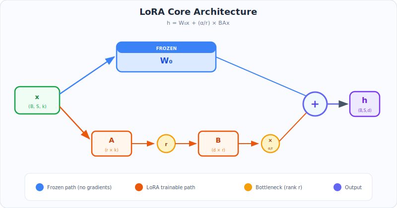
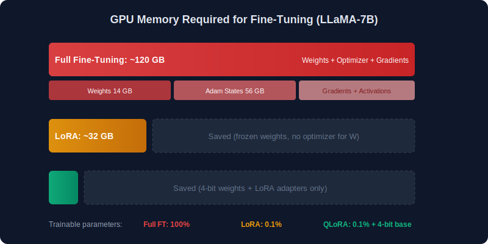
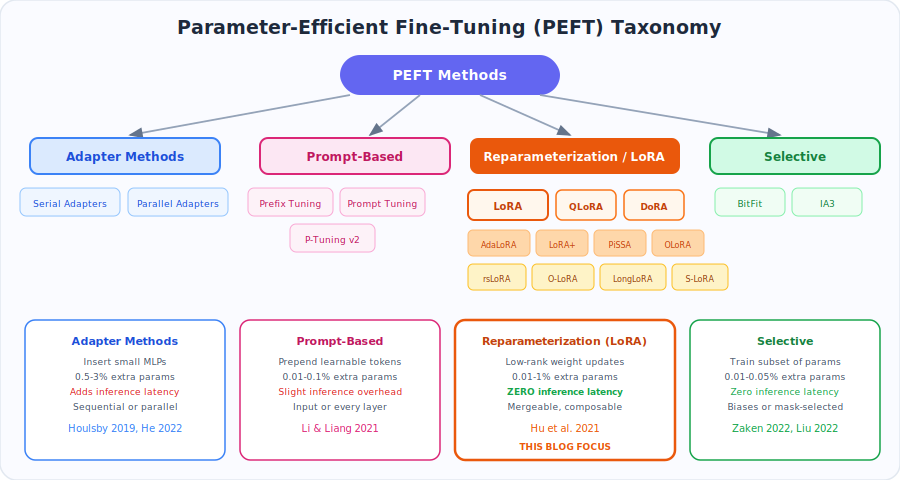
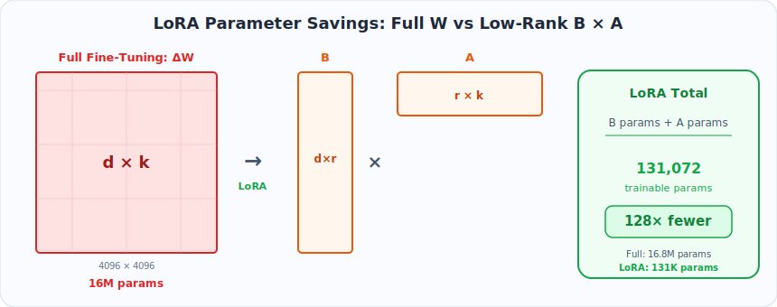
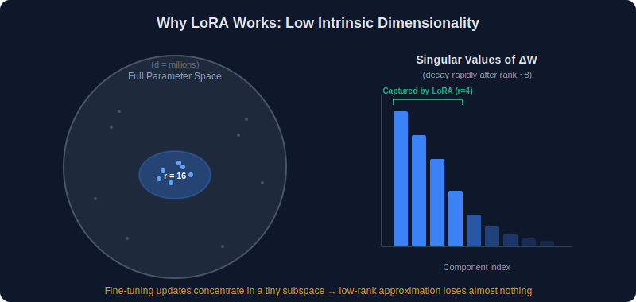
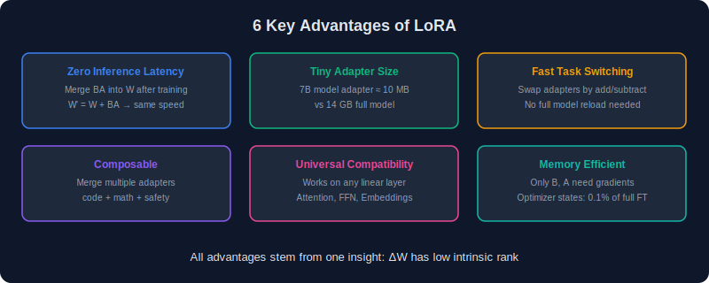
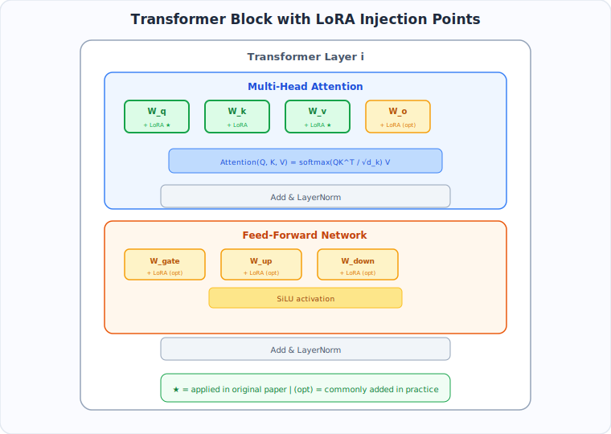

# Chapter 1: Introduction to LoRA

> *"Instead of fine-tuning all the weights, what if we only learned a small perturbation?"*

---

### What You'll Learn

- Why full fine-tuning is impractical for billion-parameter models
- The landscape of parameter-efficient methods (PEFT)
- The core idea behind LoRA and why it works
- Where LoRA adapters are injected inside a transformer
- The practical advantages that made LoRA the industry default

### TL;DR

> LoRA freezes all pre-trained weights and injects a small trainable low-rank branch (`BA`) alongside them. This achieves **99% of full fine-tuning quality** while training only **0.1% of the parameters**, with **zero additional inference cost** after merging.

---

<p align="center">
  
</p>

---

## 1.1 The Problem: Fine-Tuning at Scale

<p align="center">
  
</p>

Modern large language models (LLMs) like GPT-4, LLaMA, Mistral, and Falcon contain **billions of parameters**. Fine-tuning these models in the traditional way means:

| Model | Parameters | FP16 Memory | Full Fine-Tune Storage |
|-------|-----------|-------------|----------------------|
| LLaMA-7B | 7 billion | ~14 GB | 14 GB per task |
| LLaMA-13B | 13 billion | ~26 GB | 26 GB per task |
| LLaMA-65B | 65 billion | ~130 GB | 130 GB per task |
| GPT-3 | 175 billion | ~350 GB | 350 GB per task |

**Full fine-tuning** updates every single parameter in the model. For an organization serving 100 different tasks, that means storing 100 separate copies of the entire model — potentially **terabytes** of storage.

### The Three Core Challenges

1. **Memory**: Storing model weights, optimizer states (2x for Adam), and gradients requires 3-4x the model size in GPU memory
2. **Storage**: Each fine-tuned model is a complete copy
3. **Deployment**: Switching between tasks means loading entirely different models

---

## 1.2 Parameter-Efficient Fine-Tuning (PEFT)

The field of **Parameter-Efficient Fine-Tuning** attempts to solve this by training only a small subset of parameters while keeping the pre-trained weights frozen. Major approaches include:

<p align="center">
  
</p>

### Adapter Methods
- **Serial Adapters** (Houlsby et al., 2019): Insert small bottleneck layers between transformer sub-layers
- **Parallel Adapters** (He et al., 2022): Add adapter modules in parallel to existing layers

### Prompt-Based Methods
- **Prefix Tuning** (Li & Liang, 2021): Prepend learnable continuous vectors to keys and values
- **Prompt Tuning** (Lester et al., 2021): Prepend learnable tokens to the input
- **P-Tuning v2** (Liu et al., 2022): Add prompts to every layer

### Reparameterization Methods
- **LoRA** (Hu et al., 2021): Decompose weight updates into low-rank matrices — **this blog's focus**
- **DoRA** (Liu et al., 2024): Decompose into magnitude and direction
- **AdaLoRA** (Zhang et al., 2023): Adaptive rank allocation

### Selective Methods
- **BitFit** (Zaken et al., 2022): Only train bias terms
- **Fish Mask** (Sung et al., 2021): Select parameters based on Fisher information

---

## 1.3 What is LoRA?

<p align="center">
  
</p>

**LoRA (Low-Rank Adaptation)** was introduced by Edward Hu et al. from Microsoft in the paper *"LoRA: Low-Rank Adaptation of Large Language Models"* (2021).

The key insight is elegantly simple:

> The change in weights during fine-tuning has a **low intrinsic rank**.

Instead of updating a weight matrix $W \in \mathbb{R}^{d \times k}$ directly, LoRA constrains the update to a low-rank decomposition:

$$
W' = W + \Delta W = W + BA
$$

where:
- $W \in \mathbb{R}^{d \times k}$ — the original pre-trained weight (frozen)
- $B \in \mathbb{R}^{d \times r}$ — the low-rank down-projection
- $A \in \mathbb{R}^{r \times k}$ — the low-rank up-projection
- $r \ll \min(d, k)$ — the rank (typically 4, 8, 16, or 64)

### How the Forward Pass Changes

```
Before LoRA (full fine-tuning):
    h = W'x                      ← all of W' is trained

After LoRA:
    h = Wx + BAx                 ← W is FROZEN, only B and A are trained
      = Wx + (α/r) · BAx        ← with scaling factor
```

### Parameter Savings — By the Numbers

For a weight matrix of shape `(4096, 4096)`:

| Method | Parameters | Reduction |
|--------|-----------|:---------:|
| Full fine-tuning | 4096 × 4096 = **16,777,216** | 1x |
| LoRA (r=16) | (4096 × 16) + (16 × 4096) = **131,072** | **128x** |
| LoRA (r=8) | (4096 × 8) + (8 × 4096) = **65,536** | **256x** |
| LoRA (r=4) | (4096 × 4) + (4 × 4096) = **32,768** | **512x** |

---

## 1.4 Why Does LoRA Work?

<p align="center">
  
</p>

The authors of LoRA built on a critical observation from prior work (Aghajanyan et al., 2020):

> Pre-trained language models have a **low intrinsic dimensionality** — they can be effectively fine-tuned in a much smaller subspace.

### The Intrinsic Dimensionality Argument

When you fine-tune a model from pre-trained weights $W_0$ to task-specific weights $W_0 + \Delta W$:
- The matrix $\Delta W$ (the change) does not need to be full rank
- Empirically, $\Delta W$ can be well-approximated by a matrix of rank $r$, where $r$ is very small relative to the dimensions of $W$
- This means the "useful" information learned during fine-tuning lies in a low-dimensional subspace

### Empirical Evidence

The original paper showed that:
1. LoRA with rank $r = 4$ matches or exceeds full fine-tuning on GPT-3 175B
2. Performance does **not** significantly improve beyond $r = 8$ for most tasks
3. The learned $\Delta W$ matrices from full fine-tuning indeed have rapidly decaying singular values

---

## 1.5 Key Advantages of LoRA

<p align="center">
  
</p>

| Advantage | Description |
|-----------|-------------|
| **No additional inference latency** | Merge $BA$ into $W$ after training: $W' = W + BA$ |
| **Tiny adapter size** | A LoRA adapter for a 7B model can be < 10 MB |
| **Task switching** | Swap adapters by simple addition/subtraction on the base weights |
| **Composable** | Multiple LoRA adapters can be combined |
| **Compatible** | Works with any linear layer — attention, FFN, embeddings |
| **Memory efficient** | Only $B$, $A$, and their gradients/optimizer states need GPU memory |

---

## 1.6 Where is LoRA Applied in a Transformer?

<p align="center">
  
</p>

In a standard transformer block, the linear layers are:

```
Transformer Block:
├── Multi-Head Attention
│   ├── Q projection  (W_q): d_model → d_model    ← LoRA applied here
│   ├── K projection  (W_k): d_model → d_model    ← optionally here
│   ├── V projection  (W_v): d_model → d_model    ← LoRA applied here
│   └── O projection  (W_o): d_model → d_model    ← optionally here
├── Layer Norm
├── Feed-Forward Network
│   ├── Up projection  (W_up):   d_model → d_ff   ← optionally here
│   ├── Gate projection (W_gate): d_model → d_ff   ← optionally here
│   └── Down projection (W_down): d_ff → d_model   ← optionally here
└── Layer Norm
```

The original LoRA paper found that applying LoRA to **Q and V projections** gives the best performance-to-parameter ratio. However, recent practice often applies LoRA to **all linear layers** for better results.

---

## Key Takeaways

1. Full fine-tuning is impractical for most teams — LoRA is the dominant solution
2. LoRA decomposes weight updates into $\Delta W = BA$ with rank $r \ll \min(d, k)$
3. Only `B` and `A` are trained; the original weights stay frozen
4. After training, `BA` merges into `W` for zero-cost inference
5. Adapters are tiny (~10 MB for a 7B model) and swappable
6. The math works because fine-tuning updates have low intrinsic dimensionality

---

## Navigation

| Previous | Up | Next |
|----------|------|------|
| — | [Home](../README.md) | [Chapter 2: Mathematics →](../02-Mathematics/README.md) |
