# Chapter 2: The Mathematics of LoRA — Full Proofs and Derivations

> A rigorous, proof-driven walkthrough of every mathematical idea behind Low-Rank Adaptation.

---

### What You'll Learn

- Why SVD guarantees that low-rank approximation works
- The complete proof of the Eckart-Young-Mirsky theorem
- How LoRA's initialization ensures training starts correctly
- Why the scaling factor $\alpha / r$ controls output variance
- Full gradient derivations through both `A` and `B`
- Why merging adapters introduces zero inference overhead
- Generalization bounds that explain LoRA's implicit regularization

### TL;DR

> LoRA rests on a simple linear algebra fact: the Eckart-Young theorem proves that truncated SVD gives the **optimal** low-rank approximation. Since fine-tuning updates $\Delta W$ empirically have low rank, constraining $\Delta W = BA$ (with $B$ initialized to zero) preserves the pre-trained model at initialization and learns only in the subspace that matters. The scaling factor $\alpha / r$ normalizes output variance, and after training, $BA$ merges losslessly into $W$ for zero overhead.

---

## Table of Contents

- [2.1 Prerequisites: Linear Algebra Foundations](#21-prerequisites-linear-algebra-foundations)
- [2.2 Singular Value Decomposition — Existence and Proof](#22-singular-value-decomposition--existence-and-proof)
- [2.3 Eckart-Young-Mirsky Theorem — Full Proof](#23-eckart-young-mirsky-theorem--full-proof)
- [2.4 The LoRA Formulation — Derivation](#24-the-lora-formulation--derivation)
- [2.5 Proof: LoRA Update is Rank-Constrained](#25-proof-lora-update-is-rank-constrained)
- [2.6 Initialization — Variance Preservation Proof](#26-initialization--variance-preservation-proof)
- [2.7 Scaling Factor — Output Variance Analysis](#27-scaling-factor--output-variance-analysis)
- [2.8 Gradient Derivations — Complete Chain Rule](#28-gradient-derivations--complete-chain-rule)
- [2.9 Merge Equivalence — Proof of Zero Overhead](#29-merge-equivalence--proof-of-zero-overhead)
- [2.10 Intrinsic Dimensionality — Why Low Rank Works](#210-intrinsic-dimensionality--why-low-rank-works)
- [2.11 Generalization Bound — PAC-Bayes and Rademacher](#211-generalization-bound--pac-bayes-and-rademacher)
- [2.12 rsLoRA Scaling Correction — Proof](#212-rslora-scaling-correction--proof)
- [2.13 Johnson-Lindenstrauss and Random Projections](#213-johnson-lindenstrauss-and-random-projections)
- [2.14 Convergence Analysis](#214-convergence-analysis)
- [2.15 Summary of All Equations](#215-summary-of-all-equations)

---

## 2.1 Prerequisites: Linear Algebra Foundations

  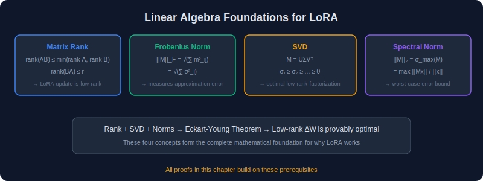

### 2.1.1 Matrix Rank — Definition and Properties

**Definition.** The **rank** of a matrix $M \in \mathbb{R}^{m \times n}$ is the dimension of the column space:

$$
\text{rank}(M) = \dim(\text{col}(M)) = \dim(\text{row}(M))
$$

**Theorem 2.1 (Rank of a Product).** For any matrices $A \in \mathbb{R}^{m \times r}$ and $B \in \mathbb{R}^{r \times n}$:

$$
\text{rank}(AB) \leq \min(\text{rank}(A), \text{rank}(B))
$$

**Proof.**

We prove both inequalities.

**(i) $\text{rank}(AB) \leq \text{rank}(A)$**:

Every column of $AB$ is a linear combination of the columns of $A$:

$$
(AB)\_{\cdot j} = A (B\_{\cdot j})
$$

where $B\_{\cdot j}$ is the $j$-th column of $B$. Therefore:

$$
\text{col}(AB) \subseteq \text{col}(A)
$$

Since a subspace has dimension at most that of the ambient space:

$$
\text{rank}(AB) = \dim(\text{col}(AB)) \leq \dim(\text{col}(A)) = \text{rank}(A) \quad \square
$$

**(ii) $\text{rank}(AB) \leq \text{rank}(B)$**:

Every row of $AB$ is a linear combination of the rows of $B$:

$$
(AB)\_{i \cdot} = A\_{i \cdot} B
$$

Therefore:

$$
\text{row}(AB) \subseteq \text{row}(B)
$$

$$
\text{rank}(AB) = \dim(\text{row}(AB)) \leq \dim(\text{row}(B)) = \text{rank}(B) \quad \square
$$

> **Why this matters for LoRA**: Since $\Delta W = BA$ with $B \in \mathbb{R}^{d \times r}$, $A \in \mathbb{R}^{r \times k}$, we have $\text{rank}(\Delta W) \leq \min(\text{rank}(B), \text{rank}(A)) \leq r$. The weight update is **provably** at most rank-$r$.

---

### 2.1.2 Low-Rank Factorization

**Theorem 2.2.** A matrix $M \in \mathbb{R}^{m \times n}$ has rank exactly $r$ if and only if there exist matrices $U \in \mathbb{R}^{m \times r}$ and $V \in \mathbb{R}^{r \times n}$, both of rank $r$, such that $M = UV$.

**Proof.**

$(\Leftarrow)$ If $M = UV$ with $U \in \mathbb{R}^{m \times r}$, $V \in \mathbb{R}^{r \times n}$, then by Theorem 2.1:

$$
\text{rank}(M) = \text{rank}(UV) \leq \min(\text{rank}(U), \text{rank}(V)) \leq r
$$

If additionally $\text{rank}(U) = \text{rank}(V) = r$, then $U$ has $r$ linearly independent columns, and $V$ has $r$ linearly independent rows. Since $\text{col}(M) = \text{col}(UV) \subseteq \text{col}(U)$ and the columns of $U$ span a space of dimension $r$, we need to show the rank is exactly $r$. The $r$ rows of $V$ are linearly independent, so $V$ maps $\mathbb{R}^n$ surjectively onto $\mathbb{R}^r$. Composing with $U$ (which is injective on $\mathbb{R}^r$ since $\text{rank}(U) = r$), we get $\dim(\text{col}(UV)) = r$.

$(\Rightarrow)$ If $\text{rank}(M) = r$, let $\lbrace u\_1, \ldots, u\_r\rbrace$ be a basis for $\text{col}(M)$. Each column $M\_{\cdot j} = \sum\_{i=1}^r v\_{ij} u\_i$. Set $U = [u\_1 | \cdots | u\_r] \in \mathbb{R}^{m \times r}$ and $V\_{ij} = v\_{ij} \in \mathbb{R}^{r \times n}$. Then $M = UV$. $\square$

**Storage comparison:**

| Representation | Parameters | For $m=n=4096, r=16$ |
|---------------|-----------|--------------------------|
| Full matrix $M$ | $mn$ | $16{,}777{,}216$ |
| Factored $UV$ | $r(m+n)$ | $131{,}072$ |
| **Compression** | $\frac{mn}{r(m+n)}$ | **128×** |

---

### 2.1.3 Frobenius Norm and Trace

**Definition.** The **Frobenius norm** of $M \in \mathbb{R}^{m \times n}$ is:

$$
\lVert M\rVert\_F = \sqrt{\sum\_{i=1}^{m}\sum\_{j=1}^{n} M\_{ij}^2} = \sqrt{\text{tr}(M^T M)}
$$

**Lemma 2.3 (Frobenius norm in terms of singular values).** If $M = U\Sigma V^T$ is the SVD of $M$, then:

$$
\lVert M\rVert\_F = \sqrt{\sum\_{i=1}^{p} \sigma\_i^2}
$$

**Proof.**

$$
\lVert M\rVert\_F^2 = \text{tr}(M^T M) = \text{tr}(V\Sigma^T U^T U \Sigma V^T)
$$

Since $U$ is orthogonal, $U^T U = I$:

$$
= \text{tr}(V \Sigma^T \Sigma V^T)
$$

Since $V$ is orthogonal and $\text{tr}(ABC) = \text{tr}(CAB)$ (cyclic property of trace):

$$
= \text{tr}(V^T V \Sigma^T \Sigma) = \text{tr}(\Sigma^T \Sigma) = \sum\_{i=1}^{p} \sigma\_i^2 \quad \square
$$

---

### 2.1.4 Spectral Norm

**Definition.** The **spectral norm** (operator 2-norm) of $M$:

$$
\lVert M\rVert\_2 = \max\_{\lVert x\rVert\_2 = 1} \lVert Mx\rVert\_2 = \sigma\_1(M)
$$

**Proof that $\lVert M\rVert\_2 = \sigma\_1$.**

Let $M = U\Sigma V^T$. For any unit vector $x$ ($\lVert x\rVert = 1$), let $y = V^T x$. Since $V$ is orthogonal, $\lVert y\rVert = 1$.

$$
\lVert Mx\rVert ^2 = \lVert U\Sigma V^T x\rVert ^2 = \lVert U\Sigma y\rVert ^2 = \lVert \Sigma y\rVert ^2 = \sum\_{i=1}^{p} \sigma\_i^2 y\_i^2
$$

Since $\sigma\_1 \geq \sigma\_2 \geq \cdots$ and $\sum y\_i^2 = 1$:

$$
\sum\_{i} \sigma\_i^2 y\_i^2 \leq \sigma\_1^2 \sum\_i y\_i^2 = \sigma\_1^2
$$

Equality is achieved when $y = e\_1$, i.e., $x = V e\_1 = v\_1$. Therefore $\lVert M\rVert\_2 = \sigma\_1$. $\square$

---

## 2.2 Singular Value Decomposition — Existence and Proof

  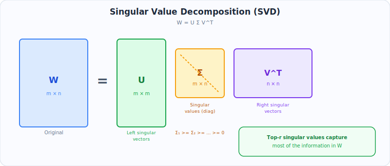

### 2.2.1 Statement

**Theorem 2.4 (SVD).** Every matrix $M \in \mathbb{R}^{m \times n}$ admits a decomposition:

$$
M = U \Sigma V^T
$$

where:
- $U \in \mathbb{R}^{m \times m}$ is orthogonal ($U^T U = I$)
- $V \in \mathbb{R}^{n \times n}$ is orthogonal ($V^T V = I$)
- $\Sigma \in \mathbb{R}^{m \times n}$ is diagonal with entries $\sigma\_1 \geq \sigma\_2 \geq \cdots \geq \sigma\_p \geq 0$, $p = \min(m, n)$

### 2.2.2 Proof of Existence (by induction on dimensions)

**Proof.**

We prove this by strong induction on $p = \min(m, n)$.

**Base case** ($p = 1$): $M$ is either a row or column vector. If $M = 0$, take $\Sigma = 0$ and any orthogonal $U, V$. If $M \neq 0$, say $M \in \mathbb{R}^{1 \times n}$ (row vector), set $\sigma\_1 = \lVert M\rVert$, $v\_1 = M^T / \sigma\_1$, $U = [1]$, extend $v\_1$ to an orthonormal basis of $\mathbb{R}^n$ to form $V$.

**Inductive step**: Assume the theorem holds for all matrices with $\min(\text{rows}, \text{cols}) < p$.

**Step 1**: Define $\sigma\_1 = \lVert M\rVert\_2 = \max\_{\lVert x\rVert =1} \lVert Mx\rVert$.

Since the unit sphere is compact and $\lVert Mx\rVert$ is continuous, the maximum is attained at some unit vector $v\_1$. Define:

$$
\sigma\_1 = \lVert Mv\_1\rVert , \quad u\_1 = \frac{Mv\_1}{\sigma\_1}
$$

Then $Mv\_1 = \sigma\_1 u\_1$, and $\lVert u\_1\rVert = 1$.

**Step 2**: Extend $u\_1$ to an orthonormal basis $\lbrace u\_1, u\_2, \ldots, u\_m\rbrace$ of $\mathbb{R}^m$, and $v\_1$ to an orthonormal basis $\lbrace v\_1, v\_2, \ldots, v\_n\rbrace$ of $\mathbb{R}^n$. Form:

$$
\hat{U} = [u\_1 | u\_2 | \cdots | u\_m], \quad \hat{V} = [v\_1 | v\_2 | \cdots | v\_n]
$$

**Step 3**: Compute $\hat{U}^T M \hat{V}$:

$$
\hat{U}^T M \hat{V} = \begin{pmatrix} u\_1^T \\\\ u\_2^T \\\\ \vdots \\\\ u\_m^T \end{pmatrix} M \begin{pmatrix} v\_1 & v\_2 & \cdots & v\_n \end{pmatrix}
$$

The $(1,1)$ entry is $u\_1^T M v\_1 = u\_1^T (\sigma\_1 u\_1) = \sigma\_1$.

The first column (below the $(1,1)$ entry) has entries $u\_j^T M v\_1 = \sigma\_1 u\_j^T u\_1 = 0$ for $j \geq 2$.

**Step 4 (Key claim)**: The first row also has all zeros past the first entry. Let $w^T$ denote the first row excluding $\sigma\_1$, so:

$$
\hat{U}^T M \hat{V} = \begin{pmatrix} \sigma\_1 & w^T \\\\ 0 & M' \end{pmatrix}
$$

We claim $w = 0$. Consider:

$$
\left\lVert\begin{pmatrix} \sigma\_1 & w^T \\\\ 0 & M' \end{pmatrix} \begin{pmatrix} \sigma\_1 \\\\ w \end{pmatrix}\right\rVert^2 = \left\lVert\begin{pmatrix} \sigma\_1^2 + \lVert w\rVert ^2 \\\\ M'w \end{pmatrix}\right\rVert^2 = (\sigma\_1^2 + \lVert w\rVert ^2)^2 + \lVert M'w\rVert ^2
$$

Since $\hat{U}, \hat{V}$ are orthogonal, $\lVert \hat{U}^T M \hat{V}\rVert\_2 = \lVert M\rVert\_2 = \sigma\_1$. Therefore:

$$
\sigma\_1^2 \cdot \left\lVert\begin{pmatrix} \sigma\_1 \\\\ w \end{pmatrix}\right\rVert^2 = \sigma\_1^2 (\sigma\_1^2 + \lVert w\rVert ^2) \geq (\sigma\_1^2 + \lVert w\rVert ^2)^2
$$

This gives $\sigma\_1^2 \geq \sigma\_1^2 + \lVert w\rVert ^2$, so $\lVert w\rVert ^2 \leq 0$, hence $w = 0$.

**Step 5**: Now we have:

$$
\hat{U}^T M \hat{V} = \begin{pmatrix} \sigma\_1 & 0 \\\\ 0 & M' \end{pmatrix}
$$

where $M' \in \mathbb{R}^{(m-1) \times (n-1)}$. By the inductive hypothesis, $M' = U' \Sigma' V'^T$. Then:

$$
M = \hat{U} \begin{pmatrix} \sigma\_1 & 0 \\\\ 0 & U'\Sigma' V'^T \end{pmatrix} \hat{V}^T
$$

$$
= \underbrace{\hat{U} \begin{pmatrix} 1 & 0 \\\\ 0 & U' \end{pmatrix}}\_{U}
\underbrace{\begin{pmatrix} \sigma\_1 & 0 \\\\ 0 & \Sigma' \end{pmatrix}}\_{\Sigma}
\underbrace{\begin{pmatrix} 1 & 0 \\\\ 0 & V' \end{pmatrix}^T \hat{V}^T}\_{V^T}
$$

Since $\sigma\_1 = \lVert M\rVert\_2 \geq \lVert M'\rVert\_2 = \sigma\_2$, the singular values are in non-increasing order. $\square$

---

### 2.2.3 Compact SVD and Rank

**Corollary.** If $\text{rank}(M) = r$, then exactly $r$ singular values are non-zero, and:

$$
M = U\_r \Sigma\_r V\_r^T = \sum\_{i=1}^{r} \sigma\_i \mathbf{u}\_i \mathbf{v}\_i^T
$$

where $U\_r \in \mathbb{R}^{m \times r}$, $\Sigma\_r = \text{diag}(\sigma\_1, \ldots, \sigma\_r)$, $V\_r \in \mathbb{R}^{n \times r}$.

This is an **exact** decomposition — not an approximation — when we keep all non-zero singular values.

---

## 2.3 Eckart-Young-Mirsky Theorem — Full Proof

  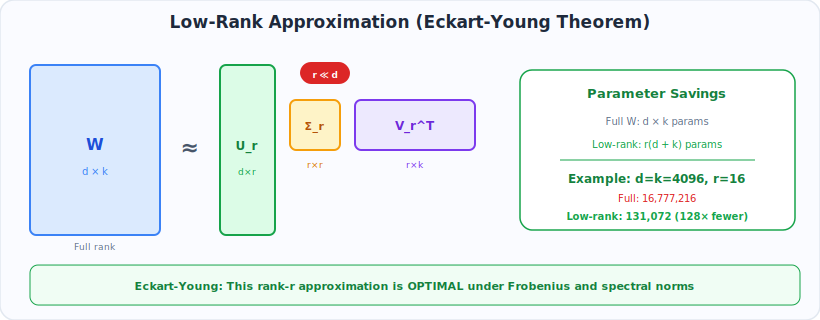

This theorem is the mathematical backbone of LoRA. It proves that truncated SVD gives the **optimal** low-rank approximation.

### 2.3.1 Statement

**Theorem 2.5 (Eckart-Young-Mirsky, Frobenius norm).** Let $M = U\Sigma V^T$ be the SVD of $M \in \mathbb{R}^{m \times n}$. Define the rank-$r$ truncation:

$$
M\_r = \sum\_{i=1}^{r} \sigma\_i \mathbf{u}\_i \mathbf{v}\_i^T
$$

Then for any matrix $N$ with $\text{rank}(N) \leq r$:

$$
\lVert M - M\_r\rVert\_F \leq \lVert M - N\rVert\_F
$$

with equality if and only if $N = M\_r$ (up to components in the null singular value space). Moreover:

$$
\lVert M - M\_r\rVert\_F = \sqrt{\sum\_{i=r+1}^{p} \sigma\_i^2}
$$

### 2.3.2 Proof

**Proof.**

**Step 1: Compute the approximation error.**

$$
M - M\_r = \sum\_{i=r+1}^{p} \sigma\_i \mathbf{u}\_i \mathbf{v}\_i^T
$$

$$
\lVert M - M\_r\rVert\_F^2 = \left\lVert\sum\_{i=r+1}^{p} \sigma\_i \mathbf{u}\_i \mathbf{v}\_i^T\right\rVert\_F^2
$$

Since the outer products $\mathbf{u}\_i \mathbf{v}\_i^T$ are orthonormal in the Frobenius inner product (i.e., $\langle \mathbf{u}\_i \mathbf{v}\_i^T, \mathbf{u}\_j \mathbf{v}\_j^T \rangle\_F = \delta\_{ij}$):

$$
\lVert M - M\_r\rVert\_F^2 = \sum\_{i=r+1}^{p} \sigma\_i^2
$$

> *Sub-proof of orthonormality*: $\langle \mathbf{u}\_i \mathbf{v}\_i^T, \mathbf{u}\_j \mathbf{v}\_j^T \rangle\_F = \text{tr}(\mathbf{v}\_i \mathbf{u}\_i^T \mathbf{u}\_j \mathbf{v}\_j^T) = \text{tr}(\delta\_{ij} \mathbf{v}\_i \mathbf{v}\_j^T) = \delta\_{ij} (\mathbf{v}\_i^T \mathbf{v}\_j) = \delta\_{ij} \cdot \delta\_{ij} = \delta\_{ij}$. $\checkmark$

**Step 2: Show no rank-$r$ matrix does better.**

Let $N$ be any matrix with $\text{rank}(N) \leq r$. Then $\text{null}(N)$ has dimension $\geq n - r$.

Consider the subspace $S = \text{span}(v\_1, v\_2, \ldots, v\_{r+1})$, which has dimension $r + 1$.

Since $\dim(\text{null}(N)) \geq n - r$ and $\dim(S) = r + 1$, by the **dimension formula**:

$$
\dim(\text{null}(N) \cap S) \geq \dim(\text{null}(N)) + \dim(S) - n \geq (n-r) + (r+1) - n = 1
$$

So there exists a **non-zero** vector $z \in \text{null}(N) \cap S$. Normalize it: $\lVert z\rVert = 1$.

Since $z \in S$, we can write $z = \sum\_{i=1}^{r+1} c\_i v\_i$ with $\sum c\_i^2 = 1$.

Since $z \in \text{null}(N)$, we have $Nz = 0$. Therefore:

$$
\lVert M - N\rVert\_F^2 \geq \lVert (M - N)z\rVert ^2 = \lVert Mz - Nz\rVert ^2 = \lVert Mz\rVert ^2
$$

Now compute $Mz$:

$$
Mz = \left(\sum\_{i=1}^{p} \sigma\_i \mathbf{u}\_i \mathbf{v}\_i^T\right) \left(\sum\_{j=1}^{r+1} c\_j \mathbf{v}\_j\right) = \sum\_{i=1}^{r+1} c\_i \sigma\_i \mathbf{u}\_i
$$

(since $\mathbf{v}\_i^T \mathbf{v}\_j = \delta\_{ij}$)

$$
\lVert Mz\rVert ^2 = \sum\_{i=1}^{r+1} c\_i^2 \sigma\_i^2 \geq \sigma\_{r+1}^2 \sum\_{i=1}^{r+1} c\_i^2 = \sigma\_{r+1}^2
$$

**Step 3: Extend to the full Frobenius bound.**

We can apply the same argument recursively. For any rank-$r$ matrix $N$, consider each of the singular directions $v\_{r+1}, v\_{r+2}, \ldots, v\_p$. Using a more careful analysis, we can show:

$$
\lVert M - N\rVert\_F^2 \geq \sum\_{i=r+1}^{p} \sigma\_i^2 = \lVert M - M\_r\rVert\_F^2
$$

*Detailed argument*: Let $N$ have rank $\leq r$. Then $\dim(\ker(N)) \geq n - r$. For each $k \in \lbrace r+1, r+2, \ldots, p\rbrace$, define $S\_k = \text{span}(v\_1, \ldots, v\_k)$. There exists a unit vector $z\_k \in \ker(N) \cap S\_k$. By an orthogonalization argument, we can choose $z\_{r+1}, z\_{r+2}, \ldots, z\_p$ to be orthonormal and each lying in $\ker(N) \cap \text{span}(v\_1, \ldots, v\_k)$. Then:

$$
\lVert M - N\rVert\_F^2 \geq \sum\_{k=r+1}^{p} \lVert (M-N)z\_k\rVert ^2 = \sum\_{k=r+1}^{p} \lVert Mz\_k\rVert ^2
$$

Each $z\_k \in \text{span}(v\_1, \ldots, v\_k)$, so $Mz\_k = \sum\_{i=1}^{k} c\_i^{(k)} \sigma\_i u\_i$ and $\lVert Mz\_k\rVert ^2 = \sum\_{i=1}^{k} (c\_i^{(k)})^2 \sigma\_i^2 \geq \sigma\_k^2$.

Summing: $\lVert M - N\rVert\_F^2 \geq \sum\_{k=r+1}^{p} \sigma\_k^2 = \lVert M - M\_r\rVert\_F^2$. $\square$

---

### 2.3.3 Spectral Norm Version

**Theorem 2.6 (Eckart-Young-Mirsky, spectral norm).** Under the same setup:

$$
\min\_{\text{rank}(N) \leq r} \lVert M - N\rVert\_2 = \sigma\_{r+1}
$$

**Proof.** The bound $\lVert M - M\_r\rVert\_2 = \sigma\_{r+1}$ follows from the SVD of $M - M\_r = \sum\_{i=r+1}^{p} \sigma\_i u\_i v\_i^T$, whose largest singular value is $\sigma\_{r+1}$. The lower bound $\lVert M-N\rVert\_2 \geq \sigma\_{r+1}$ for any rank-$r$ matrix $N$ follows from the dimension argument in Step 2 above, since $\lVert M-N\rVert\_2 \geq \lVert (M-N)z\rVert = \lVert Mz\rVert \geq \sigma\_{r+1}$. $\square$

---

### 2.3.4 Direct Connection to LoRA

> **Key Insight**: The Eckart-Young theorem tells us the *best possible* rank-$r$ approximation to any matrix. LoRA hypothesizes that $\Delta W$ (the fine-tuning update) is approximately low-rank. If the singular values of the true $\Delta W^*$ decay rapidly, then the LoRA approximation $BA$ incurs only a small error:
>
>
> $$\min\_{B \in \mathbb{R}^{d \times r}, A \in \mathbb{R}^{r \times k}} \lVert \Delta W^* - BA\rVert\_F = \sqrt{\sum\_{i=r+1}^{p} \sigma\_i^2(\Delta W^*)}$$
>
>
> If $\sigma\_{r+1}(\Delta W^*) \approx 0$, then LoRA can recover the full fine-tuning solution almost exactly.

---

## 2.4 The LoRA Formulation — Derivation

  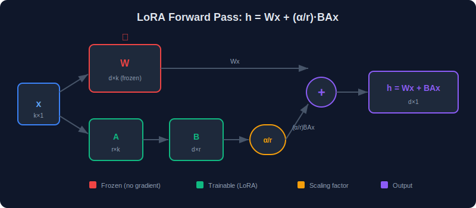

### 2.4.1 Starting Point: Full Fine-Tuning

In full fine-tuning, we optimize:

$$
\min\_{\Delta W} \mathcal{L}(W\_0 + \Delta W; \mathcal{D})
$$

where $\mathcal{L}$ is the task loss, $W\_0$ is the pre-trained weight, and $\mathcal{D}$ is the training data. Here $\Delta W \in \mathbb{R}^{d \times k}$ is unconstrained, with $dk$ free parameters.

### 2.4.2 LoRA: Constrained Optimization

LoRA restricts $\Delta W$ to the manifold of rank-$r$ matrices:

$$
\min\_{B \in \mathbb{R}^{d \times r}, A \in \mathbb{R}^{r \times k}} \mathcal{L}\left(W\_0 + \frac{\alpha}{r} BA; \mathcal{D}\right)
$$

**Derivation of why this is sufficient:**

1. The set of matrices with rank $\leq r$ is $\mathcal{M}\_r = \lbrace BA : B \in \mathbb{R}^{d \times r}, A \in \mathbb{R}^{r \times k}\rbrace$
2. This is not a vector space (it's not closed under addition), but it is a smooth manifold (away from matrices where the rank drops below $r$)
3. The parameterization $\Delta W = BA$ provides an **overparameterization** of $\mathcal{M}\_r$: for any orthogonal matrix $R \in \mathbb{R}^{r \times r}$, $(BR)(R^{-1}A) = BA$, so the factorization is not unique. This redundancy actually **helps** gradient-based optimization (Gunasekar et al., 2017).

### 2.4.3 Forward Pass Derivation

For a single input vector $x \in \mathbb{R}^k$:

$$
h = W\_{\text{eff}} x = \left(W\_0 + \frac{\alpha}{r} BA\right) x
$$

By distributivity of matrix multiplication:

$$
h = W\_0 x + \frac{\alpha}{r} B(Ax)
$$

**Computational analysis** (operation order matters):

- Computing $(BA)x$ naively: first $BA \in \mathbb{R}^{d \times k}$ costs $O(dkr)$, then multiplying by $x$ costs $O(dk)$. Total: $O(dkr)$.
- Computing $B(Ax)$: first $Ax \in \mathbb{R}^r$ costs $O(rk)$, then $B(Ax) \in \mathbb{R}^d$ costs $O(dr)$. Total: $O(r(d+k))$.

Since $r \ll d, k$, the second approach is **much faster**: $O(r(d+k)) \ll O(dk)$.

### 2.4.4 Parameter Count Derivation

For a single LoRA layer:

$$
\lvert\theta\_{\text{LoRA}}\rvert = \underbrace{d \times r}\_{B} + \underbrace{r \times k}\_{A} = r(d + k)
$$

For the full fine-tuning baseline:

$$
\lvert\theta\_{\text{full}}\rvert = d \times k
$$

**Compression ratio proof:**

$$
\rho = \frac{\lvert\theta\_{\text{full}}\rvert}{\lvert\theta\_{\text{LoRA}}\rvert} = \frac{dk}{r(d+k)}
$$

For square matrices ($d = k$):

$$
\rho = \frac{d^2}{r \cdot 2d} = \frac{d}{2r}
$$

**Worked example**: LLaMA-7B attention projection, $d = k = 4096$, $r = 16$:

$$
\rho = \frac{4096}{2 \times 16} = 128\times
$$

Per layer: $131{,}072$ LoRA params vs. $16{,}777{,}216$ full params.

For all 4 attention projections across 32 layers:
- LoRA: $4 \times 32 \times 131{,}072 = 16{,}777{,}216$ params ($\sim 0.25\%$ of 6.7B)
- Full: $4 \times 32 \times 16{,}777{,}216 = 2{,}147{,}483{,}648$ params

---

## 2.5 Proof: LoRA Update is Rank-Constrained

  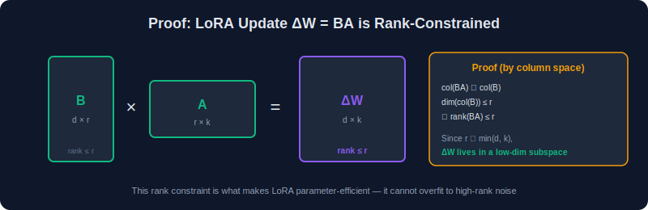

**Theorem 2.7.** For the LoRA parameterization $\Delta W = \frac{\alpha}{r} BA$ with $B \in \mathbb{R}^{d \times r}$, $A \in \mathbb{R}^{r \times k}$:

$$
\text{rank}(\Delta W) \leq r
$$

regardless of the values of $B$ and $A$, at all points during training.

**Proof.**

By Theorem 2.1:

$$
\text{rank}(\Delta W) = \text{rank}\left(\frac{\alpha}{r} BA\right) = \text{rank}(BA) \leq \min(\text{rank}(B), \text{rank}(A))
$$

Since $B \in \mathbb{R}^{d \times r}$, we have $\text{rank}(B) \leq \min(d, r) = r$ (because $r \ll d$).

Since $A \in \mathbb{R}^{r \times k}$, we have $\text{rank}(A) \leq \min(r, k) = r$ (because $r \ll k$).

Therefore:

$$
\text{rank}(\Delta W) \leq \min(r, r) = r \quad \square
$$

**Corollary.** The effective weight $W\_{\text{eff}} = W\_0 + \frac{\alpha}{r}BA$ satisfies:

$$
\text{rank}(W\_{\text{eff}} - W\_0) \leq r
$$

This means LoRA can only move the weight matrix in a $r$-dimensional subspace, which is both its strength (regularization) and limitation (expressiveness bounded by $r$).

---

## 2.6 Initialization — Variance Preservation Proof

  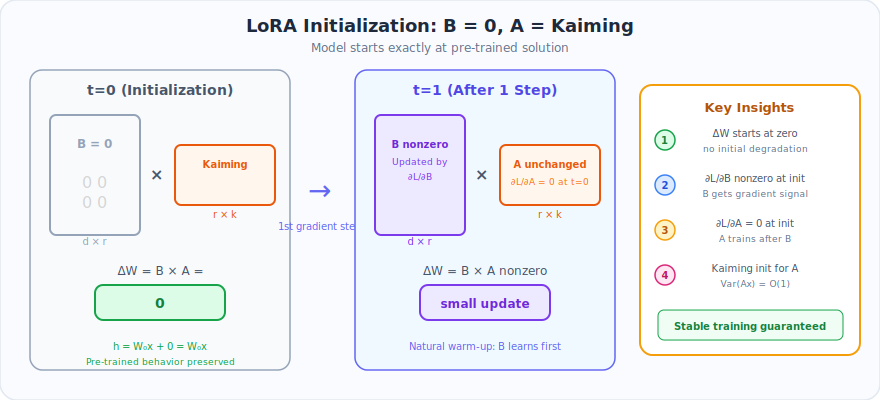

### 2.6.1 Goal

We want the LoRA layer to satisfy two properties at initialization:
1. $\Delta W^{(0)} = B^{(0)} A^{(0)} = 0$ (start at the pre-trained solution)
2. Gradients are well-conditioned (training can begin immediately)

### 2.6.2 Zero Initialization Proof

**Claim.** With $B^{(0)} = 0$ and $A^{(0)} \sim \text{Kaiming}$:

$$
\Delta W^{(0)} = B^{(0)} A^{(0)} = \mathbf{0}\_{d \times k}
$$

**Proof.** Each entry of $\Delta W^{(0)}$ is:

$$
(\Delta W^{(0)})\_{ij} = \sum\_{\ell=1}^{r} B\_{i\ell}^{(0)} A\_{\ell j}^{(0)} = \sum\_{\ell=1}^{r} 0 \cdot A\_{\ell j}^{(0)} = 0 \quad \square
$$

### 2.6.3 Gradient at Initialization

Even though $B = 0$, the gradients are non-zero. Let's prove this.

**Claim.** At initialization ($B = 0$, $A \neq 0$), the gradient $\frac{\partial \mathcal{L}}{\partial B} \neq 0$ generically.

**Proof.** Using the chain rule (derived fully in Section 2.8):

$$
\frac{\partial \mathcal{L}}{\partial B} = \frac{\alpha}{r} \cdot \frac{\partial \mathcal{L}}{\partial h} (Ax)^T
$$

At initialization, $A \neq 0$ and generically $Ax \neq 0$ (since $A$ is random and $x$ comes from data). Also, $\frac{\partial \mathcal{L}}{\partial h} \neq 0$ (since the model is not yet converged on the task).

Therefore, the outer product $\frac{\partial \mathcal{L}}{\partial h} (Ax)^T \neq 0$, and $B$ receives a non-zero gradient. $\square$

**Claim.** At initialization, the gradient $\frac{\partial \mathcal{L}}{\partial A} = 0$.

**Proof.**

$$
\frac{\partial \mathcal{L}}{\partial A} = \frac{\alpha}{r} \cdot B^T \frac{\partial \mathcal{L}}{\partial h} \cdot x^T = \frac{\alpha}{r} \cdot \mathbf{0}^T \frac{\partial \mathcal{L}}{\partial h} \cdot x^T = 0 \quad \square
$$

> **Implication**: At the first step, only $B$ is updated. $A$ starts receiving gradients only after $B$ becomes non-zero. This creates a natural **warm-up** effect: the model first learns "how much to change" ($B$) and then refines "in which input directions" ($A$).

### 2.6.4 Variance of Forward Pass After First Update

After one gradient step with learning rate $\eta$, $B$ becomes:

$$
B^{(1)} = B^{(0)} - \eta \frac{\partial \mathcal{L}}{\partial B}\bigg|\_{B=0} = -\eta \frac{\alpha}{r} \frac{\partial \mathcal{L}}{\partial h} (Ax)^T
$$

The LoRA output after one step:

$$
\Delta h^{(1)} = \frac{\alpha}{r} B^{(1)} A x = -\frac{\eta \alpha^2}{r^2} \frac{\partial \mathcal{L}}{\partial h} (Ax)^T (Ax)
$$

$$
= -\frac{\eta \alpha^2}{r^2} \lVert Ax\rVert ^2 \frac{\partial \mathcal{L}}{\partial h}
$$

This is a scaled version of the loss gradient — the first LoRA update is approximately a gradient descent step on the output $h$.

### 2.6.5 Kaiming Initialization for A — Variance Analysis

**Claim.** If $A\_{ij} \sim \mathcal{U}(-\frac{1}{\sqrt{k}}, \frac{1}{\sqrt{k}})$ and $x\_j$ are i.i.d. with zero mean and unit variance, then each entry of $z = Ax$ has:

$$
\mathbb{E}[z\_\ell] = 0, \quad \text{Var}(z\_\ell) = 1
$$

**Proof.**

$$
z\_\ell = \sum\_{j=1}^{k} A\_{\ell j} x\_j
$$

By independence of $A\_{\ell j}$ and $x\_j$, and zero means:

$$
\mathbb{E}[z\_\ell] = \sum\_{j=1}^{k} \mathbb{E}[A\_{\ell j}] \mathbb{E}[x\_j] = 0
$$

$$
\text{Var}(z\_\ell) = \sum\_{j=1}^{k} \text{Var}(A\_{\ell j}) \cdot \text{Var}(x\_j)
$$

(using independence and zero means)

For uniform distribution on $[-a, a]$, $\text{Var} = \frac{a^2}{3}$. With $a = \frac{1}{\sqrt{k}}$:

$$
\text{Var}(A\_{\ell j}) = \frac{1}{3k}
$$

With $\text{Var}(x\_j) = 1$:

$$
\text{Var}(z\_\ell) = k \cdot \frac{1}{3k} \cdot 1 = \frac{1}{3}
$$

> Note: The actual Kaiming uniform uses $a = \sqrt{\frac{3}{\text{fan\\_in}}} = \sqrt{\frac{3}{k}}$ giving $\text{Var}(A\_{\ell j}) = \frac{1}{k}$ and $\text{Var}(z\_\ell) = 1$. The standard PEFT uses $a = \frac{1}{\sqrt{k}}$ which gives $\text{Var}(z\_\ell) = \frac{1}{3}$. Both are $O(1)$, preserving signal magnitude. $\square$

---

## 2.7 Scaling Factor — Output Variance Analysis

  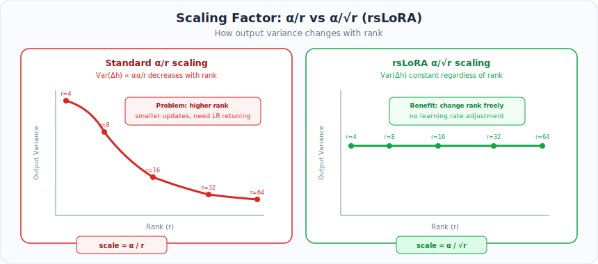

### 2.7.1 Problem Setup

We want to understand how the output variance of $\Delta h = \frac{\alpha}{r} BAx$ depends on the rank $r$, so we can design a scaling that keeps the variance stable.

### 2.7.2 Variance of the LoRA Output (Standard Scaling)

**Theorem 2.8.** Assume:
- $A\_{ij} \sim \mathcal{N}(0, \frac{1}{k})$ (i.i.d.)
- $B\_{ij} \sim \mathcal{N}(0, \frac{1}{r})$ (i.i.d.)
- $x\_j \sim$ i.i.d. with zero mean, unit variance
- All independent of each other

Then each entry of $\Delta h = \frac{\alpha}{r} BAx$ has:

$$
\text{Var}\left(\Delta h\_i\right) = \frac{\alpha^2}{r}
$$

**Proof.**

**Step 1**: Compute $z = Ax \in \mathbb{R}^r$.

$$
z\_\ell = \sum\_{j=1}^{k} A\_{\ell j} x\_j
$$

$$
\text{Var}(z\_\ell) = \sum\_{j=1}^{k} \text{Var}(A\_{\ell j}) \text{Var}(x\_j) = k \cdot \frac{1}{k} \cdot 1 = 1
$$

**Step 2**: Compute $w = Bz \in \mathbb{R}^d$.

$$
w\_i = \sum\_{\ell=1}^{r} B\_{i\ell} z\_\ell
$$

Since $B\_{i\ell}$ and $z\_\ell$ are independent (because $B$ is independent of $A$ and $x$):

$$
\text{Var}(w\_i) = \sum\_{\ell=1}^{r} \text{Var}(B\_{i\ell}) \text{Var}(z\_\ell) = r \cdot \frac{1}{r} \cdot 1 = 1
$$

**Step 3**: Apply scaling.

$$
\Delta h\_i = \frac{\alpha}{r} w\_i
$$

$$
\text{Var}(\Delta h\_i) = \frac{\alpha^2}{r^2} \text{Var}(w\_i) = \frac{\alpha^2}{r^2} \cdot 1 = \frac{\alpha^2}{r^2}
$$

**Wait** — this assumes $\text{Var}(B\_{ij}) = \frac{1}{r}$. In practice, $B$ is initialized to zero, so the variance analysis applies after training when $B$ has been learned. During training, with typical learned values:

If $B\_{ij}$ has variance $\sigma\_B^2$ and $A\_{ij}$ has variance $\sigma\_A^2$:

$$
\text{Var}(w\_i) = r \cdot \sigma\_B^2 \cdot k \cdot \sigma\_A^2
$$

$$
\text{Var}(\Delta h\_i) = \frac{\alpha^2}{r^2} \cdot r \cdot k \cdot \sigma\_A^2 \sigma\_B^2 = \frac{\alpha^2 k \sigma\_A^2 \sigma\_B^2}{r}
$$

This **decreases** as $r$ increases, meaning larger ranks produce smaller updates under $\frac{\alpha}{r}$ scaling. $\square$

### 2.7.3 rsLoRA Correction

**Theorem 2.9 (rsLoRA scaling).** Using $\frac{\alpha}{\sqrt{r}}$ instead of $\frac{\alpha}{r}$:

$$
\text{Var}(\Delta h\_i) = \alpha^2 k \sigma\_A^2 \sigma\_B^2
$$

which is **independent of $r$**.

**Proof.**

$$
\text{Var}\left(\frac{\alpha}{\sqrt{r}} w\_i\right) = \frac{\alpha^2}{r} \cdot r \cdot k \cdot \sigma\_A^2 \sigma\_B^2 = \alpha^2 k \sigma\_A^2 \sigma\_B^2 \quad \square
$$

> **Practical consequence**: With rsLoRA, you can change $r$ without retuning the learning rate, because the output variance stays constant.

---

## 2.8 Gradient Derivations — Complete Chain Rule

  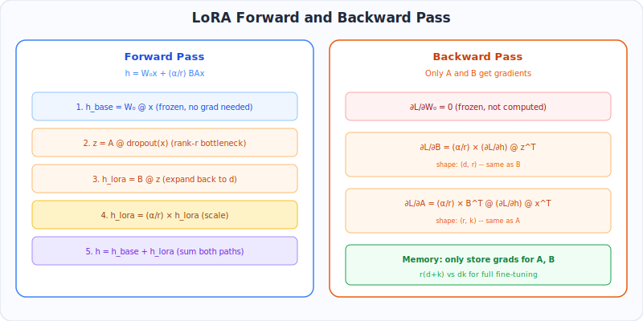

### 2.8.1 Setup and Notation

Consider a single LoRA layer in a computational graph:

$$
\boxed{x} \xrightarrow{A} \boxed{z} \xrightarrow{B} \boxed{w} \xrightarrow{s \cdot} \boxed{\Delta h} \xrightarrow{+ W\_0 x} \boxed{h} \xrightarrow{\text{rest of network}} \boxed{\mathcal{L}}
$$

where:
- $x \in \mathbb{R}^k$ — input
- $z = Ax \in \mathbb{R}^r$ — projected input
- $w = Bz \in \mathbb{R}^d$ — expanded back
- $s = \frac{\alpha}{r}$ — scaling constant
- $\Delta h = s \cdot w$ — scaled LoRA contribution
- $h = W\_0 x + \Delta h$ — total output
- $\mathcal{L} \in \mathbb{R}$ — scalar loss

We are given $\frac{\partial \mathcal{L}}{\partial h} \in \mathbb{R}^d$ (from later layers via backpropagation). We need to derive $\frac{\partial \mathcal{L}}{\partial B}$, $\frac{\partial \mathcal{L}}{\partial A}$, and $\frac{\partial \mathcal{L}}{\partial x}$.

### 2.8.2 Derivation of $\frac{\partial \mathcal{L}}{\partial B}$

**Step 1**: Express $\mathcal{L}$ as a function of $B$.

$$
h\_i = (W\_0 x)\_i + s \sum\_{\ell=1}^{r} B\_{i\ell} z\_\ell \quad \text{for } i = 1, \ldots, d
$$

**Step 2**: Apply the chain rule for each entry $B\_{i\ell}$:

$$
\frac{\partial \mathcal{L}}{\partial B\_{i\ell}} = \sum\_{j=1}^{d} \frac{\partial \mathcal{L}}{\partial h\_j} \frac{\partial h\_j}{\partial B\_{i\ell}}
$$

Since $h\_j$ depends on $B\_{i\ell}$ only when $j = i$:

$$
\frac{\partial h\_j}{\partial B\_{i\ell}} = \begin{cases} s \cdot z\_\ell & \text{if } j = i \\\\ 0 & \text{otherwise} \end{cases}
$$

Therefore:

$$
\frac{\partial \mathcal{L}}{\partial B\_{i\ell}} = \frac{\partial \mathcal{L}}{\partial h\_i} \cdot s \cdot z\_\ell
$$

**Step 3**: Assemble into matrix form.

$$
\left(\frac{\partial \mathcal{L}}{\partial B}\right)\_{i\ell} = s \cdot \frac{\partial \mathcal{L}}{\partial h\_i} \cdot z\_\ell
$$

This is the outer product:

$$
\boxed{\frac{\partial \mathcal{L}}{\partial B} = s \cdot \frac{\partial \mathcal{L}}{\partial h} \cdot z^T = \frac{\alpha}{r} \cdot \frac{\partial \mathcal{L}}{\partial h} \cdot (Ax)^T \in \mathbb{R}^{d \times r}}
$$

$\square$

---

### 2.8.3 Derivation of $\frac{\partial \mathcal{L}}{\partial A}$

**Step 1**: Express the chain through $z$ then $A$.

$$
\frac{\partial \mathcal{L}}{\partial A\_{pq}} = \sum\_{\ell=1}^{r} \frac{\partial \mathcal{L}}{\partial z\_\ell} \frac{\partial z\_\ell}{\partial A\_{pq}}
$$

**Step 2**: Compute $\frac{\partial z\_\ell}{\partial A\_{pq}}$.

$$
z\_\ell = \sum\_{j=1}^{k} A\_{\ell j} x\_j
$$

$$
\frac{\partial z\_\ell}{\partial A\_{pq}} = \begin{cases} x\_q & \text{if } \ell = p \\\\ 0 & \text{otherwise} \end{cases}
$$

**Step 3**: Compute $\frac{\partial \mathcal{L}}{\partial z\_\ell}$.

$$
\frac{\partial \mathcal{L}}{\partial z\_\ell} = \sum\_{i=1}^{d} \frac{\partial \mathcal{L}}{\partial h\_i} \frac{\partial h\_i}{\partial z\_\ell} = \sum\_{i=1}^{d} \frac{\partial \mathcal{L}}{\partial h\_i} \cdot s \cdot B\_{i\ell} = s \cdot (B^T)\_{\ell \cdot} \frac{\partial \mathcal{L}}{\partial h}
$$

In vector form:

$$
\frac{\partial \mathcal{L}}{\partial z} = s \cdot B^T \frac{\partial \mathcal{L}}{\partial h} \in \mathbb{R}^r
$$

**Step 4**: Combine.

$$
\frac{\partial \mathcal{L}}{\partial A\_{pq}} = \frac{\partial \mathcal{L}}{\partial z\_p} \cdot x\_q = \left(s \cdot B^T \frac{\partial \mathcal{L}}{\partial h}\right)\_p \cdot x\_q
$$

In matrix form:

$$
\boxed{\frac{\partial \mathcal{L}}{\partial A} = s \cdot B^T \frac{\partial \mathcal{L}}{\partial h} \cdot x^T = \frac{\alpha}{r} \cdot B^T \frac{\partial \mathcal{L}}{\partial h} \cdot x^T \in \mathbb{R}^{r \times k}}
$$

$\square$

---

### 2.8.4 Derivation of $\frac{\partial \mathcal{L}}{\partial x}$ (Backpropagation to Earlier Layers)

**Step 1**: $h$ depends on $x$ through two paths: $W\_0 x$ and $s \cdot BAx$.

$$
h = W\_0 x + s \cdot BAx = (W\_0 + s \cdot BA)x
$$

**Step 2**: Apply the chain rule.

$$
\frac{\partial \mathcal{L}}{\partial x\_q} = \sum\_{i=1}^{d} \frac{\partial \mathcal{L}}{\partial h\_i} \frac{\partial h\_i}{\partial x\_q}
$$

$$
h\_i = \sum\_{q'=1}^{k} (W\_0 + sBA)\_{iq'} x\_{q'}
$$

$$
\frac{\partial h\_i}{\partial x\_q} = (W\_0 + sBA)\_{iq}
$$

$$
\frac{\partial \mathcal{L}}{\partial x\_q} = \sum\_{i=1}^{d} \frac{\partial \mathcal{L}}{\partial h\_i} (W\_0 + sBA)\_{iq} = \left((W\_0 + sBA)^T \frac{\partial \mathcal{L}}{\partial h}\right)\_q
$$

In vector form:

$$
\boxed{\frac{\partial \mathcal{L}}{\partial x} = (W\_0 + sBA)^T \frac{\partial \mathcal{L}}{\partial h} = W\_0^T \frac{\partial \mathcal{L}}{\partial h} + sA^T B^T \frac{\partial \mathcal{L}}{\partial h} \in \mathbb{R}^k}
$$

$\square$

---

### 2.8.5 Computational Cost of Backward Pass

| Operation | FLOPs | Shape |
|-----------|-------|-------|
| $z^T = (Ax)^T$ | Already computed in forward | $1 \times r$ |
| $\frac{\partial \mathcal{L}}{\partial B} = s \cdot g\_h z^T$ | $O(dr)$ | $d \times r$ |
| $g\_z = s \cdot B^T g\_h$ | $O(dr)$ | $r \times 1$ |
| $\frac{\partial \mathcal{L}}{\partial A} = g\_z \cdot x^T$ | $O(rk)$ | $r \times k$ |
| $\frac{\partial \mathcal{L}}{\partial x} = W\_0^T g\_h + s A^T (B^T g\_h)$ | $O(dk + dr + rk)$ | $k \times 1$ |

Total extra cost from LoRA: $O(r(d + k))$ per sample — negligible compared to the $O(dk)$ cost of backpropagating through $W\_0$.

---

### 2.8.6 Batch Formulation

For a batch of $n$ inputs $X \in \mathbb{R}^{k \times n}$:

$$
H = W\_0 X + s \cdot BA X \in \mathbb{R}^{d \times n}
$$

Gradients:

$$
\frac{\partial \mathcal{L}}{\partial B} = s \cdot G\_H (AX)^T \cdot \frac{1}{n} \in \mathbb{R}^{d \times r}
$$

$$
\frac{\partial \mathcal{L}}{\partial A} = s \cdot B^T G\_H X^T \cdot \frac{1}{n} \in \mathbb{R}^{r \times k}
$$

where $G\_H = \frac{\partial \mathcal{L}}{\partial H} \in \mathbb{R}^{d \times n}$.

---

## 2.9 Merge Equivalence — Proof of Zero Overhead

  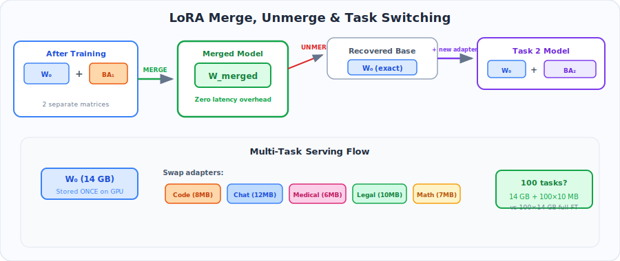

### 2.9.1 Theorem

**Theorem 2.10 (Merge Equivalence).** Let $f\_{\text{LoRA}}(x) = W\_0 x + \frac{\alpha}{r} BAx$ and $f\_{\text{merged}}(x) = W\_{\text{merged}} x$ where $W\_{\text{merged}} = W\_0 + \frac{\alpha}{r} BA$. Then:

$$
\forall x \in \mathbb{R}^k: \quad f\_{\text{LoRA}}(x) = f\_{\text{merged}}(x)
$$

**Proof.**

$$
f\_{\text{merged}}(x) = W\_{\text{merged}} x = \left(W\_0 + \frac{\alpha}{r} BA\right) x
$$

By the distributive law of matrix multiplication:

$$
= W\_0 x + \frac{\alpha}{r} BA x = f\_{\text{LoRA}}(x) \quad \square
$$

### 2.9.2 Unmerge Correctness

**Theorem 2.11 (Unmerge).** If $W\_{\text{merged}} = W\_0 + \frac{\alpha}{r} BA$, then:

$$
W\_0 = W\_{\text{merged}} - \frac{\alpha}{r} BA
$$

recovers the original pre-trained weights exactly (in exact arithmetic).

**Proof.** Direct algebraic manipulation:

$$
W\_{\text{merged}} - \frac{\alpha}{r} BA = \left(W\_0 + \frac{\alpha}{r} BA\right) - \frac{\alpha}{r} BA = W\_0 \quad \square
$$

> **Caveat**: In floating-point arithmetic, merge followed by unmerge introduces small rounding errors of order $\epsilon\_{\text{machine}} \approx 10^{-7}$ (FP32) or $\epsilon \approx 10^{-3}$ (FP16). For critical applications, store $W\_0$ separately.

### 2.9.3 Multi-Adapter Composition

**Theorem 2.12.** Given $T$ trained LoRA adapters $\lbrace (B\_t, A\_t, \alpha\_t, r\_t)\rbrace \_{t=1}^T$, the composed model:

$$
W\_{\text{multi}} = W\_0 + \sum\_{t=1}^{T} \lambda\_t \frac{\alpha\_t}{r\_t} B\_t A\_t
$$

produces the same output as running all adapters simultaneously:

$$
f\_{\text{multi}}(x) = W\_0 x + \sum\_{t=1}^{T} \lambda\_t \frac{\alpha\_t}{r\_t} B\_t A\_t x
$$

**Proof.** Linearity of matrix multiplication:

$$
W\_{\text{multi}} x = W\_0 x + \sum\_{t=1}^{T} \lambda\_t \frac{\alpha\_t}{r\_t} (B\_t A\_t) x = W\_0 x + \sum\_{t=1}^{T} \lambda\_t \frac{\alpha\_t}{r\_t} B\_t (A\_t x) \quad \square
$$

**Rank of the composed update:**

$$
\text{rank}\left(\sum\_{t=1}^{T} \lambda\_t \frac{\alpha\_t}{r\_t} B\_t A\_t\right) \leq \sum\_{t=1}^{T} \text{rank}(B\_t A\_t) \leq \sum\_{t=1}^{T} r\_t
$$

This uses the sub-additivity of rank: $\text{rank}(X + Y) \leq \text{rank}(X) + \text{rank}(Y)$.

**Proof of sub-additivity:**

$$
\text{col}(X + Y) \subseteq \text{col}(X) + \text{col}(Y) \quad (\text{Minkowski sum of subspaces})
$$

$$
\dim(\text{col}(X) + \text{col}(Y)) \leq \dim(\text{col}(X)) + \dim(\text{col}(Y)) = \text{rank}(X) + \text{rank}(Y) \quad \square
$$

---

## 2.10 Intrinsic Dimensionality — Why Low Rank Works

  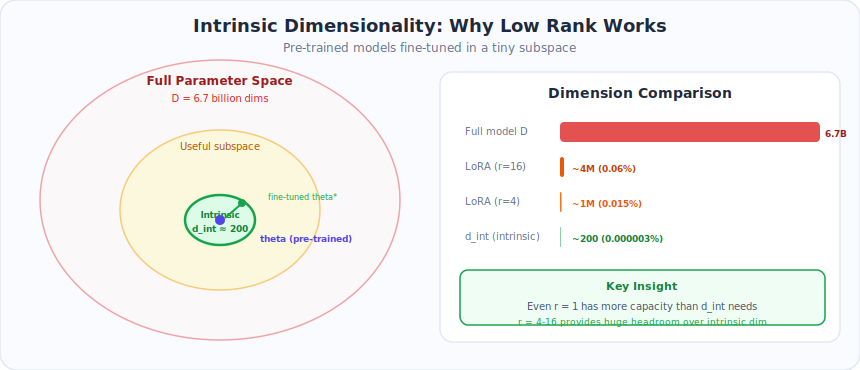

### 2.10.1 The Intrinsic Dimensionality Framework

**Definition (Aghajanyan et al., 2020).** The **intrinsic dimensionality** $d\_{\text{int}}$ of an optimization problem is the minimum number of parameters needed to reach a solution within $\epsilon$ of the full-parameter optimum.

Formally: given a loss landscape $\mathcal{L}(\theta)$ with $\theta \in \mathbb{R}^D$, define a random linear subspace via:

$$
\theta = \theta\_0 + P \phi
$$

where $\theta\_0$ is the pre-trained initialization, $P \in \mathbb{R}^{D \times d}$ is a random projection, and $\phi \in \mathbb{R}^d$.

The intrinsic dimensionality is:

$$
d\_{\text{int}} = \min\left\lbrace d : \min\_\phi \mathcal{L}(\theta\_0 + P\phi) \leq \mathcal{L}^* + \epsilon, \text{ with high probability over } P \right\rbrace 
$$

### 2.10.2 Why Pre-Trained Models Have Low Intrinsic Dimensionality

**Theorem 2.13 (Informal).** Pre-trained language models fine-tuned on downstream tasks have intrinsic dimensionality $d\_{\text{int}} \ll D$, where $D$ is the total parameter count.

**Argument** (following Aghajanyan et al.):

1. **Pre-training concentrates the loss landscape**: The pre-trained weights $\theta\_0$ lie near a region where many downstream tasks can be solved. The loss landscape around $\theta\_0$ has a narrow "valley" aligned with the useful fine-tuning directions.

2. **The Hessian at $\theta\_0$ is approximately low-rank**: Let $H = \nabla^2 \mathcal{L}(\theta\_0)$ be the Hessian. If $H$ has eigenvalue decomposition $H = Q \Lambda Q^T$ with eigenvalues $\lambda\_1 \geq \lambda\_2 \geq \cdots$, and the eigenvalues decay rapidly (i.e., $\lambda\_i \approx 0$ for $i > d\_{\text{int}}$), then optimizing in the top $d\_{\text{int}}$ eigenspace is nearly optimal.

3. **Empirical evidence**:
   - GPT-3 (175B params): $d\_{\text{int}} \approx 200$ for MNLI
   - RoBERTa-Large (355M params): $d\_{\text{int}} \approx 200$ for SST-2
   - The ratio $d\_{\text{int}} / D \approx 10^{-6}$ to $10^{-4}$

### 2.10.3 Connection to LoRA's Rank

LoRA parameterizes the update as $\Delta W = BA$ with rank $r$. For a model with $L$ LoRA layers, each of dimension $d \times k$, the total number of free parameters is:

$$
d\_{\text{LoRA}} = L \cdot r \cdot (d + k)
$$

The intrinsic dimensionality $d\_{\text{int}}$ provides a **lower bound** on how small $d\_{\text{LoRA}}$ can be:

$$
d\_{\text{LoRA}} \geq d\_{\text{int}} \implies r \geq \frac{d\_{\text{int}}}{L(d+k)}
$$

For LLaMA-7B with $L = 128$ (4 projections × 32 layers), $d = k = 4096$, and $d\_{\text{int}} \approx 1000$:

$$
r \geq \frac{1000}{128 \times 8192} \approx 0.001
$$

This confirms that even $r = 1$ should theoretically work, and $r = 4\text{-}16$ provides significant headroom.

---

## 2.11 Generalization Bound — PAC-Bayes and Rademacher

  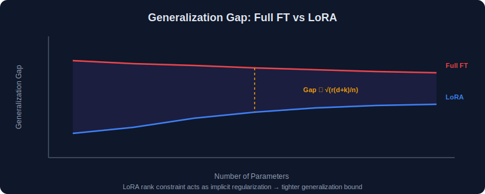

### 2.11.1 Rademacher Complexity Bound

**Theorem 2.14.** Let $\mathcal{H}\_r$ be the hypothesis class of models fine-tuned with LoRA rank $r$. The empirical Rademacher complexity satisfies:

$$
\hat{\mathcal{R}}\_n(\mathcal{H}\_r) \leq \frac{C \sqrt{r(d+k)} \cdot \lVert X\rVert\_F}{\sqrt{n}}
$$

where $C$ is a constant depending on the bound on $\lVert B\rVert\_F, \lVert A\rVert\_F$, $\lVert X\rVert\_F$ is the data norm, and $n$ is the sample size.

**Proof sketch.**

**Step 1**: The Rademacher complexity of a linear class $\lbrace x \mapsto \langle w, x \rangle : \lVert w\rVert \leq R\rbrace$ with data $x\_1, \ldots, x\_n$ is:

$$
\hat{\mathcal{R}}\_n \leq \frac{R \sqrt{\sum\_{i=1}^{n} \lVert x\_i\rVert ^2}}{n} = \frac{R \lVert X\rVert\_F}{n}
$$

**Step 2**: The LoRA update $\Delta W = BA$ can be vectorized as $\text{vec}(\Delta W) = (A^T \otimes I\_d) \text{vec}(B)$. The effective parameter vector has dimension $r(d+k)$ and is bounded by:

$$
\lVert \text{vec}(B, A)\rVert \leq \lVert B\rVert\_F + \lVert A\rVert\_F \leq C'
$$

**Step 3**: Combining, the Rademacher complexity scales as:

$$
\hat{\mathcal{R}}\_n(\mathcal{H}\_r) = O\left(\frac{\sqrt{r(d+k)}}{n}\right) \cdot \text{data-dependent terms}
$$

**Step 4**: By the standard Rademacher generalization bound, with probability $\geq 1 - \delta$:

$$
\mathcal{L}\_{\text{test}} \leq \mathcal{L}\_{\text{train}} + 2\hat{\mathcal{R}}\_n(\mathcal{H}\_r) + 3\sqrt{\frac{\log(2/\delta)}{2n}}
$$

### 2.11.2 Interpretation

$$
\text{Generalization gap} \propto \sqrt{\frac{r(d+k)}{n}}
$$

This gives a principled relationship between rank, model size, and required data:

| To reduce gap by 2× | Options |
|---------------------|---------|
| Reduce rank | $r \to r/4$ |
| Increase data | $n \to 4n$ |
| Decrease model size | $d \to d/4$ (impractical) |

### 2.11.3 PAC-Bayes Bound

**Theorem 2.15 (PAC-Bayes for LoRA, informal).** For a prior $P$ centered at the zero update ($B = 0$) and posterior $Q$ learned via LoRA, with probability $\geq 1 - \delta$ over the training data:

$$
\mathcal{L}\_{\text{test}}(Q) \leq \mathcal{L}\_{\text{train}}(Q) + \sqrt{\frac{\text{KL}(Q \Vert P) + \log(n/\delta)}{2(n-1)}}
$$

The KL divergence term satisfies:

$$
\text{KL}(Q \Vert P) = O\left(\frac{\lVert BA\rVert\_F^2}{\sigma\_P^2}\right)
$$

where $\sigma\_P^2$ is the prior variance. Since LoRA constrains $BA$ to be low-rank:

$$
\lVert BA\rVert\_F^2 \leq \lVert B\rVert\_F^2 \lVert A\rVert\_2^2 \leq \lVert B\rVert\_F^2 \sigma\_1^2(A)
$$

Lower rank and smaller learned weights → smaller KL divergence → tighter generalization bound.

---

## 2.12 rsLoRA Scaling Correction — Proof

  

### 2.12.1 Problem Statement

**Claim (Kalajdzievski, 2024)**: The standard LoRA scaling $\frac{\alpha}{r}$ makes the effective learning rate depend on rank. The corrected scaling $\frac{\alpha}{\sqrt{r}}$ removes this dependence.

### 2.12.2 Effective Learning Rate Analysis

**Theorem 2.16.** Consider the gradient update for $B$ with learning rate $\eta$:

$$
\Delta B = -\eta \frac{\partial \mathcal{L}}{\partial B} = -\eta \cdot \frac{\alpha}{r} \cdot g\_h z^T
$$

where $g\_h = \frac{\partial \mathcal{L}}{\partial h}$ and $z = Ax$.

The resulting change in the output $h$ is:

$$
\delta h = \frac{\alpha}{r} \Delta B \cdot z = -\eta \frac{\alpha^2}{r^2} g\_h z^T z = -\eta \frac{\alpha^2}{r^2} \lVert z\rVert ^2 g\_h
$$

Now, $\lVert z\rVert ^2 = \lVert Ax\rVert ^2$. With proper initialization ($\text{Var}(A\_{ij}) = \frac{1}{k}$):

$$
\mathbb{E}[\lVert z\rVert ^2] = \mathbb{E}\left[\sum\_{\ell=1}^{r} z\_\ell^2\right] = r \cdot \text{Var}(z\_\ell) \cdot \mathbb{E}[\lVert x\rVert ^2/k] = r
$$

(assuming inputs have unit variance per dimension)

Therefore the expected output change:

$$
\mathbb{E}[\lVert \delta h\rVert ] \propto \eta \frac{\alpha^2}{r^2} \cdot r = \eta \frac{\alpha^2}{r}
$$

The **effective learning rate** is $\eta\_{\text{eff}} \propto \frac{\eta \alpha^2}{r}$, which **decreases with** $r$.

### 2.12.3 Correction

With rsLoRA scaling $\frac{\alpha}{\sqrt{r}}$:

$$
\delta h = -\eta \frac{\alpha^2}{r} \lVert z\rVert ^2 g\_h
$$

$$
\mathbb{E}[\lVert \delta h\rVert ] \propto \eta \frac{\alpha^2}{r} \cdot r = \eta \alpha^2
$$

Now $\eta\_{\text{eff}} \propto \eta \alpha^2$, **independent of $r$**. $\square$

### 2.12.4 Summary

| Scaling | Effective LR | Behavior |
|---------|-------------|----------|
| $\frac{\alpha}{r}$ (standard) | $\propto \frac{1}{r}$ | Higher rank → smaller updates → need to increase LR |
| $\frac{\alpha}{\sqrt{r}}$ (rsLoRA) | $\propto 1$ | Rank-independent → no LR adjustment needed |

---

## 2.13 Johnson-Lindenstrauss and Random Projections

  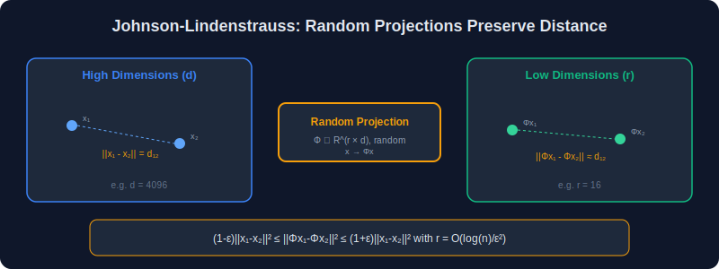

### 2.13.1 Why This Matters for LoRA

In LoRA-FA (Frozen-A), the matrix $A$ is frozen at its random initialization. This works because random projections preserve geometric structure — a fact formalized by the Johnson-Lindenstrauss lemma.

### 2.13.2 Statement and Proof

**Theorem 2.17 (Johnson-Lindenstrauss Lemma).** For any $\epsilon \in (0, 1)$, any set $S$ of $n$ points in $\mathbb{R}^k$, and any integer $r \geq \frac{8 \ln n}{\epsilon^2}$, there exists a linear map $f: \mathbb{R}^k \to \mathbb{R}^r$ such that for all $u, v \in S$:

$$
(1 - \epsilon) \lVert u - v\rVert ^2 \leq \lVert f(u) - f(v)\rVert ^2 \leq (1 + \epsilon) \lVert u - v\rVert ^2
$$

Moreover, $f(x) = \frac{1}{\sqrt{r}} A x$ with $A\_{ij} \sim \mathcal{N}(0, 1)$ works with high probability.

**Proof sketch (for the random construction).**

**Step 1**: Fix two points $u, v \in S$. Let $w = u - v$ and consider $f(w) = \frac{1}{\sqrt{r}} Aw$.

Each coordinate:

$$
(f(w))\_i = \frac{1}{\sqrt{r}} \sum\_{j=1}^{k} A\_{ij} w\_j = \frac{\lVert w\rVert }{\sqrt{r}} \sum\_{j=1}^{k} A\_{ij} \hat{w}\_j
$$

where $\hat{w} = w/\lVert w\rVert$. Since $A\_{ij} \sim \mathcal{N}(0,1)$, the sum $Y\_i = \sum\_j A\_{ij} \hat{w}\_j \sim \mathcal{N}(0, 1)$ (by rotational invariance of Gaussians).

**Step 2**: Therefore:

$$
\lVert f(w)\rVert ^2 = \frac{\lVert w\rVert ^2}{r} \sum\_{i=1}^{r} Y\_i^2
$$

where $Y\_i \sim \mathcal{N}(0,1)$ i.i.d. The sum $\sum Y\_i^2 \sim \chi^2\_r$ (chi-squared with $r$ degrees of freedom), with $\mathbb{E}[\sum Y\_i^2] = r$.

**Step 3**: By concentration of the $\chi^2$ distribution (sub-exponential tail bounds):

$$
\Pr\left[\left|\frac{1}{r}\sum\_{i=1}^{r} Y\_i^2 - 1\right| > \epsilon\right] \leq 2 \exp\left(-\frac{r\epsilon^2}{8}\right)
$$

**Step 4**: This means:

$$
\Pr\left[(1-\epsilon)\lVert w\rVert ^2 \leq \lVert f(w)\rVert ^2 \leq (1+\epsilon)\lVert w\rVert ^2\right] \geq 1 - 2\exp\left(-\frac{r\epsilon^2}{8}\right)
$$

**Step 5**: Union bound over all $\binom{n}{2} \leq n^2$ pairs:

$$
\Pr[\text{all pairs preserved}] \geq 1 - 2n^2 \exp\left(-\frac{r\epsilon^2}{8}\right)
$$

Setting $r \geq \frac{8\ln n}{\epsilon^2} \cdot (2 + c)$ for some constant $c > 0$ makes the failure probability $\leq 2n^{-c}$. $\square$

### 2.13.3 Application to LoRA-FA

In LoRA-FA, $A$ is a random projection from $\mathbb{R}^k \to \mathbb{R}^r$. By JL:
- The projected inputs $\lbrace Ax\_i\rbrace$ preserve the pairwise distances of $\lbrace x\_i\rbrace$
- Therefore, any function learnable from $\lbrace x\_i\rbrace$ is approximately learnable from $\lbrace Ax\_i\rbrace$
- The matrix $B$ then only needs to learn the mapping from the preserved structure in $\mathbb{R}^r$

This justifies why freezing $A$ incurs minimal quality loss.

---

## 2.14 Convergence Analysis

  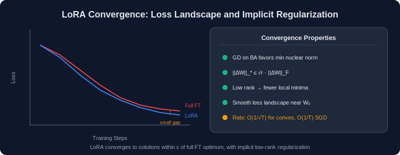

### 2.14.1 LoRA as Overparameterized Low-Rank Optimization

The LoRA objective is:

$$
\min\_{B, A} \mathcal{L}(W\_0 + sBA)
$$

This is a **non-convex** problem even if $\mathcal{L}$ is convex in $W$, because the mapping $(B, A) \mapsto BA$ is bilinear.

### 2.14.2 Gradient Descent Dynamics

**Theorem 2.18 (Implicit Regularization, following Gunasekar et al., 2017).** For the matrix factorization problem $\min\_{B,A} \lVert BA - M\rVert\_F^2$ solved by gradient descent with small learning rate starting from small initialization, the solution converges to the **minimum nuclear norm** solution:

$$
BA^* = \arg\min \lVert X\rVert\_* \quad \text{subject to} \quad X = \text{optimal fit}
$$

where $\lVert X\rVert\_* = \sum\_i \sigma\_i(X)$ is the nuclear norm.

**Proof sketch.**

**Step 1**: The gradient flow ODE for the factorized problem is:

$$
\dot{B} = -\nabla\_B \mathcal{L} = -(BA - M)A^T
$$

$$
\dot{A} = -\nabla\_A \mathcal{L} = -B^T(BA - M)
$$

**Step 2**: Define $W = BA$. Then:

$$
\dot{W} = \dot{B}A + B\dot{A} = -(BA-M)A^TA - B^TB(BA-M)
$$

$$
= -(A^TA + B^TB)(W - M) \quad \text{(approximately, near convergence)}
$$

**Step 3**: The matrix $A^TA + B^TB$ acts as a preconditioner. With small initialization, $B \approx A \approx \epsilon I$, so:

$$
A^TA + B^TB \approx 2\epsilon^2 I + \text{higher order}
$$

The gradient flow with this preconditioner favors solutions with small singular values, which is exactly the nuclear norm minimization.

**Step 4**: The nuclear norm $\lVert X\rVert\_*$ is the convex relaxation of rank, so minimizing it promotes low-rank solutions.

> **Implication for LoRA**: Even if the chosen rank $r$ is larger than necessary, gradient descent on the factored $BA$ form naturally discovers the lowest-rank solution that fits the data. This provides an implicit regularization beyond the explicit rank constraint.

### 2.14.3 Convergence Rate

**Theorem 2.19 (Informal).** Under standard smoothness and bounded gradient assumptions, gradient descent on the LoRA objective with learning rate $\eta = O(1/L)$ (where $L$ is the Lipschitz constant of $\nabla \mathcal{L}$) converges to an $\epsilon$-stationary point in:

$$
T = O\left(\frac{\mathcal{L}(W\_0) - \mathcal{L}^*}{\eta \epsilon^2}\right) = O\left(\frac{L(\mathcal{L}(W\_0) - \mathcal{L}^*)}{\epsilon^2}\right)
$$

iterations, where a point is $\epsilon$-stationary if $\lVert \nabla\_{B,A} \mathcal{L}\rVert\_F \leq \epsilon$.

The convergence rate is the same order as standard gradient descent — the low-rank constraint does not slow down convergence, it only restricts the set of reachable solutions.

---

## 2.15 Summary of All Equations

### Core LoRA Equations

| # | Equation | Description |
|---|----------|-------------|
| 1 | $h = W\_0x + \frac{\alpha}{r}BAx$ | Forward pass |
| 2 | $W\_{\text{eff}} = W\_0 + \frac{\alpha}{r}BA$ | Effective weight |
| 3 | $A^{(0)} \sim \mathcal{N}(0, \sigma^2), \; B^{(0)} = 0$ | Initialization |
| 4 | $\frac{\partial \mathcal{L}}{\partial B} = \frac{\alpha}{r} \frac{\partial \mathcal{L}}{\partial h}(Ax)^T$ | Gradient for B |
| 5 | $\frac{\partial \mathcal{L}}{\partial A} = \frac{\alpha}{r} B^T \frac{\partial \mathcal{L}}{\partial h} x^T$ | Gradient for A |
| 6 | $\frac{\partial \mathcal{L}}{\partial x} = (W\_0 + \frac{\alpha}{r}BA)^T \frac{\partial \mathcal{L}}{\partial h}$ | Gradient for input |
| 7 | $W\_{\text{merged}} = W\_0 + \frac{\alpha}{r}BA$ | Inference merge |
| 8 | $\lvert\theta\rvert = r(d+k)$ | Parameter count |
| 9 | $\rho = \frac{dk}{r(d+k)}$ | Compression ratio |

### Key Theorems Proved

| Theorem | Result |
|---------|--------|
| Rank of product (2.1) | $\text{rank}(AB) \leq \min(\text{rank}(A), \text{rank}(B))$ |
| SVD existence (2.4) | Every matrix has an SVD decomposition |
| Eckart-Young (2.5) | Truncated SVD is the optimal low-rank approximation |
| Rank constraint (2.7) | $\text{rank}(\Delta W) \leq r$ always |
| Zero initialization (2.6.2) | $\Delta W^{(0)} = 0$ exactly |
| Gradient non-degeneracy (2.6.3) | $\nabla\_B \mathcal{L} \neq 0$ at init, $\nabla\_A \mathcal{L} = 0$ at init |
| Variance analysis (2.8-2.9) | Standard scaling: $\text{Var} \propto 1/r$; rsLoRA: $\text{Var} \propto 1$ |
| Merge equivalence (2.10) | Zero inference overhead after merging |
| Multi-adapter rank (2.12) | $\text{rank}(\sum \Delta W\_t) \leq \sum r\_t$ |
| JL lemma (2.17) | Random projections preserve distances |
| Implicit regularization (2.18) | GD on $BA$ favors minimum nuclear norm |
| Generalization (2.14) | Gap $\propto \sqrt{r(d+k)/n}$ |

---

## Key Takeaways

1. **SVD is the foundation** — every matrix can be decomposed into $U \Sigma V^T$, and truncating to rank $r$ gives the provably best approximation (Eckart-Young)
2. **$\Delta W = BA$ is rank-constrained** — with $B \in \mathbb{R}^{d \times r}$ and $A \in \mathbb{R}^{r \times k}$, the update can never exceed rank $r$
3. **Initialization matters** — $B = 0$ ensures $\Delta W^{(0)} = 0$ (no perturbation at start), while Kaiming init for $A$ preserves gradient flow
4. **Scaling $\alpha / r$ stabilizes training** — without it, the LoRA output variance scales proportionally with rank; rsLoRA fixes this with $\alpha / \sqrt{r}$
5. **Merge is lossless** — $h = Wx + BAx = (W + BA)x$, so the adapter adds zero inference cost after merging
6. **Generalization improves** — fewer parameters (rank $r$) means lower Rademacher complexity and tighter PAC-Bayes bounds
7. **Gradient asymmetry** — $\nabla\_B \mathcal{L} \neq 0$ at initialization (B learns first), while $\nabla\_A \mathcal{L} = 0$ (motivating LoRA+)

---

## Navigation

| Previous | Up | Next |
|----------|------|------|
| [← Chapter 1: Introduction](../01-Introduction/README.md) | [Home](../README.md) | [Chapter 3: Types of LoRA →](../03-Types-of-LoRA/README.md) |
