# Chapter 3: Types of LoRA

> A comprehensive catalog of every major LoRA variant, with key ideas, math, and trade-offs.

---

### What You'll Learn

- 16 LoRA variants and what specific problem each one solves
- The mathematical formulation behind each variant
- How to pick the right variant for your use case
- A head-to-head comparison table

### TL;DR

> Not all LoRA is created equal. **QLoRA** lets you fine-tune on a single consumer GPU. **DoRA** improves quality by decomposing magnitude and direction. **AdaLoRA** dynamically allocates rank where it matters. **LoRA+** fixes gradient asymmetry with separate learning rates. **O-LoRA** prevents catastrophic forgetting. Use the **Quick Selection Guide** below to pick the right one.

### Quick Selection Guide

| Your Situation | Best Variant |
|---|---|
| Limited GPU memory (< 16 GB) | **QLoRA** |
| Want best quality, no extra cost | **LoRA+** or **rsLoRA** |
| Quality matters more than memory | **DoRA** |
| Layers need different capacities | **AdaLoRA** |
| Long context (> 8K tokens) | **LongLoRA** |
| Serving many adapters simultaneously | **S-LoRA** |
| Continual learning (multiple tasks sequentially) | **O-LoRA** |
| Faster convergence | **PiSSA** or **OLoRA** |
| General-purpose default | **LoRA** with `r=16, alpha=32` |

---

## Table of Contents

- [3.1 Original LoRA](#31-original-lora)
- [3.2 QLoRA (Quantized LoRA)](#32-qlora-quantized-lora)
- [3.3 AdaLoRA (Adaptive LoRA)](#33-adalora-adaptive-lora)
- [3.4 LoRA+ (LoRA Plus)](#34-lora-lora-plus)
- [3.5 DoRA (Weight-Decomposed LoRA)](#35-dora-weight-decomposed-lora)
- [3.6 GLoRA (Generalized LoRA)](#36-glora-generalized-lora)
- [3.7 LongLoRA](#37-longlora)
- [3.8 S-LoRA (Serving LoRA)](#38-s-lora-serving-lora)
- [3.9 LoRA-FA (Frozen-A)](#39-lora-fa-frozen-a)
- [3.10 Delta-LoRA](#310-delta-lora)
- [3.11 LoRAHub](#311-lorahub)
- [3.12 MultiLoRA / MELoRA](#312-multilora--melora)
- [3.13 rsLoRA (Rank-Stabilized LoRA)](#313-rslora-rank-stabilized-lora)
- [3.14 PiSSA (Principal Singular Values and Singular Vectors Adaptation)](#314-pissa)
- [3.15 O-LoRA (Orthogonal LoRA)](#315-o-lora-orthogonal-lora)
- [3.16 OLoRA (Orthogonal Low-Rank Adaptation)](#316-olora-orthogonal-low-rank-adaptation)
- [3.17 Comparison Table](#317-comparison-table)

---

## 3.1 Original LoRA

<p align="center">
  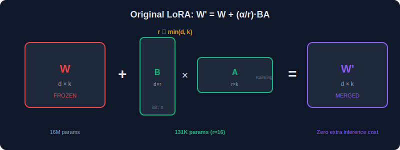
</p>

**Paper**: *LoRA: Low-Rank Adaptation of Large Language Models* (Hu et al., 2021)

### Core Idea

Freeze the pre-trained weight $ W_0 $ and learn a low-rank update:

$$
W = W_0 + \frac{\alpha}{r} BA
$$

### Key Properties
- $ B $ initialized to zero, $ A $ initialized with Kaiming/Gaussian
- Applied to attention projections (Q, V recommended)
- Rank $ r $ typically 4-64
- **Zero** inference latency after merging

### Application to Different Layer Types

LoRA's core equation $W = W_0 + \frac{\alpha}{r}BA$ applies to any linear projection. Here is the mathematical form for each layer type encountered in practice (see Chapter 2, Sections 2.4.5–2.4.7 for full derivations):

**Linear (fully connected) layer** — the most direct application:

$$
y = W_0\, x + b \quad \xrightarrow{\text{LoRA}} \quad y = \left(W_0 + \frac{\alpha}{r}BA\right) x + b
$$

where $W_0 \in \mathbb{R}^{d_{out} \times d_{in}}$, $B \in \mathbb{R}^{d_{out} \times r}$, $A \in \mathbb{R}^{r \times d_{in}}$. The bias $b$ is **not** adapted. The computation splits into a frozen path $W_0 x + b$ and a LoRA path $\frac{\alpha}{r} B(Ax)$ with cost $r(d_{in} + d_{out}) \ll d_{in} \cdot d_{out}$.

**Convolutional layer** — via kernel reshaping:

A kernel $\mathcal{K} \in \mathbb{R}^{C_{out} \times C_{in} \times k_h \times k_w}$ is reshaped to $K \in \mathbb{R}^{C_{out} \times (C_{in} \cdot k_h \cdot k_w)}$, then:

$$
K_{\text{LoRA}} = K_0 + \frac{\alpha}{r}\, B_K\, A_K
$$

where $B_K \in \mathbb{R}^{C_{out} \times r}$ and $A_K \in \mathbb{R}^{r \times (C_{in} \cdot k_h \cdot k_w)}$. The LoRA path is equivalent to a **bottleneck convolution**: $r$ standard filters followed by a $1 \times 1$ pointwise convolution.

**Transformer attention projections** — the primary use case:

For each projection $P \in \lbrace Q, K, V, O\rbrace$ applied to token embedding $x \in \mathbb{R}^d$:

$$
p = W_{P,0}\, x + \frac{\alpha}{r}\, B_P(A_P\, x)
$$

The LoRA correction to the attention score between tokens $i$ and $j$ decomposes as:

$$
q_i^T k_j = \underbrace{q_{0,i}^T k_{0,j}}_{\text{frozen}} + \underbrace{q_{0,i}^T \Delta k_j + \Delta q_i^T k_{0,j}}_{\text{first-order LoRA}} + \underbrace{\Delta q_i^T \Delta k_j}_{O(\alpha^2/r^2)}
$$

**Transformer FFN** — adapting up/down (or gate/up/down) projections:

For SwiGLU FFN (LLaMA-style):

$$
g = W_{\text{gate},0}\, x + \frac{\alpha}{r}\, B_g(A_g x), \quad u = W_{\text{up},0}\, x + \frac{\alpha}{r}\, B_u(A_u x)
$$

$$
\text{FFN}_{\text{LoRA}}(x) = W_{\text{down},0}\, [\text{SiLU}(g) \odot u] + \frac{\alpha}{r}\, B_d(A_d\, [\text{SiLU}(g) \odot u])
$$

The gate and up adapters interact **multiplicatively** through the SwiGLU activation, producing a richer adaptation signal than either alone.

### Which Layers to Adapt

| Configuration | LoRA Targets | Params (LLaMA-7B, r=16) | Quality |
|---|---|---|---|
| Minimal | $W_Q, W_V$ | 8.4M (0.12%) | Good baseline |
| Attention-full | $W_Q, W_K, W_V, W_O$ | 16.8M (0.25%) | Better |
| All projections | + $W_{\text{gate}}, W_{\text{up}}, W_{\text{down}}$ | 40.0M (0.60%) | Best |

### Limitations
- Fixed rank across all layers (may be suboptimal)
- No awareness of which layers need more capacity
- Scaling factor tuning can be tricky

---

## 3.2 QLoRA (Quantized LoRA)

**Paper**: *QLoRA: Efficient Finetuning of Quantized Language Models* (Dettmers et al., 2023)

<p align="center">
  
</p>

### Core Idea

Combine **4-bit quantization** of the base model with LoRA adapters in higher precision:

$$
h = \text{Dequant}(W_0^{\text{4bit}}) \cdot x + \frac{\alpha}{r} BAx
$$

### Key Innovations

1. **4-bit NormalFloat (NF4)**: A new data type optimal for normally-distributed weights

$$
\text{NF4}: \text{quantile}_{i} = \Phi^{-1}\left(\frac{i}{2^k + 1}\right), \quad k = 4
$$

where $ \Phi^{-1} $ is the inverse normal CDF.

2. **Double Quantization**: Quantize the quantization constants themselves

$$
W^{\text{4bit}} = \text{round}\left(\frac{W_0}{s}\right), \quad s = \text{absmax}(W_0^{\text{block}}) / 7
$$

Then quantize $ s $ with 8-bit:

$$
s^{\text{8bit}} = \text{round}\left(\frac{s}{s_s}\right)
$$

3. **Paged Optimizers**: Use CPU offloading with unified memory to handle memory spikes

### Memory Savings

| Method | 7B Model Memory |
|--------|----------------|
| Full fine-tuning (FP16) | ~120 GB (with optimizer states) |
| LoRA (FP16 base) | ~14 GB |
| QLoRA (4-bit base) | **~6 GB** |

### Trade-offs
- Slightly slower training due to dequantization
- Negligible quality loss compared to FP16 LoRA
- Enables fine-tuning 65B models on a single 48GB GPU

---

## 3.3 AdaLoRA (Adaptive LoRA)

**Paper**: *Adaptive Budget Allocation for Parameter-Efficient Fine-Tuning* (Zhang et al., 2023)

<p align="center">
  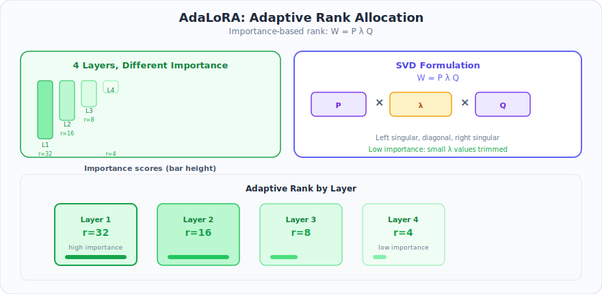
</p>

### Core Idea

Instead of using the same rank for all layers, **dynamically allocate rank** based on importance:

$$
\Delta W = P \Lambda Q
$$

where:
- $ P \in \mathbb{R}^{d \times r} $ — left singular vectors (orthogonal)
- $ \Lambda = \text{diag}(\lambda_1, \ldots, \lambda_r) $ — singular values (importance scores)
- $ Q \in \mathbb{R}^{r \times k} $ — right singular vectors (orthogonal)

### Importance Scoring

The importance of each singular value triplet $ (\mathbf{p}_i, \lambda_i, \mathbf{q}_i) $ is measured by:

$$
S_i = \lambda_i + \beta_1 \cdot \|\nabla_{\lambda_i} \mathcal{L}\| + \beta_2 \cdot \lambda_i \cdot \|\nabla_{\lambda_i} \mathcal{L}\|
$$

Low-importance components are pruned (set $ \lambda_i = 0 $), reallocating the rank budget to more important layers.

### Rank Scheduling

AdaLoRA starts with a high initial rank and progressively prunes:

$$
r^{(t)} = r_{\text{init}} - \lfloor t / T_{\text{prune}} \rfloor \cdot \Delta r
$$

until the total parameter budget is met.

### Benefits
- Layers that need more expressiveness get higher rank
- Total parameter budget is the same, but distributed optimally
- Typically outperforms uniform-rank LoRA

---

## 3.4 LoRA+ (LoRA Plus)

<p align="center">
  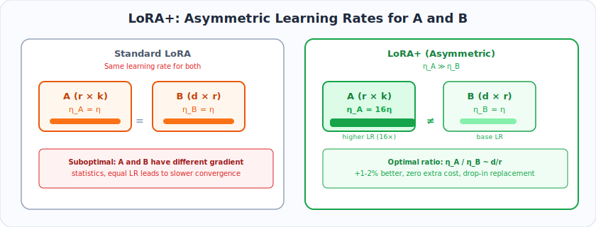
</p>

**Paper**: *LoRA+: Efficient Low Rank Adaptation of Large Models* (Hayou et al., 2024)

### Core Idea

Use **different learning rates** for matrices $ A $ and $ B $:

$$
\eta_B = \eta, \quad \eta_A = \lambda \cdot \eta, \quad \lambda \gg 1
$$

### Mathematical Justification

The authors show that in the standard LoRA parameterization, the optimal learning rate ratio scales as:

$$
\frac{\eta_A}{\eta_B} \propto \frac{d}{r}
$$

Using equal learning rates (as in original LoRA) leads to **suboptimal convergence** because:
- $ A \in \mathbb{R}^{r \times k} $ has different gradient statistics than $ B \in \mathbb{R}^{d \times r} $
- The feature learning dynamics of $ A $ and $ B $ operate at different scales

### Practical Impact
- Typical ratio: $ \lambda = 16 $ (i.e., $ \eta_A = 16 \times \eta_B $)
- **1-2% improvement** on most benchmarks
- No additional parameters or compute
- Drop-in replacement for standard LoRA

---

## 3.5 DoRA (Weight-Decomposed LoRA)

**Paper**: *DoRA: Weight-Decomposed Low-Rank Adaptation* (Liu et al., 2024)

<p align="center">
  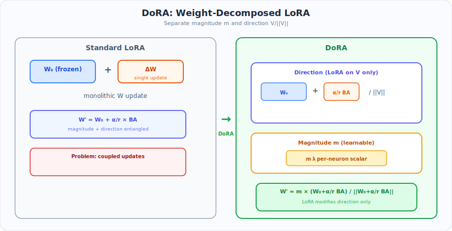
</p>

### Core Idea

Decompose the weight into **magnitude** and **direction** components, then apply LoRA only to the direction:

$$
W' = m \cdot \frac{W_0 + \frac{\alpha}{r}BA}{\|W_0 + \frac{\alpha}{r}BA\|_c}
$$

where:
- $ m \in \mathbb{R}^{d} $ — learnable magnitude vector (one scalar per output neuron)
- $ \|\cdot\|_c $ — column-wise norm
- $ W_0 + \frac{\alpha}{r}BA $ — the directional component (adapted with LoRA)

### Mathematical Decomposition

Any weight matrix can be decomposed as:

$$
W = \underbrace{\|W\|_c}_{\text{magnitude}} \cdot \underbrace{\frac{W}{\|W\|_c}}_{\text{direction}}
$$

DoRA separately adapts:
1. **Direction**: via LoRA on the full weight → captures "what features to use"
2. **Magnitude**: via direct learning of $ m $ → captures "how strongly to activate"

### Why It Works Better

The authors show that full fine-tuning naturally decomposes into magnitude and direction changes. Standard LoRA entangles these two, limiting its expressiveness. DoRA's decomposition allows:
- Negative magnitude changes (rare in standard LoRA)
- Independent control of feature importance vs. feature selection

### Performance
- Consistently outperforms LoRA by **0.5-2%** on various benchmarks
- Minimal overhead: only $ d $ additional parameters per layer for magnitude
- Works with QLoRA (QDoRA)

---

## 3.6 GLoRA (Generalized LoRA)

<p align="center">
  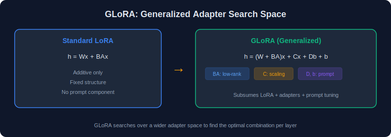
</p>

**Paper**: *One-for-All: Generalized LoRA for Parameter-Efficient Fine-tuning* (Chavan et al., 2024)

### Core Idea

Generalize LoRA to include additional learnable transformations:

$$
h = (W_0 + BA) \cdot (x + Cx) + D \cdot x + b
$$

where $ C $, $ D $ are additional low-rank adapters and $ b $ is a bias term.

### Expanded Formulation

GLoRA subsumes several PEFT methods:
- **Set C=0, D=0, b=0**: Standard LoRA
- **Set A=0, B=0**: Adapter-style tuning
- **Various combinations**: Novel adaptation strategies

The optimizer can learn to use any combination, effectively searching over the PEFT design space.

---

## 3.7 LongLoRA

<p align="center">
  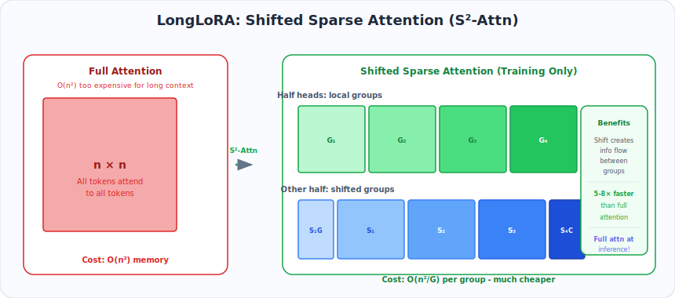
</p>

**Paper**: *LongLoRA: Efficient Fine-tuning of Long-Context Large Language Models* (Chen et al., 2024)

### Core Idea

Extend context length efficiently using LoRA with **shifted sparse attention** (S²-Attn):

### Shifted Sparse Attention

Instead of full attention over the extended context, split the attention into groups with shifts:

$$
\text{Attn}_{\text{S}^2}(Q, K, V) = \text{Concat}(\text{Attn}_{\text{group}_1}, \ldots, \text{Attn}_{\text{group}_G})
$$

where:
- Half the attention heads attend to their local group
- The other half attend to a **shifted** grouping (offset by half the group size)
- This creates information flow between groups without full attention cost

### Key Results
- Extend context from 4K to **100K+** tokens
- Training is **5-8x** faster than full attention fine-tuning
- Quality approaches full attention fine-tuning
- At inference, still uses **full attention** (S²-Attn is training-only)

---

## 3.8 S-LoRA (Serving LoRA)

<p align="center">
  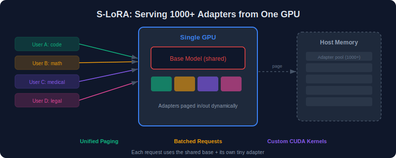
</p>

**Paper**: *S-LoRA: Serving Thousands of Concurrent LoRA Adapters* (Sheng et al., 2023)

### Core Idea

Efficiently serve **thousands** of LoRA adapters simultaneously from a single base model in production:

### Architecture

```
Shared Base Model (GPU Memory)
    │
    ├── LoRA Adapter Pool (CPU + GPU)
    │   ├── Adapter 1 (Task A)
    │   ├── Adapter 2 (Task B)
    │   ├── ...
    │   └── Adapter N (Task N)
    │
    └── Unified Paging (dynamic adapter loading)
```

### Key Innovations
1. **Unified Paging**: Store adapters in a paged memory system (similar to vLLM's PagedAttention)
2. **Heterogeneous Batching**: Batch requests using different adapters together
3. **Custom CUDA Kernels**: Fused operations for batched LoRA computation

### Batched LoRA Forward

For a batch with $ T $ different adapters:

$$
H = W_0 X + \text{BatchedLoRA}(X, \lbrace B_t, A_t\rbrace_{t=1}^{T})
$$

where $ \text{BatchedLoRA} $ applies the correct adapter to each sample in the batch.

---

## 3.9 LoRA-FA (Frozen-A)

<p align="center">
  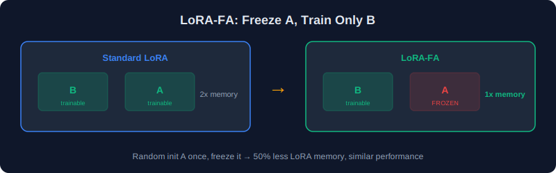
</p>

**Paper**: *LoRA-FA: Memory-efficient Low-rank Adaptation for Large Language Models Fine-tuning* (Zhang et al., 2023)

### Core Idea

Freeze matrix $ A $ after initialization and **only train** $ B $:

$$
\Delta W = B \cdot A_{\text{frozen}}
$$

### Why Freeze A?

- $ A $ projects the input into the low-rank space — this random projection is sufficient
- Only $ B $ needs to learn the task-specific mapping
- Reduces trainable parameters by **50%** and memory by nearly the same

### Mathematical Justification

Random projections preserve pairwise distances (Johnson-Lindenstrauss lemma):

$$
(1-\epsilon)\|x - y\|^2 \leq \|Ax - Ay\|^2 \leq (1+\epsilon)\|x - y\|^2
$$

So a random $ A $ is a valid projection into the low-rank space, and only $ B $ needs optimization.

### Performance
- **<1% degradation** compared to full LoRA on most benchmarks
- **~50% memory reduction** in optimizer states
- Particularly effective for very large models

---

## 3.10 Delta-LoRA

<p align="center">
  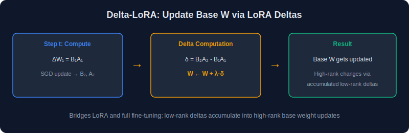
</p>

**Paper**: *Delta-LoRA: Fine-Tuning High-Rank Parameters with the Delta of Low-Rank Matrices* (Zi et al., 2023)

### Core Idea

Use the **change** in LoRA weights to also update the frozen pre-trained weights:

$$
W_0^{(t+1)} = W_0^{(t)} + \lambda \left(B^{(t)}A^{(t)} - B^{(t-1)}A^{(t-1)}\right)
$$

### Mathematical Formulation

At each training step:
1. Update $ B $ and $ A $ via gradient descent as usual
2. Compute the delta: $ \Delta = B^{(t)}A^{(t)} - B^{(t-1)}A^{(t-1)} $
3. Apply this delta to the pre-trained weights: $ W_0 \leftarrow W_0 + \lambda \Delta $

### Why It Works
- The rank constraint of LoRA limits the expressiveness of $ \Delta W $
- By propagating LoRA updates into $ W_0 $, the effective update is **no longer rank-constrained**
- Over time, $ W_0 $ accumulates full-rank updates through many small rank-$ r $ steps

### Trade-offs
- Better performance than standard LoRA
- Slightly more memory (need to store previous $ B, A $)
- $ W_0 $ is no longer shared across tasks after training

---

## 3.11 LoRAHub

<p align="center">
  
</p>

**Paper**: *LoRAHub: Efficient Cross-Task Generalization via Dynamic LoRA Composition* (Huang et al., 2024)

### Core Idea

Compose multiple pre-trained LoRA adapters for new tasks **without additional training**:

$$
\Delta W_{\text{new}} = \sum_{i=1}^{N} w_i \cdot B_i A_i
$$

where $ w_i $ are scalar blending weights optimized on a few examples of the new task.

### Optimization

The weights are found by minimizing loss on a small set of examples:

$$
\mathbf{w}^* = \arg\min_{\mathbf{w}} \frac{1}{|D_{\text{new}}|} \sum_{(x,y) \in D_{\text{new}}} \mathcal{L}\left(f_{W_0 + \sum w_i B_i A_i}(x), y\right)
$$

This is a **low-dimensional optimization** (just $ N $ scalar weights), solvable in minutes.

---

## 3.12 MultiLoRA / MELoRA

<p align="center">
  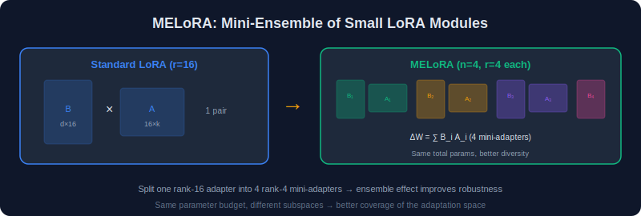
</p>

### MELoRA (Mini-Ensemble LoRA)

**Paper**: *MELoRA: Mini-Ensemble Low-Rank Adapters for Parameter-Efficient Fine-Tuning* (Ren et al., 2024)

### Core Idea

Use multiple parallel mini LoRA modules instead of one large one:

$$
\Delta W = \sum_{i=1}^{n} B_i A_i, \quad \text{where each } r_i \text{ is very small}
$$

### Benefits
- Each mini adapter captures different aspects of the task
- Ensemble effect improves robustness
- Same total parameter count, but better utilization
- Total rank: $ r_{\text{eff}} = \sum_i r_i $, but the factored form provides regularization

---

## 3.13 rsLoRA (Rank-Stabilized LoRA)

<p align="center">
  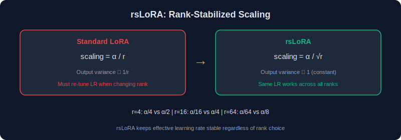
</p>

**Paper**: *A Rank Stabilization Scaling Factor for Fine-Tuning with LoRA* (Kalajdzievski, 2024)

### Core Idea

Replace the standard $ \frac{\alpha}{r} $ scaling with $ \frac{\alpha}{\sqrt{r}} $:

$$
h = W_0 x + \frac{\alpha}{\sqrt{r}} BAx
$$

### Mathematical Motivation

The output variance of the LoRA component:

$$
\text{Var}(BAx) \propto r \cdot \text{Var}(B_{ij}) \cdot \text{Var}(A_{jk}) \cdot \text{Var}(x_k)
$$

With standard scaling $ \frac{\alpha}{r} $:

$$
\text{Var}\left(\frac{\alpha}{r} BAx\right) \propto \frac{\alpha^2}{r^2} \cdot r = \frac{\alpha^2}{r}
$$

This **decreases** with $ r $, meaning higher ranks produce smaller updates — suboptimal.

With $ \frac{\alpha}{\sqrt{r}} $:

$$
\text{Var}\left(\frac{\alpha}{\sqrt{r}} BAx\right) \propto \frac{\alpha^2}{r} \cdot r = \alpha^2
$$

Now the output variance is **independent of rank**, enabling stable training across different rank choices.

### Practical Impact
- Particularly beneficial when using **high rank** (r > 64)
- Eliminates the need to retune learning rate when changing rank
- Available in HuggingFace PEFT via `use_rslora=True`

---

## 3.14 PiSSA

<p align="center">
  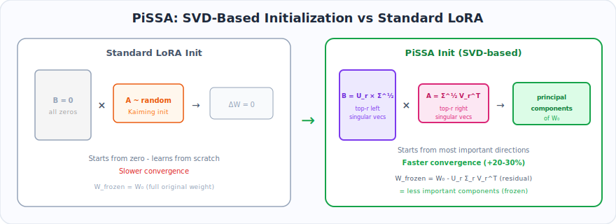
</p>

**Paper**: *PiSSA: Principal Singular Values and Singular Vectors Adaptation of Large Language Models* (Meng et al., 2024)

### Core Idea

Instead of initializing LoRA randomly, initialize with the **principal components** of the pre-trained weight:

$$
W_0 = U_r \Sigma_r V_r^T + W_{\text{res}}
$$

- Train: $ \Delta W = B A $ initialized from $ U_r \Sigma_r^{1/2} $ and $ \Sigma_r^{1/2} V_r^T $
- Freeze: $ W_{\text{res}} $ (the residual after removing top-$ r $ SVD components)

### Mathematical Details

Perform SVD on the pre-trained weight:

$$
W_0 = U \Sigma V^T
$$

Initialize:

$$
B^{(0)} = U_r \Sigma_r^{1/2}, \quad A^{(0)} = \Sigma_r^{1/2} V_r^T
$$

Frozen residual:

$$
W_{\text{res}} = W_0 - B^{(0)} A^{(0)} = \sum_{i=r+1}^{p} \sigma_i \mathbf{u}_i \mathbf{v}_i^T
$$

### Why It Works
- The principal components capture the most important "directions" in the weight
- Training starts from a meaningful initialization rather than near-zero
- Converges faster and often achieves better final performance
- Particularly effective for smaller ranks

---

## 3.15 O-LoRA (Orthogonal LoRA)

**Paper**: *O-LoRA: Orthogonal Low-Rank Adaptation of Large Language Models* (Wang et al., 2023)

<p align="center">
  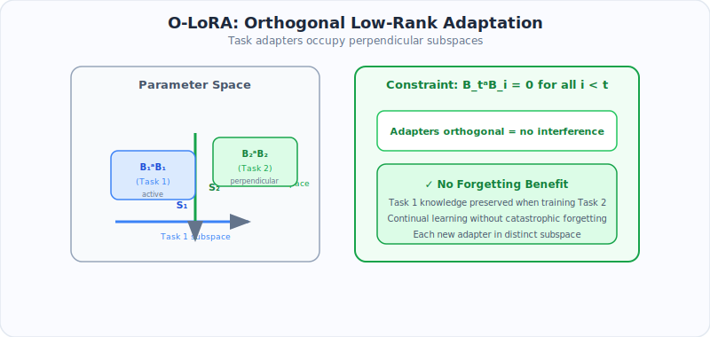
</p>

### Core Idea

When training LoRA adapters **sequentially** for multiple tasks, constrain each new adapter to lie in a subspace **orthogonal** to all previously learned adapters. This prevents catastrophic forgetting without replaying old data.

### Mathematical Formulation

Given previously learned adapters $ \lbrace(B_1, A_1), (B_2, A_2), \ldots, (B_{t-1}, A_{t-1})\rbrace $ for tasks $ 1 $ through $ t-1 $, the new adapter $ (B_t, A_t) $ for task $ t $ must satisfy:

**Orthogonality constraint on B (output space):**

$$
B_t^T B_i = \mathbf{0} \quad \forall \, i < t
$$

**Orthogonality constraint on A (input space):**

$$
A_t A_i^T = \mathbf{0} \quad \forall \, i < t
$$

### Why Orthogonality Prevents Forgetting

**Theorem.** If $ B_t^T B_i = 0 $ and $ A_t A_i^T = 0 $ for all $ i < t $, then the update for task $ t $ does not alter the output for inputs in the subspace of previous tasks.

**Proof.**

Consider an input $ x $ that lies in the subspace captured by previous adapter $ A_i $, i.e., $ A_i x \neq 0 $. The output contribution from task $ t $'s adapter is:

$$
\Delta h_t = B_t A_t x
$$

For this to not interfere with task $ i $'s representation, we need the new update to be orthogonal to the old update in output space. Since $ B_t^T B_i = 0 $, the columns of $ B_t $ are orthogonal to the columns of $ B_i $. Therefore:

$$
B_i^T \Delta h_t = B_i^T B_t (A_t x) = \mathbf{0} \cdot (A_t x) = \mathbf{0}
$$

The new adapter's output has **zero projection** onto the subspace used by any previous adapter. $ \square $

### Enforcing Orthogonality in Practice

**Method 1: Regularization Loss**

Add a soft orthogonality penalty to the training loss:

$$
\mathcal{L}_{\text{total}} = \mathcal{L}_{\text{task}} + \lambda_B \sum_{i < t} \|B_t^T B_i\|_F^2 + \lambda_A \sum_{i < t} \|A_t A_i^T\|_F^2
$$

where $ \lambda_B, \lambda_A > 0 $ control the strength of the orthogonality constraint.

**Method 2: Projection (Hard Constraint)**

After each gradient step, project $ B_t $ and $ A_t $ onto the orthogonal complement:

$$
B_t \leftarrow B_t - \sum_{i < t} B_i (B_i^T B_t) \cdot (B_i^T B_i)^{-1}
$$

$$
A_t \leftarrow A_t - \sum_{i < t} (A_t A_i^T) \cdot (A_i A_i^T)^{-1} A_i
$$

If the previous $ B_i $ have orthonormal columns, this simplifies to:

$$
B_t \leftarrow B_t - \sum_{i < t} B_i B_i^T B_t
$$

### Capacity Budget

**Key limitation**: With rank $ r $ per task and ambient dimension $ d $, at most $ \lfloor d / r \rfloor $ tasks can have strictly orthogonal adapters.

For $ d = 4096, r = 16 $: up to **256 tasks** can be accommodated — more than sufficient for most settings.

### Performance
- Eliminates catastrophic forgetting for sequential task learning
- No need for experience replay or task-specific data retention
- Slight overhead from orthogonality projection (negligible for small $ r $)
- Quality per task matches standard LoRA when sufficient capacity remains

---

## 3.16 OLoRA (Orthogonal Low-Rank Adaptation)

<p align="center">
  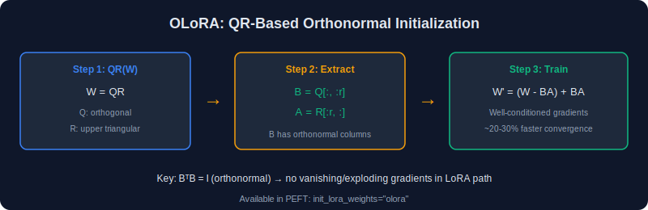
</p>

**Paper**: *OLoRA: Orthonormal Low-Rank Adaptation of Large Language Models* (Büyükakyüz, 2024)

### Core Idea

Initialize LoRA matrices using **QR decomposition** of the pre-trained weight to get orthonormal starting points, improving training stability and convergence:

$$
W_0 = QR
$$

where $ Q \in \mathbb{R}^{d \times d} $ is orthogonal and $ R \in \mathbb{R}^{d \times k} $ is upper triangular.

### Mathematical Formulation

**Step 1: QR factorization of the pre-trained weight:**

$$
W_0 = QR
$$

**Step 2: Initialize LoRA matrices from Q and R:**

$$
B^{(0)} = Q_r \in \mathbb{R}^{d \times r}, \quad A^{(0)} = R_r \in \mathbb{R}^{r \times k}
$$

where $ Q_r $ is the first $ r $ columns of $ Q $ and $ R_r $ is the first $ r $ rows of $ R $.

**Step 3: Store the residual as frozen weight:**

$$
W_{\text{res}} = W_0 - B^{(0)} A^{(0)}
$$

The forward pass becomes:

$$
h = W_{\text{res}} \, x + B A x
$$

### Why QR Instead of SVD (PiSSA)?

| Property | PiSSA (SVD-based) | OLoRA (QR-based) |
|----------|------------------|-----------------|
| Initialization cost | $ O(\min(d,k) \cdot dk) $ | $ O(dk \cdot \min(d,k)) $ — but typically faster in practice |
| Orthonormality | $ U_r $ orthonormal, $ V_r $ orthonormal | $ Q_r $ orthonormal |
| Captures most variance? | Yes (by definition of SVD) | Not necessarily — captures a valid basis |
| Training stability | Very good | Excellent (orthonormal columns of $ B $) |
| Gradient conditioning | Good | Better — QR preserves condition number |

### Key Property: Orthonormality of B

Since $ Q_r $ has orthonormal columns:

$$
(B^{(0)})^T B^{(0)} = Q_r^T Q_r = I_r
$$

**Proof.** $ Q $ is orthogonal, so $ Q^T Q = I $. The first $ r $ columns $ Q_r $ satisfy:

$$
(Q_r)_{ij} = Q_{ij}, \quad i = 1, \ldots, d, \quad j = 1, \ldots, r
$$

$$
(Q_r^T Q_r)_{ij} = \sum_{k=1}^{d} (Q_r)_{ki} (Q_r)_{kj} = \sum_{k=1}^{d} Q_{ki} Q_{kj} = (Q^T Q)_{ij} = \delta_{ij} \quad \square
$$

This means:
- The initial columns of $ B $ span an orthonormal basis in $ \mathbb{R}^d $
- The gradient w.r.t. $ B $ is well-conditioned from the start
- No vanishing/exploding gradient issues in the LoRA path at initialization

### Performance
- Faster convergence than random initialization LoRA (by ~20-30% fewer steps)
- Comparable to PiSSA but with simpler implementation
- Works especially well for moderate ranks ($ r = 8\text{-}64 $)
- Available in HuggingFace PEFT via `init_lora_weights="olora"`

---

## 3.17 Comparison Table

<p align="center">
  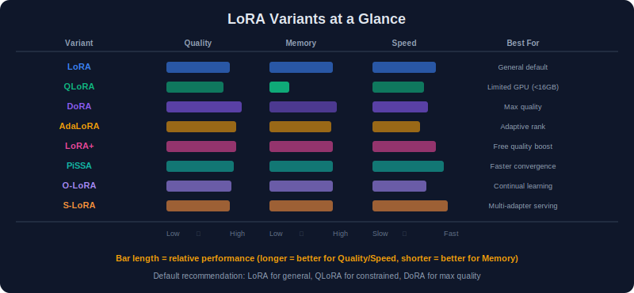
</p>

| Variant | Year | Key Innovation | Extra Params | Extra Compute | Memory vs LoRA |
|---------|------|---------------|--------------|---------------|----------------|
| **LoRA** | 2021 | Low-rank weight update | Baseline | Baseline | Baseline |
| **QLoRA** | 2023 | 4-bit base model quantization | None | +dequant | **~60% less** |
| **AdaLoRA** | 2023 | Adaptive rank allocation | SVD params | +importance scoring | Similar |
| **LoRA+** | 2024 | Asymmetric learning rates | None | None | Same |
| **DoRA** | 2024 | Magnitude-direction decomposition | +d per layer | +norm computation | Slightly more |
| **GLoRA** | 2024 | Generalized adapter search | +C, D, b | More | More |
| **LongLoRA** | 2024 | Shifted sparse attention | None | Less (training) | Less |
| **S-LoRA** | 2023 | Efficient multi-adapter serving | None | System-level | System-level |
| **LoRA-FA** | 2023 | Freeze A matrix | **50% less** | Same | **~50% less** |
| **Delta-LoRA** | 2023 | Update pre-trained weights via delta | +prev B,A | +delta compute | Slightly more |
| **LoRAHub** | 2024 | Compose adapters for new tasks | None | Minimal | Same |
| **MELoRA** | 2024 | Mini-ensemble of LoRA modules | Same | Same | Same |
| **rsLoRA** | 2024 | Rank-stabilized scaling ( $\sqrt{r} $) | None | None | Same |
| **PiSSA** | 2024 | SVD-based initialization | None | +SVD (one-time) | Same |
| **O-LoRA** | 2023 | Orthogonal continual learning | +projection | +orthog. constraint | Same |
| **OLoRA** | 2024 | QR-based orthonormal initialization | None | +QR (one-time) | Same |

---

## Choosing the Right Variant

<p align="center">
  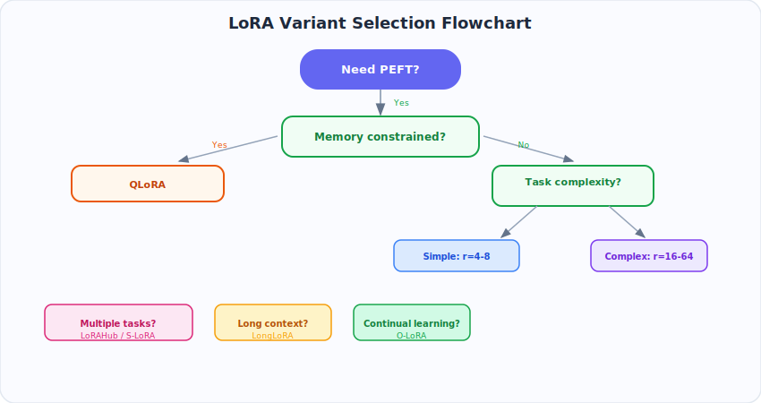
</p>

---

## Key Takeaways

1. **Original LoRA** remains the best default — simple, effective, and universally supported
2. **QLoRA** is the go-to for memory-constrained setups (4-bit quantization + LoRA on a single 24 GB GPU)
3. **DoRA** consistently outperforms LoRA by ~1-2% by separating weight magnitude from direction
4. **LoRA+** is a free lunch — just use different learning rates for A and B (`lr_B = 2-8x × lr_A`)
5. **rsLoRA** fixes rank-dependent scaling so you can change rank without re-tuning learning rate
6. **AdaLoRA** is best when you suspect some layers matter more than others
7. **O-LoRA** is essential for continual learning scenarios where you add tasks over time
8. **PiSSA** and **OLoRA** improve convergence speed through better initialization
9. Most variants are **composable** — e.g., QLoRA + rsLoRA + LoRA+ all work together

---

## Navigation

| Previous | Up | Next |
|----------|------|------|
| [← Chapter 2: Mathematics](../02-Mathematics/README.md) | [Home](../README.md) | [Chapter 4: Implementation →](../04-Implementation/README.md) |
