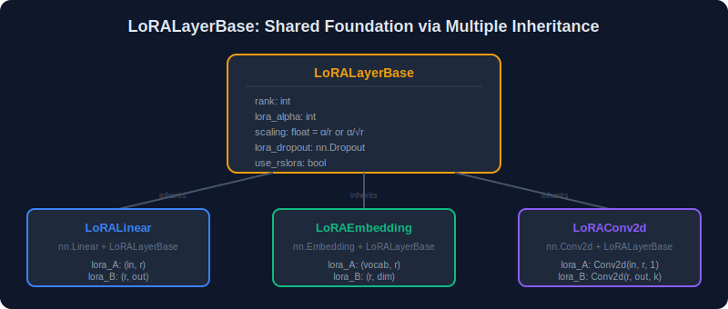
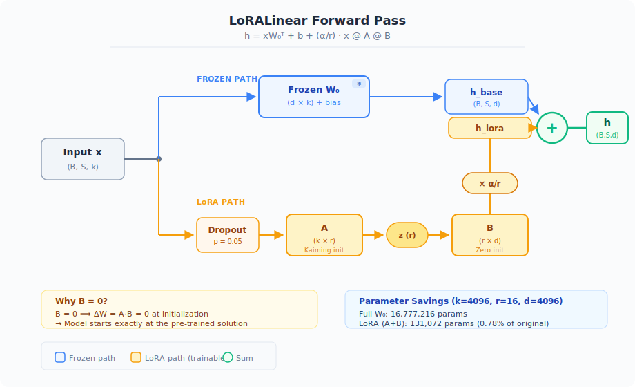
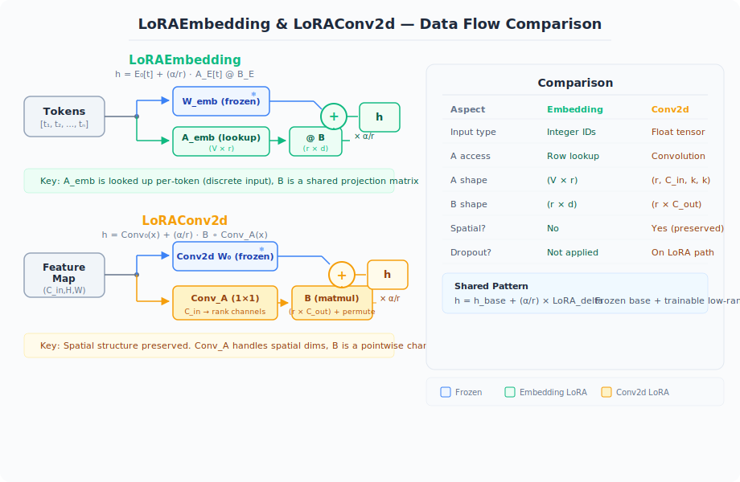
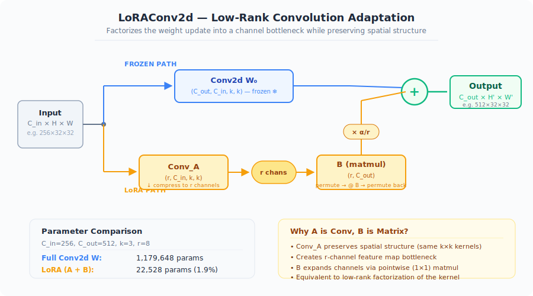
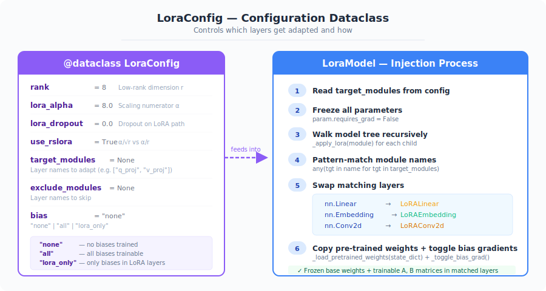
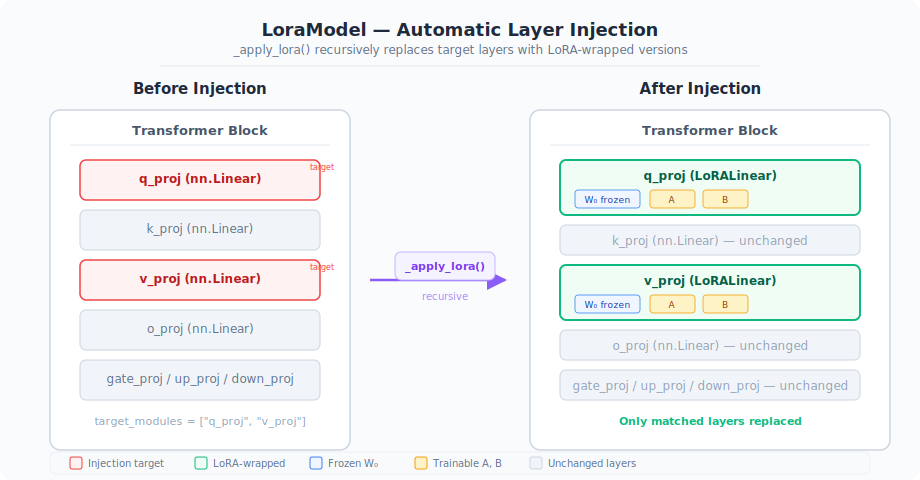
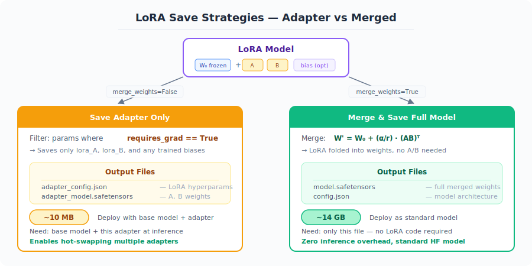
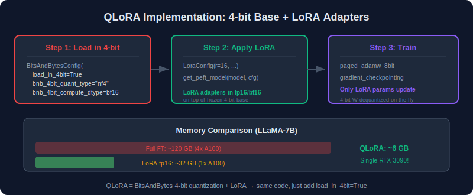
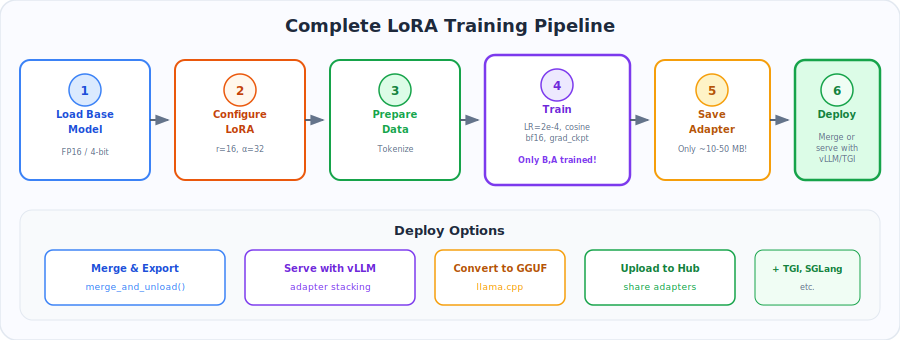
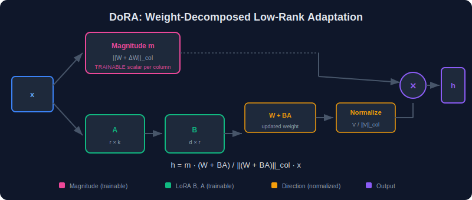

# Chapter 4: Implementation — Line-by-Line LoRA from Scratch

> A complete, production-quality LoRA implementation in PyTorch — every line explained, every design decision justified.
>
> **Reference**: Inspired by [priyammaz/PyTorch-Adventures](https://github.com/priyammaz/PyTorch-Adventures/blob/main/PyTorch%20Tools/LoRA/lora.py) and the [original Microsoft LoRA repo](https://github.com/microsoft/LoRA/).

---

### What You'll Learn

- How to build a complete LoRA library from scratch in ~300 lines of PyTorch
- The design patterns behind `LoRALinear`, `LoRAEmbedding`, and `LoRAConv2d`
- How the automatic injection wrapper (`LoraModel`) replaces standard layers
- Merging adapters back into base weights for zero-overhead inference
- Using HuggingFace PEFT for production training (QLoRA, DoRA included)

### TL;DR

> LoRA is surprisingly simple to implement. The core is a `LoRALinear` class (~40 lines) that adds a trainable `A @ B` branch to a frozen `nn.Linear`. A `LoraModel` wrapper walks any model's module tree and swaps matching layers. After training, `merged_weight = W + (α/r) · BA` produces a standard `nn.Linear` with zero overhead. This chapter builds every piece from scratch, then shows how to use HuggingFace PEFT for production.

---

## Table of Contents

- [4.1 LoRALayerBase — The Foundation](#41-loralayerbase--the-foundation)
- [4.2 LoRALinear — Core Implementation](#42-loralinear--core-implementation)
- [4.3 LoRAEmbedding — Vocabulary Adaptation](#43-loraembedding--vocabulary-adaptation)
- [4.4 LoRAConv2d — Vision Model Adaptation](#44-loraconv2d--vision-model-adaptation)
- [4.5 LoraConfig — Configuration Dataclass](#45-loraconfig--configuration-dataclass)
- [4.6 LoraModel — Automatic Injection Wrapper](#46-loramodel--automatic-injection-wrapper)
- [4.7 HuggingFace PEFT Library](#47-huggingface-peft-library)
- [4.8 QLoRA Implementation](#48-qlora-implementation)
- [4.9 Complete Training Pipeline](#49-complete-training-pipeline)
- [4.10 Merging and Exporting](#410-merging-and-exporting)
- [4.11 DoRA Implementation](#411-dora-implementation)

---

## 4.1 LoRALayerBase — The Foundation

<p align="center">
  
</p>

Every LoRA layer (Linear, Embedding, Conv2d) shares the same hyperparameters: rank, alpha, scaling, and dropout. We extract these into a **base class** using Python's multiple inheritance.

### Mathematical Foundation: The Scaling Factor

Every LoRA layer requires a scaling constant $s$ that normalizes the adapter output. The choice of $s$ determines how output variance depends on rank $r$.

**Standard LoRA scaling.** Given the adapter output $\Delta h = s \cdot BAx$ with $B \in \mathbb{R}^{d \times r}$, $A \in \mathbb{R}^{r \times k}$, if entries have typical learned variance $\sigma\_B^2$ and $\sigma\_A^2$ respectively, the output variance per element is:

$$
\text{Var}(\Delta h_i) = s^2 \cdot r \cdot k \cdot \sigma_B^2 \cdot \sigma_A^2
$$

**Derivation.** Each element of $w = BAx$ is $w\_i = \sum\_{\ell=1}^{r} B\_{i\ell} \sum\_{j=1}^{k} A\_{\ell j} x\_j$. By independence:

$$
\text{Var}(w_i) = r \cdot \sigma_B^2 \cdot k \cdot \sigma_A^2 \cdot \text{Var}(x_j) = r \cdot k \cdot \sigma_B^2 \cdot \sigma_A^2
$$

With standard scaling $s = \alpha / r$:

$$
\text{Var}(\Delta h_i) = \frac{\alpha^2}{r^2} \cdot r \cdot k \cdot \sigma_B^2 \cdot \sigma_A^2 = \frac{\alpha^2 k \sigma_B^2 \sigma_A^2}{r}
$$

This **decreases** with $r$ — higher rank produces smaller updates.

With rsLoRA scaling $s = \alpha / \sqrt{r}$:

$$
\text{Var}(\Delta h_i) = \frac{\alpha^2}{r} \cdot r \cdot k \cdot \sigma_B^2 \cdot \sigma_A^2 = \alpha^2 k \sigma_B^2 \sigma_A^2
$$

Now the variance is **independent of $r$** — changing rank does not require re-tuning the learning rate. $\square$

**LoRA dropout regularization.** Dropout with probability $p$ on the LoRA path zeros each element of the input with probability $p$ and scales survivors by $1/(1-p)$. For input $x$, the dropout output is $\tilde{x} = \frac{1}{1-p} m \odot x$ where $m\_j \sim \text{Bernoulli}(1-p)$. This preserves the expected value:

$$
\mathbb{E}[\tilde{x}] = \frac{1}{1-p}(1-p)x = x
$$

while increasing variance:

$$
\text{Var}(\tilde{x}_j) = \frac{1}{(1-p)} \text{Var}(x_j) + \frac{p}{(1-p)^2} \mathbb{E}[x_j]^2
$$

Applied only to the LoRA path, dropout regularizes the low-rank update without disturbing the frozen base model's output.

### Implementation

```python
import math
import torch
import torch.nn as nn
import torch.nn.functional as F
from dataclasses import dataclass
from typing import Optional, Literal, Union
from safetensors.torch import save_file


class LoRALayerBase:
    """
    Base class for all LoRA layers.
    Stores shared hyperparameters and computes the scaling factor.

    Args:
        rank:         Low-rank dimension r
        lora_alpha:   Scaling constant α
        lora_dropout: Dropout probability on the LoRA path
        use_rslora:   If True, use rank-stabilized scaling α/√r
                      instead of standard α/r
    """

    def __init__(
        self,
        rank=8,
        lora_alpha=8,
        lora_dropout=0.0,
        use_rslora=True,
    ):
        self.rank = rank
        self.lora_alpha = lora_alpha

        # Standard LoRA: scale = α/r → output variance decreases with rank
        # rsLoRA:        scale = α/√r → output variance stays constant
        self.scaling = (
            self.lora_alpha / self.rank**0.5
            if use_rslora
            else self.lora_alpha / self.rank
        )

        # Dropout on the LoRA path only — base model path is unaffected
        self.lora_dropout = (
            nn.Dropout(lora_dropout) if lora_dropout > 0 else lambda x: x
        )

    def _load_pretrained_weights(self, state_dict):
        """Copy pre-trained weights from the original layer into this LoRA layer."""
        self.weight.data = state_dict["weight"]
        if "bias" in state_dict.keys():
            self.bias.data = state_dict["bias"]
```

### Line-by-Line Breakdown

| Line | What it does |
|------|-------------|
| `class LoRALayerBase:` | A plain Python class (not `nn.Module`) — will be mixed-in via multiple inheritance |
| `self.rank = rank` | The bottleneck dimension `r`. Typical values: 4, 8, 16, 32, 64 |
| `self.lora_alpha = lora_alpha` | The numerator of the scaling factor. Often set equal to `rank` or `2×rank` |
| `self.scaling = α / r^0.5 if use_rslora else α / r` | **Key formula.** rsLoRA divides by `√r` so that scaling doesn't shrink when you increase rank — no need to re-tune the learning rate |
| `self.lora_dropout = nn.Dropout(p)` | Applied to the LoRA branch input. Regularizes the low-rank update without affecting the frozen path |
| `_load_pretrained_weights()` | Copies `weight` (and optionally `bias`) from the original `nn.Linear` / `nn.Embedding` into the frozen weight of this LoRA layer |

---

## 4.2 LoRALinear — Core Implementation

<p align="center">
  
</p>

This is the heart of LoRA — wrapping `nn.Linear` to inject a trainable low-rank branch while keeping the original weights frozen.

### Mathematical Derivation

Before writing a single line of code, let us derive every formula that the implementation needs.

**Forward pass.** A standard `nn.Linear` computes $h = W\_0^T x + b$ (PyTorch stores weights as $(d\_{out}, d\_{in})$ and applies $F.linear(x, W) = xW^T$). With LoRA:

$$
h = x\, W_0^T + b + \frac{\alpha}{r}\, x\, (AB)^T = x\, W_0^T + b + \frac{\alpha}{r}\, (xA)(B^T)
$$

where $A \in \mathbb{R}^{d\_{in} \times r}$ (down-projection) and $B \in \mathbb{R}^{r \times d\_{out}}$ (up-projection).

Equivalently, writing $\Delta W = AB \in \mathbb{R}^{d\_{in} \times d\_{out}}$:

$$
h_j = \sum_{i=1}^{d_{in}} (W_0)_{ji}\, x_i + b_j + \frac{\alpha}{r} \sum_{i=1}^{d_{in}} \left(\sum_{\ell=1}^{r} A_{i\ell}\, B_{\ell j}\right) x_i
$$

**Initialization proof.** We need $\Delta W^{(0)} = A^{(0)} B^{(0)} = 0$ so the model starts at the pre-trained solution.

*Claim:* If $B^{(0)} = 0$ (all zeros) and $A^{(0)}$ is any matrix, then $\Delta W^{(0)} = 0$.

*Proof:* $(A^{(0)} B^{(0)})\_{ij} = \sum\_{\ell=1}^{r} A^{(0)}\_{i\ell}\, B^{(0)}\_{\ell j} = \sum\_{\ell=1}^{r} A^{(0)}\_{i\ell} \cdot 0 = 0$. $\square$

The Kaiming uniform initialization for $A$ with $a = \sqrt{5}$ sets $A\_{ij} \sim \mathcal{U}(-\text{bound}, \text{bound})$ where $\text{bound} = \sqrt{\frac{6}{(1+a^2) \cdot \text{fan\_in}}}$. This preserves gradient variance through $A$ at the first training step (see Chapter 2, Section 2.6).

**Merge proof.** After training, we want to fold the adapter into a single weight for zero-overhead inference.

*Claim:* $f\_{\text{LoRA}}(x) = f\_{\text{merged}}(x)$ for all $x$ where $W\_{\text{merged}} = W\_0 + \frac{\alpha}{r}(AB)^T$.

*Proof:*

$$
f_{\text{merged}}(x) = x\, W_{\text{merged}}^T + b = x \left(W_0 + \frac{\alpha}{r}(AB)^T\right)^T + b
$$

Since $(AB)^T$ is transposed by `nn.Linear`'s convention $(d\_{out}, d\_{in})$, and the stored weight $W\_0$ already has shape $(d\_{out}, d\_{in})$:

$$
= x W_0^T + \frac{\alpha}{r}\, x(AB) + b = x W_0^T + b + \frac{\alpha}{r}\, x A B = f_{\text{LoRA}}(x) \quad \square
$$

**Rank constraint.** $\text{rank}(\Delta W) = \text{rank}(AB) \leq \min(\text{rank}(A), \text{rank}(B)) \leq r$. The weight update is provably bounded by rank $r$ at all times during training.

### Implementation

```python
class LoRALinear(nn.Linear, LoRALayerBase):
    """
    LoRA wrapper around nn.Linear.

    Forward: h = xW^T + (α/r) · x @ A @ B
    The original weight W is frozen; only A and B are trained.
    """

    def __init__(
        self,
        in_features,
        out_features,
        bias=True,
        rank=8,
        lora_alpha=8,
        lora_dropout=0.0,
        use_rslora=True,
        **kwargs,
    ):
        # Step 1: Initialize the standard nn.Linear (creates self.weight)
        nn.Linear.__init__(self, in_features, out_features, bias=bias, **kwargs)

        # Step 2: Initialize LoRA hyperparameters (scaling, dropout, etc.)
        LoRALayerBase.__init__(
            self,
            rank=rank,
            lora_alpha=lora_alpha,
            lora_dropout=lora_dropout,
            use_rslora=use_rslora,
        )

        assert rank > 0, "If Rank is 0, Why are you doing LoRA?"

        # Step 3: Freeze the original weight — this is the whole point of LoRA
        self.weight.requires_grad = False

        # Step 4: Define low-rank matrices A and B as raw Parameters
        # Shape: A is (in_features, rank), B is (rank, out_features)
        # Note: nn.Linear stores weight as (out, in), but we define A,B
        # in the natural (in→rank→out) direction to avoid extra transposes.
        self.lora_A = nn.Parameter(torch.zeros(in_features, rank))
        self.lora_B = nn.Parameter(torch.zeros(rank, out_features))

        # Step 5: Initialize A with Kaiming uniform, B with zeros
        # This guarantees ΔW = AB = 0 at initialization:
        # the model starts exactly at the pre-trained solution.
        nn.init.kaiming_uniform_(self.lora_A, a=math.sqrt(5))

    def _merge_weights(self):
        """
        Merge LoRA into the base weight: W' = W + (α/r) · (AB)^T
        Returns a new nn.Linear with merged weights (no LoRA layers).
        """
        merged_weight = self.weight.data + (self.lora_A @ self.lora_B).T * self.scaling

        state_dict = {"weight": merged_weight}
        if self.bias is not None:
            state_dict["bias"] = self.bias

        merged_linear = nn.Linear(
            self.in_features,
            self.out_features,
            bias=True if self.bias is not None else False,
        )
        merged_linear.load_state_dict(state_dict)
        return merged_linear

    def forward(self, x):
        # Path 1: Frozen pre-trained weights (standard F.linear)
        orig_layer_out = F.linear(x, self.weight, bias=self.bias)

        # Path 2: Low-rank adaptation
        # x @ A @ B computes the rank-r update
        # dropout is only on this path, not the frozen path
        lora_mult = (self.lora_A @ self.lora_B) * self.scaling
        low_rank_out = self.lora_dropout(x) @ lora_mult

        # Sum both paths
        return orig_layer_out + low_rank_out
```

### Line-by-Line Breakdown

| Line | What it does |
|------|-------------|
| `class LoRALinear(nn.Linear, LoRALayerBase):` | **Multiple inheritance** — gets `weight`, `bias`, `forward` infrastructure from `nn.Linear`, and hyperparams from `LoRALayerBase` |
| `nn.Linear.__init__(self, ...)` | Creates `self.weight` of shape `(out_features, in_features)` and optionally `self.bias` |
| `self.weight.requires_grad = False` | **Freezes** the pre-trained weight. Only `lora_A` and `lora_B` will receive gradients |
| `self.lora_A = nn.Parameter(torch.zeros(in_features, rank))` | The "down-projection" matrix. Shape `(k, r)` maps input dimension → rank bottleneck |
| `self.lora_B = nn.Parameter(torch.zeros(rank, out_features))` | The "up-projection" matrix. Shape `(r, d)` maps rank bottleneck → output dimension. Initialized to **zeros** so ΔW starts at 0 |
| `nn.init.kaiming_uniform_(self.lora_A, a=math.sqrt(5))` | Matches PyTorch's default Linear init. Paper uses normal init, but the official repo uses Kaiming — we follow the repo |
| `F.linear(x, self.weight, bias=self.bias)` | Standard frozen forward pass: `h_base = xW^T + b` |
| `self.lora_A @ self.lora_B` | Computes the rank-r update matrix `(k, d)` |
| `* self.scaling` | Applies `α/r` (or `α/√r` for rsLoRA) |
| `self.lora_dropout(x) @ lora_mult` | Dropout on input, then matrix multiply. Note: dropout applied **before** A, not after |
| `orig_layer_out + low_rank_out` | The fundamental LoRA equation: `h = Wx + (α/r)·xAB` |
| `_merge_weights()` | At inference time, folds `(α/r)·(AB)^T` into `W` → a plain `nn.Linear` with **zero** overhead |

---

## 4.3 LoRAEmbedding — Vocabulary Adaptation

<p align="center">
  
</p>

LoRA also works on embedding tables. The key difference: A is looked up via `F.embedding()` (not multiplied), then the result is projected through B.

### Mathematical Derivation

**Embedding as matrix selection.** An embedding table $E \in \mathbb{R}^{V \times d}$ (vocabulary size $V$, embedding dimension $d$) maps a token index $t \in \lbrace 0, 1, \ldots, V-1\rbrace$ to a row vector:

$$
\text{Embed}(t) = E_{t,:} = e_t^T E
$$

where $e\_t \in \mathbb{R}^V$ is the one-hot vector with a 1 at position $t$. This is a **row selection** from $E$, equivalent to multiplication by a one-hot vector.

**LoRA on embeddings.** We factor the update $\Delta E = A\_E B\_E$ where $A\_E \in \mathbb{R}^{V \times r}$ and $B\_E \in \mathbb{R}^{r \times d}$:

$$
\text{Embed}_{\text{LoRA}}(t) = E_{0,t,:} + \frac{\alpha}{r}\, (A_E)_{t,:}\, B_E
$$

For token $t$, the LoRA path:
1. **Looks up** row $t$ of $A\_E$: $(A\_E)\_{t,:} \in \mathbb{R}^{1 \times r}$ — a rank-$r$ code for token $t$
2. **Projects** through $B\_E$: $(A\_E)\_{t,:} B\_E \in \mathbb{R}^{1 \times d}$ — maps the code back to embedding space

*Why lookup instead of multiply:* The input to an embedding is a discrete integer, not a continuous vector. For a token $t$, $e\_t^T A\_E = (A\_E)\_{t,:}$, so the "matrix multiply" reduces to a row selection — which is exactly `F.embedding()`.

**Merge.** The merged embedding table is:

$$
E_{\text{merged}} = E_0 + \frac{\alpha}{r}\, A_E B_E \in \mathbb{R}^{V \times d}
$$

*Proof:* $\text{Embed}\_{\text{merged}}(t) = (E\_{\text{merged}})\_{t,:} = (E\_0)\_{t,:} + \frac{\alpha}{r}(A\_E B\_E)\_{t,:} = (E\_0)\_{t,:} + \frac{\alpha}{r}(A\_E)\_{t,:} B\_E = \text{Embed}\_{\text{LoRA}}(t)$. $\square$

**Parameter savings.** Original: $V \times d$ parameters. LoRA: $V \times r + r \times d = r(V + d)$. For a 32K vocabulary with $d = 4096$, $r = 16$: compression = $\frac{32768 \times 4096}{16 \times (32768 + 4096)} = \frac{134M}{0.59M} \approx 227\times$.

**Sequence formulation.** For a sequence of tokens $[t\_1, t\_2, \ldots, t\_n]$:

$$
\text{Embed}_{\text{LoRA}}([t_1, \ldots, t_n]) = E_{0,[t_1,\ldots,t_n],:} + \frac{\alpha}{r}\, (A_E)_{[t_1,\ldots,t_n],:}\, B_E \in \mathbb{R}^{n \times d}
$$

Each row of the output is the LoRA-adapted embedding for the corresponding token.

### Implementation

```python
class LoRAEmbedding(nn.Embedding, LoRALayerBase):
    """
    LoRA wrapper around nn.Embedding.

    Forward: h = Embed(x) + (α/r) · Embed_A(x) @ B
    """

    def __init__(
        self,
        num_embeddings,
        embedding_dim,
        rank=8,
        lora_alpha=8,
        lora_dropout=0.0,
        use_rslora=True,
        **kwargs,
    ):
        nn.Embedding.__init__(self, num_embeddings, embedding_dim, **kwargs)
        LoRALayerBase.__init__(
            self,
            rank=rank,
            lora_alpha=lora_alpha,
            lora_dropout=lora_dropout,
            use_rslora=use_rslora,
        )

        assert rank > 0, "If Rank is 0, Why are you doing LoRA?"

        # Freeze the original embedding table
        self.weight.requires_grad = False

        # A is an embedding table of shape (vocab_size, rank)
        # B is a projection matrix of shape (rank, embedding_dim)
        self.lora_A = nn.Parameter(torch.zeros(self.num_embeddings, rank))
        self.lora_B = nn.Parameter(torch.zeros(rank, self.embedding_dim))

        nn.init.kaiming_uniform_(self.lora_A, a=math.sqrt(5))

    def _merge_weights(self):
        """Merge: W' = W + (α/r) · AB"""
        merged_weights = self.weight.data + (self.lora_A @ self.lora_B) * self.scaling
        state_dict = {"weight": merged_weights}
        merged_emb = nn.Embedding(self.num_embeddings, self.embedding_dim)
        merged_emb.load_state_dict(state_dict)
        return merged_emb

    def forward(self, x):
        # Path 1: Frozen embedding lookup
        orig_layer_out = F.embedding(
            input=x,
            weight=self.weight,
            padding_idx=self.padding_idx,
            max_norm=self.max_norm,
            norm_type=self.norm_type,
            scale_grad_by_freq=self.scale_grad_by_freq,
            sparse=self.sparse,
        )

        # Path 2: LoRA branch — look up in A, then project through B
        low_rank_A_output = F.embedding(
            input=x,
            weight=self.lora_A,
            padding_idx=self.padding_idx,
            max_norm=self.max_norm,
            norm_type=self.norm_type,
            scale_grad_by_freq=self.scale_grad_by_freq,
            sparse=self.sparse,
        )

        # (B, S, rank) @ (rank, embedding_dim) → (B, S, embedding_dim)
        low_rank_output = (low_rank_A_output @ self.lora_B) * self.scaling

        return orig_layer_out + low_rank_output
```

### Key Differences from LoRALinear

| Aspect | LoRALinear | LoRAEmbedding |
|--------|-----------|---------------|
| **A access** | Matrix multiply: `x @ A` | Embedding lookup: `F.embedding(x, A)` |
| **Input type** | Float tensor `(B, S, k)` | Integer token IDs `(B, S)` |
| **A shape** | `(in_features, rank)` | `(vocab_size, rank)` |
| **Dropout** | Applied to input x | Not applied (discrete tokens) |

---

## 4.4 LoRAConv2d — Vision Model Adaptation

<p align="center">
  
</p>

LoRA extends to convolutional layers for vision models (ViT, ResNet, UNet in Stable Diffusion).

### Mathematical Derivation

**Standard 2D convolution.** A convolution kernel $\mathcal{K} \in \mathbb{R}^{C\_{out} \times C\_{in} \times k\_h \times k\_w}$ applied to input $X \in \mathbb{R}^{C\_{in} \times H \times W}$ produces:

$$
Y_{c,i,j} = \sum_{c'=1}^{C_{in}} \sum_{p=0}^{k_h-1} \sum_{q=0}^{k_w-1} \mathcal{K}_{c, c', p, q} \cdot X_{c', i+p, j+q} + b_c
$$

**LoRA factorization for convolutions.** The key insight is that a convolution can be decomposed into two stages via a rank-$r$ bottleneck:

**Stage 1 — Down-project via $A$:** Apply $r$ convolutional filters $\mathcal{A} \in \mathbb{R}^{r \times C\_{in} \times k\_h \times k\_w}$:

$$
Z_{\ell,i,j} = \sum_{c'=1}^{C_{in}} \sum_{p=0}^{k_h-1} \sum_{q=0}^{k_w-1} \mathcal{A}_{\ell, c', p, q} \cdot X_{c', i+p, j+q} \quad \text{for } \ell = 1, \ldots, r
$$

This produces $Z \in \mathbb{R}^{r \times H\_{out} \times W\_{out}}$ — $r$ feature maps (the bottleneck).

**Stage 2 — Up-project via $B$:** Apply a pointwise ($1 \times 1$) linear mix $B \in \mathbb{R}^{r \times C\_{out}}$:

$$
\Delta Y_{c,i,j} = \sum_{\ell=1}^{r} B_{\ell c} \cdot Z_{\ell,i,j}
$$

This expands back to $\Delta Y \in \mathbb{R}^{C\_{out} \times H\_{out} \times W\_{out}}$.

**Equivalence to kernel-level LoRA.** Flattening the kernel into a matrix $K = \text{reshape}(\mathcal{K}) \in \mathbb{R}^{C\_{out} \times (C\_{in} \cdot k\_h \cdot k\_w)}$ and similarly $A\_{\text{flat}} = \text{reshape}(\mathcal{A}) \in \mathbb{R}^{r \times (C\_{in} \cdot k\_h \cdot k\_w)}$, the LoRA update on the kernel is:

$$
K_{\text{LoRA}} = K_0 + \frac{\alpha}{r}\, B^T A_{\text{flat}}
$$

*Proof:* The merged kernel for output channel $c$ and flattened spatial index $m$:

$$
(K_{\text{LoRA}})_{c,m} = (K_0)_{c,m} + \frac{\alpha}{r} \sum_{\ell=1}^{r} B_{\ell c} \cdot (A_{\text{flat}})_{\ell, m}
$$

This equals $(K\_0 + \frac{\alpha}{r} B^T A\_{\text{flat}})\_{c,m}$, confirming the matrix factorization. Reshaping back gives the merged 4D kernel. $\square$

**Merge formula.** The merged kernel $\mathcal{K}\_{\text{merged}} = \mathcal{K}\_0 + \frac{\alpha}{r} \cdot \text{reshape}(B^T A\_{\text{flat}})$, where the reshape converts the $(C\_{out}, C\_{in} \cdot k\_h \cdot k\_w)$ matrix back to $(C\_{out}, C\_{in}, k\_h, k\_w)$.

**Parameter comparison:**

| | Parameters |
|---|---|
| Original kernel | $C\_{out} \cdot C\_{in} \cdot k\_h \cdot k\_w$ |
| LoRA: $\mathcal{A}$ | $r \cdot C\_{in} \cdot k\_h \cdot k\_w$ |
| LoRA: $B$ | $r \cdot C\_{out}$ |
| **Total LoRA** | $r(C\_{in} \cdot k\_h \cdot k\_w + C\_{out})$ |

### Implementation

```python
class LoRAConv2d(nn.Conv2d, LoRALayerBase):
    """
    LoRA wrapper around nn.Conv2d.

    A is a Conv2d with `rank` output channels (compresses spatially).
    B is a (rank, out_channels) matrix that expands back.
    """

    def __init__(
        self,
        in_channels,
        out_channels,
        kernel_size,
        stride=1,
        padding=0,
        bias=True,
        rank=8,
        lora_alpha=8,
        lora_dropout=0.0,
        use_rslora=True,
        **kwargs,
    ):
        nn.Conv2d.__init__(
            self,
            in_channels=in_channels,
            out_channels=out_channels,
            kernel_size=kernel_size,
            stride=stride,
            padding=padding,
            bias=bias,
            **kwargs,
        )
        LoRALayerBase.__init__(
            self,
            rank=rank,
            lora_alpha=lora_alpha,
            lora_dropout=lora_dropout,
            use_rslora=use_rslora,
        )

        assert rank > 0, "If Rank is 0, Why are you doing LoRA?"

        self.weight.requires_grad = False

        # A: a convolution that reduces channels from in_channels → rank
        # Shape: (rank, in_channels, kernel_h, kernel_w)
        self.lora_A = nn.Parameter(
            torch.zeros(rank, self.in_channels, *self.kernel_size)
        )

        # B: a simple matrix that expands rank → out_channels
        # Shape: (rank, out_channels) — NOT a convolution
        self.lora_B = nn.Parameter(torch.zeros(rank, self.out_channels))

        nn.init.kaiming_uniform_(self.lora_A, a=math.sqrt(5))

    def _merge_weights(self):
        """Merge conv weights: W' = W + (α/r) · B^T @ flatten(A)"""
        # (rank, C_in*k_h*k_w)
        lora_A_flatten = self.lora_A.flatten(1)

        # (out_channels, rank) @ (rank, C_in*k_h*k_w) → (out_ch, C_in*k_h*k_w)
        lora_mult = (self.lora_B.T @ lora_A_flatten) * self.scaling

        # Reshape back to conv weight shape
        lora_mult = lora_mult.reshape(
            self.out_channels, self.in_channels, *self.kernel_size
        )

        merged_weight = self.weight.data + lora_mult

        state_dict = {"weight": merged_weight}
        if self.bias is not None:
            state_dict["bias"] = self.bias

        merged_conv = nn.Conv2d(
            self.in_channels,
            self.out_channels,
            kernel_size=self.kernel_size,
            stride=self.stride,
            padding=self.padding,
            bias=True if self.bias is not None else False,
        )
        merged_conv.load_state_dict(state_dict)
        return merged_conv

    def forward(self, x):
        # Path 1: Frozen convolution
        orig_layer_out = F.conv2d(
            input=x,
            weight=self.weight,
            bias=self.bias,
            stride=self.stride,
            padding=self.padding,
        )

        # Path 2: LoRA — convolve with A (produces rank channels)
        lora_rank_A_output = F.conv2d(
            input=x,
            weight=self.lora_A,
            bias=None,
            stride=self.stride,
            padding=self.padding,
        )  # → (B, rank, H', W')

        # Permute to put rank last: (B, H', W', rank)
        lora_rank_A_output = lora_rank_A_output.permute(0, 2, 3, 1)

        # Multiply by B: (B, H', W', rank) @ (rank, out_ch) → (B, H', W', out_ch)
        low_rank_output = (
            self.lora_dropout(lora_rank_A_output) @ self.lora_B
        ) * self.scaling

        # Permute back to image format: (B, out_ch, H', W')
        low_rank_output = low_rank_output.permute(0, 3, 1, 2)

        return orig_layer_out + low_rank_output
```

### The Conv2d Trick — Why A is a Conv and B is a Matrix

```
Input:  (B, C_in, H, W)
                │
     ┌──────────┴──────────┐
     │ Frozen W₀           │ LoRA A (Conv2d)
     │ (C_out, C_in, k, k) │ (rank, C_in, k, k)
     ▼                     ▼
(B, C_out, H', W')   (B, rank, H', W')   ← spatial dims preserved
     │                     │
     │              permute + B @ ...
     │              (rank, C_out) matrix
     │                     │
     │                     ▼
     │              (B, C_out, H', W')
     │                     │
     └────────  +  ────────┘
               ▼
         (B, C_out, H', W')
```

---

## 4.5 LoraConfig — Configuration Dataclass

<p align="center">
  
</p>

```python
@dataclass
class LoraConfig:
    """All hyperparameters for a LoRA adaptation."""

    rank: int = 8                                        # Low-rank dimension r
    target_modules: Optional[Union[list[str], str]] = None  # Layer names to adapt
    exclude_modules: Optional[Union[list[str], str]] = None # Layer names to skip
    lora_alpha: float = 8.0                              # Scaling numerator α
    lora_dropout: float = 0.0                            # Dropout on LoRA path
    bias: Literal["none", "all", "lora_only"] = "none"   # Which biases to train
    use_rslora: bool = True                              # α/√r vs α/r
```

### Bias Modes

| Mode | Behavior |
|------|----------|
| `"none"` | No biases are trained anywhere |
| `"all"` | All biases in the model are trained |
| `"lora_only"` | Only biases in LoRA-wrapped layers are trained |

---

## 4.6 LoraModel — Automatic Injection Wrapper

<p align="center">
  
</p>

The `LoraModel` wraps any `nn.Module`, **recursively** finds target layers, and replaces them with their LoRA equivalents.

```python
class LoraModel(nn.Module):
    """
    Wraps an arbitrary nn.Module and injects LoRA into specified layers.
    Handles:
      - Recursive layer replacement (Linear, Embedding, Conv2d)
      - Freezing all non-LoRA parameters
      - Bias gradient control
      - Weight merging for deployment
      - Adapter-only saving
    """

    def __init__(self, model, config):
        super(LoraModel, self).__init__()

        self.lora_model = model
        self.config = config

        # Normalize target/exclude modules to lists
        if self.config.target_modules is None:
            self.config.target_modules = []
        elif isinstance(self.config.target_modules, str):
            self.config.target_modules = [self.config.target_modules]
        if self.config.exclude_modules is None:
            self.config.exclude_modules = []
        elif isinstance(self.config.exclude_modules, str):
            self.config.exclude_modules = [self.config.exclude_modules]

        # Count original trainable params (for the summary printout)
        orig_trainable_params = self._compute_trainable_parameters()

        # Step 1: Freeze everything
        self._disable_all_grads()

        # Step 2: Replace target layers with LoRA versions
        self._apply_lora(self.lora_model)

        # Step 3: Toggle bias gradients based on config
        self._toggle_bias_grad()

        # Print summary
        lora_trainable_params = self._compute_trainable_parameters()
        print(
            f"Initial Parameters : {orig_trainable_params} || "
            f"LoRA Parameters : {lora_trainable_params} || "
            f"Trainable Proportion : "
            f"{round(lora_trainable_params * 100 / orig_trainable_params, 2)}%"
        )

    def forward(self, *inputs, **kwargs):
        """Pass-through — all inputs go directly to the wrapped model."""
        return self.lora_model(*inputs, **kwargs)
```

### The Recursive Replacement Engine

```python
    def _exclude_module_name_check(self, name):
        """Returns True if this module name matches any exclusion pattern."""
        return any([ex in name for ex in self.config.exclude_modules])

    def _target_module_name_check(self, name):
        """Returns True if this module name matches any target pattern."""
        return any([tgt in name for tgt in self.config.target_modules])

    def _apply_lora(self, module):
        """
        Recursively walk the model tree.
        For each child whose name matches a target:
          - If it's nn.Linear   → replace with LoRALinear
          - If it's nn.Conv2d   → replace with LoRAConv2d
          - If it's nn.Embedding → replace with LoRAEmbedding
        Copy pre-trained weights into the new LoRA layer.
        """

        for name, child in module.named_children():

            if self._target_module_name_check(name):

                if isinstance(child, nn.Linear):
                    new_layer = LoRALinear(
                        in_features=child.in_features,
                        out_features=child.out_features,
                        bias=True if child.bias is not None else False,
                        rank=self.config.rank,
                        lora_alpha=self.config.lora_alpha,
                        lora_dropout=self.config.lora_dropout,
                        use_rslora=self.config.use_rslora,
                    )
                    new_layer._load_pretrained_weights(child.state_dict())
                    setattr(module, name, new_layer)

                elif isinstance(child, nn.Conv2d):
                    new_layer = LoRAConv2d(
                        in_channels=child.in_channels,
                        out_channels=child.out_channels,
                        kernel_size=child.kernel_size,
                        stride=child.stride,
                        padding=child.padding,
                        bias=True if child.bias is not None else False,
                        rank=self.config.rank,
                        lora_alpha=self.config.lora_alpha,
                        lora_dropout=self.config.lora_dropout,
                        use_rslora=self.config.use_rslora,
                    )
                    new_layer._load_pretrained_weights(child.state_dict())
                    setattr(module, name, new_layer)

                elif isinstance(child, nn.Embedding):
                    new_layer = LoRAEmbedding(
                        num_embeddings=child.num_embeddings,
                        embedding_dim=child.embedding_dim,
                        rank=self.config.rank,
                        lora_alpha=self.config.lora_alpha,
                        lora_dropout=self.config.lora_dropout,
                        use_rslora=self.config.use_rslora,
                    )
                    new_layer._load_pretrained_weights(child.state_dict())
                    setattr(module, name, new_layer)

            # Recurse deeper if the child has its own children
            # (and isn't in the exclusion list)
            if (len(list(child.children())) > 0) and not self._exclude_module_name_check(name):
                self._apply_lora(child)
```

### Gradient Control

```python
    def _disable_all_grads(self):
        """Freeze every parameter in the model (except excluded modules)."""
        for name, param in self.lora_model.named_parameters():
            if not self._exclude_module_name_check(name):
                param.requires_grad = False

    def _toggle_bias_grad(self):
        """
        Control which biases are trainable based on config.bias:
          - "none":      all biases frozen
          - "all":       all biases trainable
          - "lora_only": only biases in LoRA-targeted layers are trainable
        """
        for name, param in self.lora_model.named_parameters():
            if not self._exclude_module_name_check(name):
                if ".bias" in name:
                    if self.config.bias == "none":
                        param.requires_grad = False
                    elif self.config.bias == "all":
                        param.requires_grad = True
                    elif (self.config.bias == "lora_only") and self._target_module_name_check(name):
                        param.requires_grad = True

    def _compute_trainable_parameters(self):
        """Count parameters with requires_grad == True."""
        return sum(
            p.numel()
            for p in self.lora_model.parameters()
            if p.requires_grad
        )
```

### Weight Merging & Saving

<p align="center">
  
</p>

```python
    def _merge_weights(self, module):
        """Recursively merge LoRA weights into base weights."""
        for name, child in module.named_children():
            if isinstance(child, (LoRALinear, LoRAEmbedding, LoRAConv2d)):
                merged_layer = child._merge_weights()
                setattr(module, name, merged_layer)
            else:
                if len(list(child.children())) > 0:
                    self._merge_weights(child)

    def save_model(self, path, merge_weights=False):
        """
        Save model to disk using safetensors format.

        merge_weights=True:  Merge LoRA into base weights → save full model.
                             The saved file can be loaded into the ORIGINAL
                             model class (no LoRA wrapper needed).

        merge_weights=False: Save ONLY the trainable parameters (A, B, bias).
                             Tiny file (~10 MB). To load, the model must be
                             re-wrapped in LoraModel first.
        """

        def _detach_cpu(param):
            return param.detach().cpu()

        if merge_weights:
            self._merge_weights(self.lora_model)
            # Remove "lora_model." prefix so weights map to original model
            state_dict = {
                name.replace("lora_model.", ""): _detach_cpu(param)
                for (name, param) in self.named_parameters()
            }
        else:
            # Only save trainable params (lora_A, lora_B, and any trained biases)
            state_dict = {
                name: _detach_cpu(param)
                for (name, param) in self.named_parameters()
                if param.requires_grad
            }

        save_file(state_dict, path)
```

### Usage Example

```python
from transformers import AutoModelForCausalLM

# Load any pre-trained model
base_model = AutoModelForCausalLM.from_pretrained(
    "meta-llama/Llama-2-7b-hf",
    torch_dtype=torch.float16,
    device_map="auto",
)

# Define LoRA config
config = LoraConfig(
    rank=16,
    target_modules=["q_proj", "k_proj", "v_proj", "o_proj"],
    lora_alpha=32,
    lora_dropout=0.05,
    bias="none",
    use_rslora=True,
)

# Wrap — this freezes, injects, and prints the summary
model = LoraModel(base_model, config)
# → Initial Parameters : 6738415616 || LoRA Parameters : 6291456 || Trainable Proportion : 0.09%

# Train as usual...
output = model(input_ids=tokens)

# Save adapter only (~10 MB)
model.save_model("adapter.safetensors", merge_weights=False)

# Or merge and save full model (~14 GB)
model.save_model("merged_model.safetensors", merge_weights=True)
```

---

## 4.7 HuggingFace PEFT Library

<p align="center">
  
</p>

The production-ready way to use LoRA. Our from-scratch code above mirrors what PEFT does internally.

### Installation

```bash
pip install peft transformers accelerate bitsandbytes
```

### Basic LoRA Setup

```python
from peft import LoraConfig, get_peft_model, TaskType
from transformers import AutoModelForCausalLM, AutoTokenizer
import torch

model_name = "meta-llama/Llama-2-7b-hf"

model = AutoModelForCausalLM.from_pretrained(
    model_name,
    torch_dtype=torch.float16,
    device_map="auto",
)
tokenizer = AutoTokenizer.from_pretrained(model_name)

lora_config = LoraConfig(
    r=16,                           # Rank
    lora_alpha=32,                  # Scaling factor
    target_modules=[                # Which layers to adapt
        "q_proj", "k_proj",
        "v_proj", "o_proj",
        "gate_proj", "up_proj", "down_proj",
    ],
    lora_dropout=0.05,              # Dropout on LoRA path
    bias="none",                    # Don't train biases
    task_type=TaskType.CAUSAL_LM,   # Task type for head setup
    # use_rslora=True,              # Enable rsLoRA scaling
    # use_dora=True,                # Enable DoRA
)

model = get_peft_model(model, lora_config)
model.print_trainable_parameters()
```

### Configuration Deep Dive

```python
lora_config = LoraConfig(
    # ─── Core Parameters ───
    r=16,                    # Rank of the low-rank matrices
    lora_alpha=32,           # Scaling factor (effective scale = alpha/r)

    # ─── Target Modules ───
    target_modules="all-linear",  # Apply to ALL linear layers
    # OR specify explicitly:
    # target_modules=["q_proj", "v_proj"],

    # ─── Regularization ───
    lora_dropout=0.05,       # Dropout probability

    # ─── Bias Handling ───
    bias="none",             # "none", "all", or "lora_only"

    # ─── Advanced ───
    modules_to_save=None,    # Modules to fully train (e.g., classifier head)
    layers_to_transform=None,  # Specific layer indices to apply LoRA
    layers_pattern=None,     # Regex pattern for layer selection

    # ─── Variants ───
    use_rslora=False,        # Rank-stabilized scaling (alpha/sqrt(r))
    use_dora=False,          # Weight-decomposed LoRA

    # ─── Task Type ───
    task_type=TaskType.CAUSAL_LM,
    # Options: CAUSAL_LM, SEQ_2_SEQ_LM, SEQ_CLS, TOKEN_CLS, QUESTION_ANS
)
```

### Mapping: Our Code ↔ PEFT

| Our Implementation | PEFT Equivalent |
|-------------------|-----------------|
| `LoRALayerBase` | `peft.tuners.lora.layer.LoraLayer` |
| `LoRALinear` | `peft.tuners.lora.layer.Linear` |
| `LoraConfig` | `peft.LoraConfig` |
| `LoraModel._apply_lora()` | `peft.get_peft_model()` + `inject_adapter_in_model()` |
| `LoraModel._merge_weights()` | `model.merge_and_unload()` |
| `LoraModel.save_model(merge=False)` | `model.save_pretrained()` |

---

## 4.8 QLoRA Implementation

<p align="center">
  
</p>

### 4-Bit Quantized Model + LoRA

```python
from transformers import AutoModelForCausalLM, BitsAndBytesConfig
from peft import LoraConfig, get_peft_model, prepare_model_for_kbit_training
import torch

bnb_config = BitsAndBytesConfig(
    load_in_4bit=True,
    bnb_4bit_quant_type="nf4",            # NormalFloat4 quantization
    bnb_4bit_compute_dtype=torch.bfloat16, # Compute in bfloat16
    bnb_4bit_use_double_quant=True,        # Double quantization
)

model = AutoModelForCausalLM.from_pretrained(
    "meta-llama/Llama-2-7b-hf",
    quantization_config=bnb_config,
    device_map="auto",
)

model = prepare_model_for_kbit_training(model)

lora_config = LoraConfig(
    r=64,
    lora_alpha=16,
    target_modules="all-linear",
    lora_dropout=0.1,
    bias="none",
    task_type="CAUSAL_LM",
)

model = get_peft_model(model, lora_config)
model.print_trainable_parameters()
# ~1.2% trainable parameters, ~6GB total GPU memory for 7B model
```

---

## 4.9 Complete Training Pipeline

<p align="center">
  
</p>

### Using the Trainer API

```python
from transformers import (
    AutoModelForCausalLM,
    AutoTokenizer,
    TrainingArguments,
    Trainer,
    DataCollatorForLanguageModeling,
)
from peft import LoraConfig, get_peft_model
from datasets import load_dataset
import torch


model_name = "meta-llama/Llama-2-7b-hf"
tokenizer = AutoTokenizer.from_pretrained(model_name)
tokenizer.pad_token = tokenizer.eos_token

model = AutoModelForCausalLM.from_pretrained(
    model_name,
    torch_dtype=torch.bfloat16,
    device_map="auto",
)

lora_config = LoraConfig(
    r=16,
    lora_alpha=32,
    target_modules=["q_proj", "k_proj", "v_proj", "o_proj"],
    lora_dropout=0.05,
    bias="none",
    task_type="CAUSAL_LM",
)
model = get_peft_model(model, lora_config)


dataset = load_dataset("tatsu-lab/alpaca", split="train")

def tokenize(example):
    prompt = f"### Instruction:\n{example['instruction']}\n\n### Response:\n{example['output']}"
    tokens = tokenizer(
        prompt,
        truncation=True,
        max_length=512,
        padding="max_length",
    )
    tokens["labels"] = tokens["input_ids"].copy()
    return tokens

dataset = dataset.map(tokenize, remove_columns=dataset.column_names)


training_args = TrainingArguments(
    output_dir="./lora-alpaca",
    num_train_epochs=3,
    per_device_train_batch_size=4,
    gradient_accumulation_steps=8,
    learning_rate=2e-4,
    weight_decay=0.01,
    warmup_ratio=0.03,
    lr_scheduler_type="cosine",
    logging_steps=10,
    save_strategy="steps",
    save_steps=200,
    bf16=True,
    gradient_checkpointing=True,
    optim="paged_adamw_8bit",
    report_to="wandb",
)

trainer = Trainer(
    model=model,
    args=training_args,
    train_dataset=dataset,
    data_collator=DataCollatorForLanguageModeling(tokenizer, mlm=False),
)

trainer.train()

model.save_pretrained("./lora-alpaca-adapter")
tokenizer.save_pretrained("./lora-alpaca-adapter")
```

### Using SFTTrainer (Recommended for Chat/Instruction Tuning)

```python
from trl import SFTTrainer, SFTConfig
from peft import LoraConfig

sft_config = SFTConfig(
    output_dir="./lora-sft",
    num_train_epochs=3,
    per_device_train_batch_size=4,
    gradient_accumulation_steps=8,
    learning_rate=2e-4,
    lr_scheduler_type="cosine",
    warmup_ratio=0.03,
    max_seq_length=2048,
    bf16=True,
    gradient_checkpointing=True,
    logging_steps=10,
    save_strategy="epoch",
    optim="paged_adamw_8bit",
    packing=True,
)

lora_config = LoraConfig(
    r=16,
    lora_alpha=32,
    target_modules="all-linear",
    lora_dropout=0.05,
    bias="none",
    task_type="CAUSAL_LM",
)

trainer = SFTTrainer(
    model=model_name,
    args=sft_config,
    train_dataset=dataset,
    peft_config=lora_config,
    tokenizer=tokenizer,
)

trainer.train()
```

---

## 4.10 Merging and Exporting

<p align="center">
  
</p>

### Merge LoRA Adapter into Base Model

```python
from peft import PeftModel
from transformers import AutoModelForCausalLM, AutoTokenizer

base_model = AutoModelForCausalLM.from_pretrained(
    "meta-llama/Llama-2-7b-hf",
    torch_dtype=torch.float16,
    device_map="cpu",
)

model = PeftModel.from_pretrained(base_model, "./lora-alpaca-adapter")

merged_model = model.merge_and_unload()

merged_model.save_pretrained("./llama-2-7b-alpaca-merged")
tokenizer = AutoTokenizer.from_pretrained("./lora-alpaca-adapter")
tokenizer.save_pretrained("./llama-2-7b-alpaca-merged")
```

### Convert to GGUF (for llama.cpp)

```bash
# After merging
python convert_hf_to_gguf.py ./llama-2-7b-alpaca-merged \
    --outtype f16 \
    --outfile llama-2-7b-alpaca.gguf

# Quantize for deployment
./llama-quantize llama-2-7b-alpaca.gguf llama-2-7b-alpaca-Q4_K_M.gguf Q4_K_M
```

### Save Only the Adapter

```python
model.save_pretrained("./my-adapter")
# This saves only the LoRA weights (~10-50 MB)

# Directory structure:
# my-adapter/
# ├── adapter_config.json      (LoRA configuration)
# ├── adapter_model.safetensors (LoRA weights only)
# └── README.md
```

---

## 4.11 DoRA Implementation

<p align="center">
  
</p>

### Mathematical Derivation: Weight Decomposition

**Any weight matrix can be decomposed into magnitude and direction.** For $W \in \mathbb{R}^{d\_{out} \times d\_{in}}$, define the column-wise norm:

$$
\lVert W \rVert_c = \bigl[\lVert W_{1,:} \rVert_2, \; \lVert W_{2,:} \rVert_2, \; \ldots, \; \lVert W_{d_{out},:} \rVert_2\bigr]^T \in \mathbb{R}^{d_{out}}
$$

where $W\_{i,:}$ is the $i$-th row of $W$. Then:

$$
W = \underbrace{\lVert W \rVert_c}_{\text{magnitude } m \in \mathbb{R}^{d_{out}}} \odot \underbrace{\frac{W}{\lVert W \rVert_c}}_{\text{direction } \hat{V} \in \mathbb{R}^{d_{out} \times d_{in}}}
$$

where $\odot$ denotes row-wise scaling (each row of $\hat{V}$ is a unit vector).

*Proof of decomposition:* For row $i$: $W\_{i,:} = \lVert W\_{i,:}\rVert\_2 \cdot \frac{W\_{i,:}}{\lVert W\_{i,:}\rVert\_2} = m\_i \cdot \hat{V}\_{i,:}$. Since $\lVert \hat{V}\_{i,:}\rVert\_2 = 1$, the direction is normalized. $\square$

**DoRA applies LoRA to the direction and learns the magnitude separately:**

$$
W' = m \odot \frac{W_0 + \frac{\alpha}{r} BA}{\left\lVert W_0 + \frac{\alpha}{r} BA \right\rVert_c}
$$

where $m \in \mathbb{R}^{d\_{out}}$ is a learnable magnitude vector initialized to $m^{(0)} = \lVert W\_0 \rVert\_c$.

**Initialization proof.** At initialization ($B = 0$):

$$
W'^{(0)} = m^{(0)} \odot \frac{W_0 + 0}{\lVert W_0 \rVert_c} = \lVert W_0 \rVert_c \odot \frac{W_0}{\lVert W_0 \rVert_c} = W_0 \quad \square
$$

**Why separate magnitude and direction?** Full fine-tuning independently changes both the magnitude and direction of each weight row. Standard LoRA entangles these: a rank-$r$ update $BA$ simultaneously shifts both. DoRA decouples them:

1. **Direction** ($\hat{V}$) — adapted via LoRA with rank $r$, controls *which features* each neuron responds to
2. **Magnitude** ($m$) — adapted via a free vector with $d\_{out}$ parameters, controls *how strongly* each neuron fires

**Forward pass derivation.** For input $x \in \mathbb{R}^{d\_{in}}$, the $i$-th output element:

$$
h_i = m_i \cdot \frac{(W_0 + \frac{\alpha}{r}BA)_{i,:}}{\lVert (W_0 + \frac{\alpha}{r}BA)_{i,:} \rVert_2} \cdot x = m_i \cdot \hat{V}_{i,:} \cdot x
$$

**Extra parameter cost:** Only $d\_{out}$ parameters for the magnitude vector — negligible. For a $4096 \times 4096$ projection: 4096 magnitude params vs. $2 \times 16 \times 4096 = 131072$ LoRA params — less than 4% overhead.

### Implementation (From Scratch)

```python
class DoRALinear(nn.Module):
    """
    Weight-Decomposed Low-Rank Adaptation.
    Decomposes into magnitude and direction, applies LoRA to direction only.

    Forward:
      1. W' = W₀ + (α/r) · B @ A           (standard LoRA update)
      2. direction = W' / ||W'||_col         (normalize each column)
      3. output = magnitude * direction @ x  (scale by learned magnitude)
    """

    def __init__(
        self,
        in_features: int,
        out_features: int,
        rank: int = 8,
        alpha: float = 16.0,
    ):
        super().__init__()
        self.rank = rank
        self.scaling = alpha / rank

        self.linear = nn.Linear(in_features, out_features, bias=False)
        self.linear.weight.requires_grad_(False)

        self.lora_A = nn.Linear(in_features, rank, bias=False)
        self.lora_B = nn.Linear(rank, out_features, bias=False)

        # Learnable per-output-neuron magnitude
        self.magnitude = nn.Parameter(
            torch.norm(self.linear.weight, dim=1)  # (out_features,)
        )

        nn.init.kaiming_uniform_(self.lora_A.weight, a=math.sqrt(5))
        nn.init.zeros_(self.lora_B.weight)

    def forward(self, x: torch.Tensor) -> torch.Tensor:
        # Step 1: Compute adapted weight
        adapted_weight = (
            self.linear.weight
            + self.scaling * (self.lora_B.weight @ self.lora_A.weight)
        )

        # Step 2: Normalize to unit direction vectors
        column_norm = torch.norm(adapted_weight, dim=1, keepdim=True)
        norm_adapted = adapted_weight / (column_norm + 1e-8)

        # Step 3: Scale by learned magnitude
        final_weight = self.magnitude.unsqueeze(1) * norm_adapted

        return x @ final_weight.T
```

### Using PEFT

```python
from peft import LoraConfig, get_peft_model

dora_config = LoraConfig(
    r=16,
    lora_alpha=32,
    target_modules="all-linear",
    use_dora=True,  # Enable DoRA
    task_type="CAUSAL_LM",
)

model = get_peft_model(base_model, dora_config)
```

---

## Key Takeaways

1. **LoRA is ~300 lines of PyTorch** — the core `LoRALinear` is only ~40 lines
2. **Multiple inheritance** (`nn.Linear` + `LoRALayerBase`) keeps the interface clean and composable
3. **Freeze the original weight** (`self.weight.requires_grad = False`) — this is the single most important line
4. **Initialize B to zero, A with Kaiming** — ensures `ΔW = 0` at the start of training
5. **Scaling = α/r** (or α/√r for rsLoRA) — normalizes the LoRA output independent of rank
6. **Merging is a single matrix addition**: `W' = W + scaling × (A @ B)^T`
7. **LoraModel** automates injection — pattern-match module names, swap `nn.Linear` → `LoRALinear`
8. **HuggingFace PEFT** handles all of this in production — use it unless you need custom behavior
9. **QLoRA** just adds `BitsAndBytesConfig(load_in_4bit=True)` — the LoRA part is identical

---

## Navigation

| Previous | Up | Next |
|----------|------|------|
| [← Chapter 3: Types of LoRA](../03-Types-of-LoRA/README.md) | [Home](../README.md) | [Chapter 5: Training Guide →](../05-Training-Guide/README.md) |
