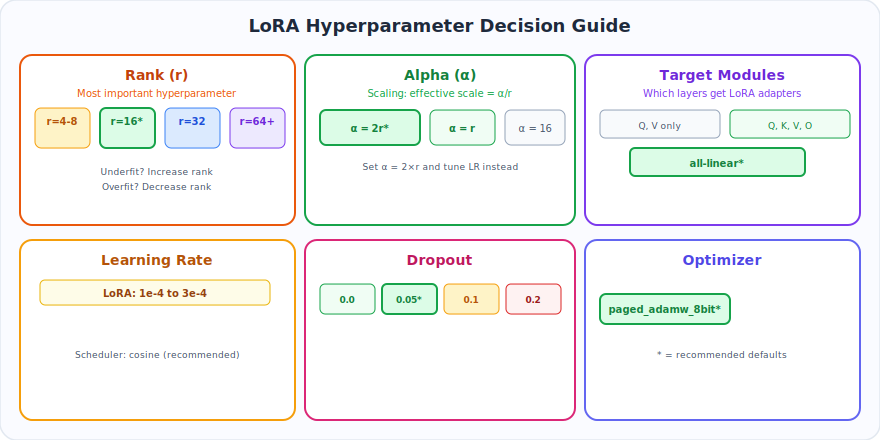
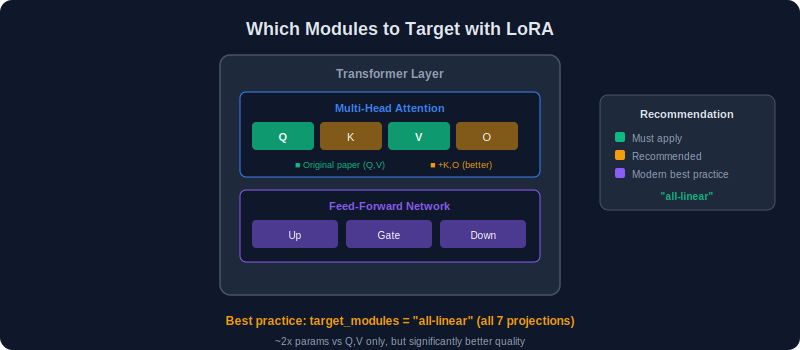
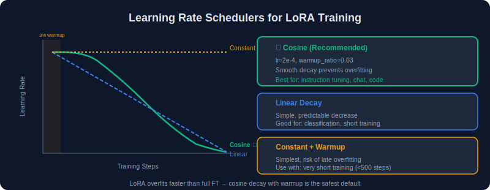
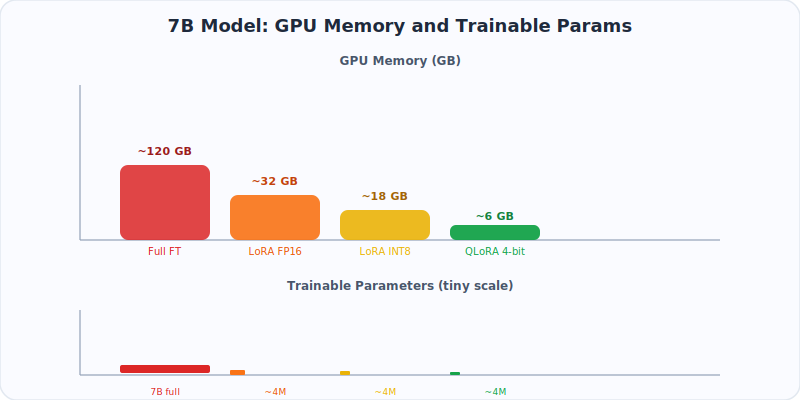
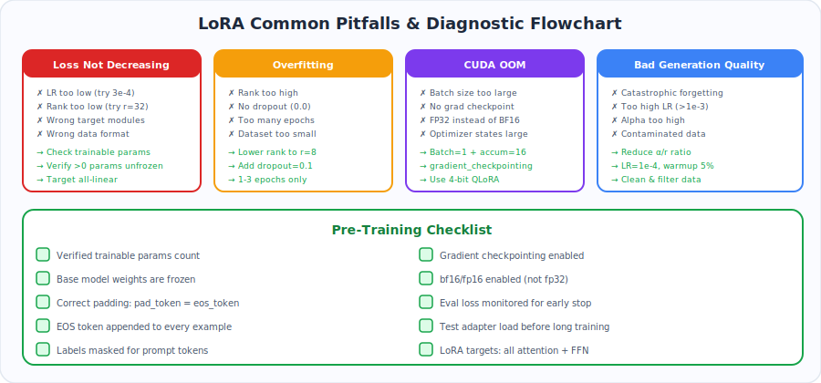
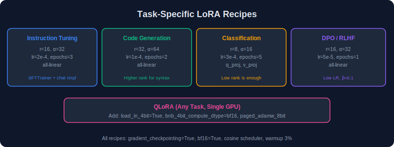
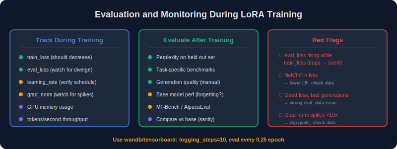

# Chapter 5: Training Guide

> Practical hyperparameter selection, best practices, common pitfalls, and battle-tested recipes.

---

### What You'll Learn

- How to choose rank, alpha, dropout, and learning rate
- Which modules to target (and why `"all-linear"` is usually best)
- Memory optimization tricks (gradient checkpointing, 8-bit optimizers, mixed precision)
- The most common pitfalls and how to debug them
- Copy-paste recipes for instruction tuning, code, classification, and DPO

### TL;DR

> Start with **`r=16, alpha=32, lr=2e-4, target_modules="all-linear", optimizer=paged_adamw_8bit, bf16=True`**. This works for 90% of tasks. Increase rank if underfitting, decrease if overfitting. Always enable gradient checkpointing. See the **Cheat Sheet** at the bottom for a one-glance summary.

### 30-Second Recipe (Copy-Paste Ready)

```python
from peft import LoraConfig
from transformers import TrainingArguments

lora_config = LoraConfig(
    r=16, lora_alpha=32, target_modules="all-linear",
    lora_dropout=0.05, bias="none", task_type="CAUSAL_LM",
)

training_args = TrainingArguments(
    output_dir="./output",
    num_train_epochs=3,
    per_device_train_batch_size=4,
    gradient_accumulation_steps=4,
    learning_rate=2e-4,
    lr_scheduler_type="cosine",
    warmup_ratio=0.03,
    bf16=True,
    gradient_checkpointing=True,
    optim="paged_adamw_8bit",
    max_grad_norm=0.3,
    logging_steps=10,
    save_strategy="epoch",
)
```

---

## Table of Contents

- [5.1 Hyperparameter Selection](#51-hyperparameter-selection)
- [5.2 Which Modules to Target](#52-which-modules-to-target)
- [5.3 Learning Rate and Scheduler](#53-learning-rate-and-scheduler)
- [5.4 Memory Optimization Techniques](#54-memory-optimization-techniques)
- [5.5 Common Pitfalls and Debugging](#55-common-pitfalls-and-debugging)
- [5.6 Recipes for Common Tasks](#56-recipes-for-common-tasks)
- [5.7 Evaluation and Monitoring](#57-evaluation-and-monitoring)

---

## 5.1 Hyperparameter Selection

<p align="center">
  
</p>

### Rank (r)

The rank is the **most important** hyperparameter. It controls the expressiveness of the adaptation.

| Rank | Use Case | Trainable Params (7B model) | Notes |
|------|----------|---------------------------|-------|
| 4 | Simple classification, sentiment | ~1M | Minimal but effective for narrow tasks |
| 8 | Standard fine-tuning | ~2M | Good default for most tasks |
| 16 | Instruction tuning, chat | ~4M | Recommended starting point |
| 32 | Complex reasoning, code | ~8M | Good for tasks requiring more capacity |
| 64 | Domain adaptation, multilingual | ~16M | When you need maximum expressiveness |
| 128+ | Near full fine-tuning quality | ~32M+ | Consider if you really need LoRA at this point |

**Rule of Thumb**: Start with `r=16` and increase if underfitting, decrease if overfitting.

### Alpha (α)

| Strategy | Setting | When to Use |
|----------|---------|-------------|
| `alpha = r` | Scale = 1.0 | Conservative, good default |
| `alpha = 2r` | Scale = 2.0 | More aggressive adaptation |
| `alpha = 16` (fixed) | Scale varies with r | Common in practice |

**Recommendation**: Set `alpha = 2 * r` and tune the learning rate instead of alpha.

### Dropout

| Value | When to Use |
|-------|-------------|
| 0.0 | Large datasets (>100K examples), large models |
| 0.05 | Medium datasets, general use |
| 0.1 | Small datasets (<10K examples) |
| 0.2 | Very small datasets (<1K examples) |

---

## 5.2 Which Modules to Target

<p align="center">
  
</p>

### Performance vs. Parameter Count

| Target Modules | Params (7B) | Quality | Recommendation |
|---------------|-------------|---------|----------------|
| Q, V only | ~2M | Good | Minimum viable LoRA |
| Q, K, V, O | ~4M | Better | Standard recommendation |
| All attention + FFN | ~10M | Best | Current best practice |
| `"all-linear"` | ~10M | Best | Easiest and recommended |

### Layer-Specific Recommendations

```python
# Minimum (original paper recommendation)
target_modules = ["q_proj", "v_proj"]

# Standard
target_modules = ["q_proj", "k_proj", "v_proj", "o_proj"]

# Full (recommended for best quality)
target_modules = [
    "q_proj", "k_proj", "v_proj", "o_proj",  # Attention
    "gate_proj", "up_proj", "down_proj",       # FFN (for LLaMA-style)
]

# Or simply:
target_modules = "all-linear"  # Let PEFT figure it out
```

### Selective Layer Application

Not all transformer layers contribute equally. You can apply LoRA to specific layers:

```python
lora_config = LoraConfig(
    r=16,
    lora_alpha=32,
    target_modules="all-linear",
    layers_to_transform=list(range(16, 32)),  # Only last 16 layers of a 32-layer model
)
```

Later layers tend to be more task-specific, earlier layers more general.

---

## 5.3 Learning Rate and Scheduler

<p align="center">
  
</p>

### Learning Rate

LoRA typically uses a **higher learning rate** than full fine-tuning because the LoRA parameters are initialized near zero and need to learn quickly.

| Method | Learning Rate Range |
|--------|-------------------|
| Full fine-tuning | 1e-5 to 5e-5 |
| LoRA | **1e-4 to 3e-4** |
| QLoRA | **1e-4 to 2e-4** |
| DoRA | **5e-5 to 2e-4** |

### Scheduler Comparison

| Scheduler | Behavior | Best For |
|-----------|----------|----------|
| Cosine | Smooth decay to near-zero | General purpose, recommended |
| Linear | Steady decay | Short training runs |
| Cosine with restarts | Periodic warmup | Multi-phase training |
| Constant with warmup | Flat after warmup | When you want consistent updates |

### Warmup

- **3-5% of total steps** for warmup is standard
- For small datasets: use 10% warmup
- Never skip warmup — LoRA is sensitive to early training dynamics

```python
training_args = TrainingArguments(
    learning_rate=2e-4,
    lr_scheduler_type="cosine",
    warmup_ratio=0.03,      # 3% warmup
    # OR
    warmup_steps=100,        # Fixed warmup steps
)
```

---

## 5.4 Memory Optimization Techniques

<p align="center">
  
</p>

### Technique Comparison

| Technique | Memory Savings | Speed Impact | Compatibility |
|-----------|---------------|--------------|---------------|
| Gradient checkpointing | ~40% less activation memory | ~20% slower | All models |
| Mixed precision (bf16) | ~50% less weight memory | Faster on Ampere+ | Most models |
| 4-bit quantization (QLoRA) | ~75% less weight memory | ~10% slower training | Via bitsandbytes |
| 8-bit optimizer | ~50% less optimizer memory | Minimal | Via bitsandbytes |
| Gradient accumulation | Enables larger effective batch | Proportional slowdown | All |
| DeepSpeed ZeRO | Distributed across GPUs | Communication overhead | Multi-GPU |

### Combining Techniques for Maximum Savings

```python
from transformers import TrainingArguments, BitsAndBytesConfig

bnb_config = BitsAndBytesConfig(
    load_in_4bit=True,
    bnb_4bit_quant_type="nf4",
    bnb_4bit_compute_dtype=torch.bfloat16,
    bnb_4bit_use_double_quant=True,
)

training_args = TrainingArguments(
    per_device_train_batch_size=2,       # Small batch per GPU
    gradient_accumulation_steps=16,      # Effective batch = 32
    gradient_checkpointing=True,         # Recompute activations
    bf16=True,                           # Mixed precision
    optim="paged_adamw_8bit",            # 8-bit optimizer with paging
    max_grad_norm=0.3,                   # Gradient clipping
)
```

### Memory Estimates (7B Parameter Model)

| Configuration | GPU Memory |
|--------------|------------|
| Full FP16 fine-tuning | ~120 GB |
| LoRA FP16 | ~16 GB |
| LoRA + gradient checkpointing | ~12 GB |
| QLoRA 4-bit | ~6 GB |
| QLoRA 4-bit + gradient checkpointing | **~4.5 GB** |

---

## 5.5 Common Pitfalls and Debugging

<p align="center">
  
</p>

### Pitfall 1: Loss Not Decreasing

**Symptoms**: Training loss stays flat or decreases very slowly.

**Causes and Fixes**:

| Cause | Fix |
|-------|-----|
| Learning rate too low | Increase to 1e-4 or 2e-4 |
| Rank too low | Increase r from 8 to 16 or 32 |
| Wrong target modules | Use `"all-linear"` |
| Alpha too low | Set alpha = 2 * r |
| Data formatting issue | Check tokenization, verify labels are correct |

### Pitfall 2: Overfitting

**Symptoms**: Training loss decreases but validation loss increases.

**Fixes**:
- Reduce rank (r=16 → r=8)
- Increase dropout (0.05 → 0.1)
- Reduce number of epochs
- Add weight decay (0.01-0.1)
- Use smaller learning rate
- Increase dataset size or add data augmentation

### Pitfall 3: NaN / Inf Loss

**Symptoms**: Loss becomes NaN or Inf during training.

**Fixes**:
- Lower learning rate
- Add gradient clipping (`max_grad_norm=0.3`)
- Use bf16 instead of fp16 (bf16 has wider dynamic range)
- Check for data issues (empty sequences, extremely long sequences)
- Reduce alpha

### Pitfall 4: Catastrophic Forgetting

**Symptoms**: Model loses base capabilities after fine-tuning.

**Fixes**:
- Lower rank and learning rate
- Fewer training epochs
- Mix in general-purpose data during training
- Use lower alpha for gentler adaptation

### Pitfall 5: Poor Generation Quality

**Symptoms**: Model generates repetitive, incoherent, or off-topic text.

**Fixes**:
- Check that the training data format matches what the model expects
- Ensure labels are properly masked (don't train on prompts)
- Try different generation parameters (temperature, top_p)
- Verify the base model works correctly before fine-tuning

---

## 5.6 Recipes for Common Tasks

<p align="center">
  
</p>

### Recipe 1: Instruction Following (Chat)

```python
LoraConfig(
    r=16,
    lora_alpha=32,
    target_modules="all-linear",
    lora_dropout=0.05,
    bias="none",
)
# LR: 2e-4, Epochs: 3, Batch: 32 (via accumulation)
```

### Recipe 2: Code Generation

```python
LoraConfig(
    r=32,           # Higher rank for complex code patterns
    lora_alpha=64,
    target_modules="all-linear",
    lora_dropout=0.05,
    bias="none",
)
# LR: 1e-4, Epochs: 2-3, Max seq length: 2048+
```

### Recipe 3: Domain Adaptation (Medical, Legal, etc.)

```python
LoraConfig(
    r=64,           # High rank for significant domain shift
    lora_alpha=128,
    target_modules="all-linear",
    lora_dropout=0.1,
    bias="none",
)
# LR: 5e-5, Epochs: 5-10, Mix with general data
```

### Recipe 4: Classification

```python
LoraConfig(
    r=8,            # Lower rank sufficient for classification
    lora_alpha=16,
    target_modules=["q_proj", "v_proj"],
    lora_dropout=0.1,
    bias="none",
    task_type="SEQ_CLS",
    modules_to_save=["classifier"],  # Train the classification head fully
)
# LR: 2e-4, Epochs: 5-10
```

### Recipe 5: Multi-turn Conversation (DPO/RLHF)

```python
LoraConfig(
    r=16,
    lora_alpha=32,
    target_modules="all-linear",
    lora_dropout=0.05,
    bias="none",
)
# First: SFT with LR 2e-4
# Then: DPO with LR 5e-5 (lower for alignment phase)
```

---

## 5.7 Evaluation and Monitoring

<p align="center">
  
</p>

### Key Metrics to Track

```python
# Monitor during training (via wandb or tensorboard)
metrics = {
    "train/loss": "Should decrease smoothly",
    "eval/loss": "Should track train/loss, gap indicates overfitting",
    "eval/perplexity": "Lower is better, domain-dependent baseline",
    "train/grad_norm": "Should be stable, spikes indicate issues",
    "train/learning_rate": "Verify scheduler works as expected",
}
```

### Post-Training Evaluation

```python
from lm_eval import evaluator

results = evaluator.simple_evaluate(
    model="hf",
    model_args=f"pretrained=./lora-merged,dtype=float16",
    tasks=["mmlu", "hellaswag", "arc_challenge", "truthfulqa"],
    batch_size=8,
)

for task, metrics in results["results"].items():
    print(f"{task}: {metrics}")
```

### A/B Testing Adapters

```python
from peft import PeftModel

base = AutoModelForCausalLM.from_pretrained("meta-llama/Llama-2-7b-hf")

model_a = PeftModel.from_pretrained(base, "./adapter_v1")
model_b = PeftModel.from_pretrained(base, "./adapter_v2")

# Swap adapters on the same base model:
model_a.set_adapter("default")
output_a = model_a.generate(**inputs)

model_a.load_adapter("./adapter_v2", adapter_name="v2")
model_a.set_adapter("v2")
output_b = model_a.generate(**inputs)
```

---

## Cheat Sheet

```
┌─────────────────────────────────────────────────┐
│              LoRA Training Cheat Sheet           │
├─────────────────────────────────────────────────┤
│ Rank:       16 (start here)                     │
│ Alpha:      2 × rank                            │
│ Targets:    "all-linear"                        │
│ Dropout:    0.05                                │
│ LR:         2e-4                                │
│ Scheduler:  cosine                              │
│ Warmup:     3%                                  │
│ Optimizer:  paged_adamw_8bit                    │
│ Precision:  bf16                                │
│ Grad clip:  0.3                                 │
│ Checkpt:    gradient_checkpointing=True         │
└─────────────────────────────────────────────────┘
```

---

## Key Takeaways

1. **Rank 16 is the sweet spot** — covers 90% of use cases; go higher only if you see underfitting
2. **Always set `alpha = 2 × r`** — then tune learning rate instead of alpha
3. **Target all linear layers** — the marginal parameter cost is small and quality improves
4. **Use `paged_adamw_8bit`** — cuts optimizer memory by 75% with negligible quality loss
5. **Enable gradient checkpointing** — trades ~20% speed for ~60% memory savings
6. **Learning rate 2e-4** is the default — lower (1e-5) for DPO, higher (3e-4) for small datasets
7. **Train for 1-3 epochs** — LoRA overfits faster than full fine-tuning
8. **Save checkpoints every epoch** — LoRA checkpoints are tiny, and the best epoch is rarely the last
9. **Monitor loss AND eval metrics** — low loss with bad generations means overfitting

---

## Navigation

| Previous | Up | Next |
|----------|------|------|
| [← Chapter 4: Implementation](../04-Implementation/README.md) | [Home](../README.md) | [Chapter 6: Advanced Topics →](../06-Advanced-Topics/README.md) |
