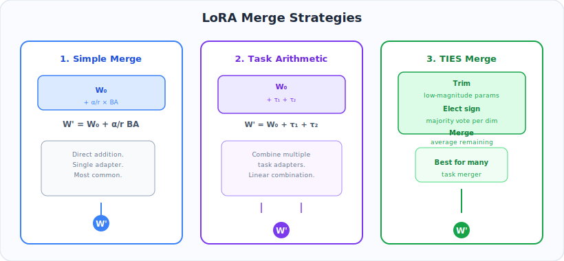
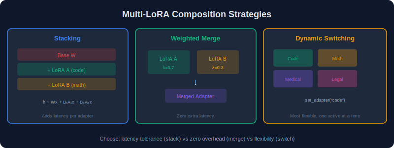
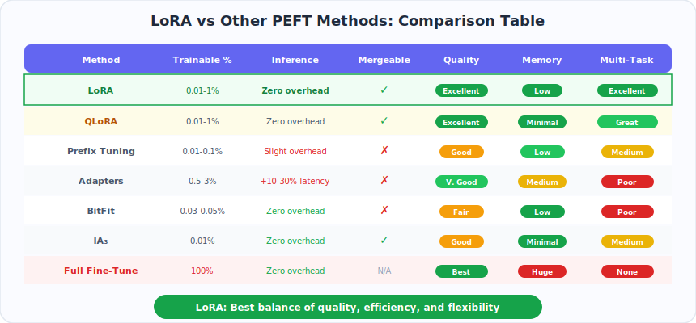
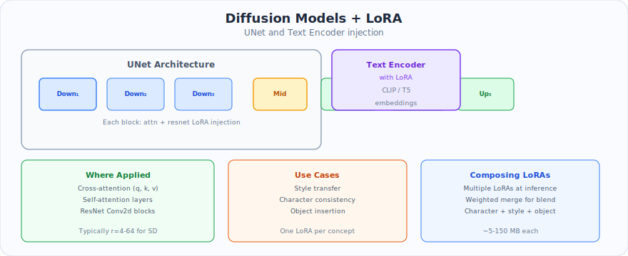
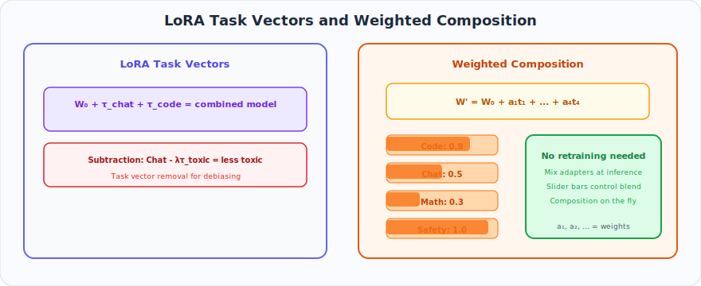

# Chapter 6: Advanced Topics

> Merging strategies, multi-adapter serving, LoRA composition, and comparisons with other PEFT methods.

---

### What You'll Learn

- How to merge multiple LoRA adapters into a single model (4 strategies)
- Composing skills without retraining via LoRA arithmetic
- Deploying LoRA in production (merged, runtime, S-LoRA)
- Applying LoRA to vision, speech, and diffusion models
- Continual learning with orthogonal constraints
- How LoRA compares to other PEFT methods (adapters, prefix tuning, IA3)

### TL;DR

> After training, the real power of LoRA emerges. **Merge** multiple adapters via task arithmetic, TIES, or DARE. **Serve** 100+ adapters from a single GPU with S-LoRA. **Compose** skills by adding/subtracting adapter weights — no retraining needed. LoRA also works beyond text: **diffusion models** use it for style transfer, and **O-LoRA** enables continual learning without catastrophic forgetting.

---

## Table of Contents

- [6.1 Adapter Merging Strategies](#61-adapter-merging-strategies)
- [6.2 Multi-LoRA Composition](#62-multi-lora-composition)
- [6.3 LoRA for Different Modalities](#63-lora-for-different-modalities)
- [6.4 Production Serving](#64-production-serving)
- [6.5 LoRA vs Other PEFT Methods](#65-lora-vs-other-peft-methods)
- [6.6 LoRA for Diffusion Models](#66-lora-for-diffusion-models)
- [6.7 Continual Learning with LoRA](#67-continual-learning-with-lora)
- [6.8 LoRA Arithmetic and Model Editing](#68-lora-arithmetic-and-model-editing)

---

## 6.1 Adapter Merging Strategies

<p align="center">
  
</p>

After training multiple LoRA adapters (e.g., one for code, one for math, one for medical), you may want to combine them into a single model.

### Strategy 1: Linear Merging

The simplest approach — weighted average of adapter weights:

$$
\Delta W_{\text{merged}} = \sum_{i=1}^{N} \lambda_i \cdot B_i A_i, \quad \sum_i \lambda_i = 1
$$

```python
from peft import PeftModel

base_model = AutoModelForCausalLM.from_pretrained("meta-llama/Llama-2-7b-hf")
model = PeftModel.from_pretrained(base_model, "./adapter_code", adapter_name="code")
model.load_adapter("./adapter_math", adapter_name="math")

model.add_weighted_adapter(
    adapters=["code", "math"],
    weights=[0.7, 0.3],
    adapter_name="merged",
    combination_type="linear",
)
model.set_adapter("merged")
```

### Strategy 2: TIES Merging

**TIES (Trim, Elect Sign, Merge)** resolves conflicts between adapters:

1. **Trim**: Zero out small-magnitude parameters (keep top-k%)
2. **Elect Sign**: For each parameter, vote on the sign across adapters
3. **Merge**: Average only the parameters that agree on sign

```python
model.add_weighted_adapter(
    adapters=["code", "math", "medical"],
    weights=[0.5, 0.3, 0.2],
    adapter_name="ties_merged",
    combination_type="ties",
    density=0.5,  # Keep top 50% of parameters
)
```

### Strategy 3: DARE Merging

**DARE (Drop And REscale)**: Randomly drop parameters and rescale:

$$
\tilde{\Delta W}_i = \frac{1}{1-p} \cdot \text{mask}_p(\Delta W_i)
$$

where $ \text{mask}_p $ randomly zeros out parameters with probability $ p $.

```python
model.add_weighted_adapter(
    adapters=["code", "math"],
    weights=[0.6, 0.4],
    adapter_name="dare_merged",
    combination_type="dare_ties",
    density=0.5,
)
```

### Strategy 4: SVD Merging

Merge multiple adapters and re-compress via SVD to maintain a target rank:

$$
\sum_i \lambda_i B_i A_i \xrightarrow{\text{SVD}} U_r \Sigma_r V_r^T \xrightarrow{\text{split}} B_{\text{new}} A_{\text{new}}
$$

### Merging Strategy Comparison

| Strategy | Quality | Conflict Resolution | Compute Cost |
|----------|---------|-------------------|--------------|
| Linear | Good | None | O(params) |
| TIES | Better | Sign-based voting | O(params) |
| DARE | Better | Random dropout | O(params) |
| SVD | Best | Rank truncation | O(SVD cost) |
| Task Arithmetic | Good | Direction-based | O(params) |

---

## 6.2 Multi-LoRA Composition

<p align="center">
  
</p>

### Dynamic Adapter Switching

Serve multiple tasks from one base model by swapping adapters at runtime:

```python
from peft import PeftModel

base = AutoModelForCausalLM.from_pretrained("meta-llama/Llama-2-7b-hf")
model = PeftModel.from_pretrained(base, "./adapter_chat", adapter_name="chat")
model.load_adapter("./adapter_code", adapter_name="code")
model.load_adapter("./adapter_medical", adapter_name="medical")

# Route incoming requests to the correct adapter
def route_request(request):
    if request.task == "code":
        model.set_adapter("code")
    elif request.task == "medical":
        model.set_adapter("medical")
    else:
        model.set_adapter("chat")
    return model.generate(**request.inputs)
```

### Stacking LoRA Adapters

Apply multiple adapters sequentially (composing behaviors):

$$
W_{\text{stacked}} = W_0 + \frac{\alpha_1}{r_1} B_1 A_1 + \frac{\alpha_2}{r_2} B_2 A_2
$$

```python
model.set_adapter(["chat", "code"])  # Apply both adapters simultaneously
```

### Per-Layer Adapter Mixing

Use different adapters for different layers:

```python
adapter_config = {
    "layers_0_15": "general_adapter",
    "layers_16_31": "task_specific_adapter",
}
```

---

## 6.3 LoRA for Different Modalities

<p align="center">
  
</p>

### Vision Transformers (ViT)

```python
from peft import LoraConfig, get_peft_model
from transformers import ViTForImageClassification

model = ViTForImageClassification.from_pretrained("google/vit-base-patch16-224")

config = LoraConfig(
    r=16,
    lora_alpha=32,
    target_modules=["query", "value"],  # ViT naming convention
    modules_to_save=["classifier"],
    task_type="IMAGE_CLASSIFICATION",
)

model = get_peft_model(model, config)
```

### Vision-Language Models (LLaVA, etc.)

```python
config = LoraConfig(
    r=16,
    lora_alpha=32,
    target_modules=[
        "q_proj", "v_proj",            # Language model attention
        "mm_projector.linear_1",        # Vision-language connector
        "mm_projector.linear_2",
    ],
)
```

### Speech Models (Whisper)

```python
from transformers import WhisperForConditionalGeneration

model = WhisperForConditionalGeneration.from_pretrained("openai/whisper-large-v3")

config = LoraConfig(
    r=32,
    lora_alpha=64,
    target_modules="all-linear",
    task_type="SEQ_2_SEQ_LM",
)
```

---

## 6.4 Production Serving

<p align="center">
  
</p>

### Serving with vLLM

```python
from vllm import LLM

llm = LLM(
    model="meta-llama/Llama-2-7b-hf",
    enable_lora=True,
    max_lora_rank=64,
    max_loras=4,
)

from vllm import SamplingParams
from vllm.lora.request import LoRARequest

output = llm.generate(
    "Write a function to sort a list",
    SamplingParams(temperature=0.7, max_tokens=256),
    lora_request=LoRARequest("code_adapter", 1, "./adapter_code"),
)
```

### Serving with Text Generation Inference (TGI)

```bash
docker run --gpus all \
    -v ./models:/models \
    ghcr.io/huggingface/text-generation-inference:latest \
    --model-id meta-llama/Llama-2-7b-hf \
    --lora-adapters code=./adapter_code,medical=./adapter_medical
```

### Serving with ONNX Runtime

```python
from optimum.onnxruntime import ORTModelForCausalLM

model = ORTModelForCausalLM.from_pretrained(
    "./lora-merged",
    export=True,
    provider="CUDAExecutionProvider",
)
```

### Latency Comparison

| Method | Latency (tokens/s) | Memory | Multi-adapter |
|--------|-------------------|--------|---------------|
| Merged model | Baseline | 1x model | No (1 per model) |
| Runtime LoRA | +5-10% overhead | 1x model + adapters | Yes |
| S-LoRA | +2-5% overhead | 1x model + paged adapters | Yes (thousands) |
| Batched LoRA (vLLM) | +3-7% overhead | 1x model + adapters | Yes (concurrent) |

---

## 6.5 LoRA vs Other PEFT Methods

<p align="center">
  
</p>

### Head-to-Head Comparison

| Method | Params | Memory | Latency (Inference) | Quality | Composability |
|--------|--------|--------|-------------------|---------|---------------|
| **Full Fine-Tuning** | 100% | Very High | Baseline | Best | None |
| **LoRA** | 0.1-1% | Low | **Zero added** | Near-best | Excellent |
| **Prefix Tuning** | 0.1% | Low | +5-15% | Good | Limited |
| **Prompt Tuning** | 0.01% | Very Low | +2-5% | Lower | Good |
| **Adapters (Serial)** | 0.5-3% | Low | +5-20% | Good | Limited |
| **BitFit** | 0.05% | Very Low | Zero | Lower | None |
| **IA3** | 0.01% | Very Low | Minimal | Good | Good |

### When to Choose LoRA Over Alternatives

**Choose LoRA when:**
- Inference latency matters (zero overhead after merging)
- You need to serve multiple task-specific models
- You want to compose capabilities
- Working with models >1B parameters

**Consider alternatives when:**
- Extremely parameter-constrained → Prompt Tuning or IA3
- Need deep architectural changes → Full Adapters
- Simple bias adjustment suffices → BitFit
- Working with small models (<100M) → Full fine-tuning may be affordable

---

## 6.6 LoRA for Diffusion Models

<p align="center">
  
</p>

LoRA is extensively used in Stable Diffusion for style transfer, subject injection, and concept customization.

### Stable Diffusion LoRA

```python
from diffusers import StableDiffusionPipeline

pipe = StableDiffusionPipeline.from_pretrained(
    "stabilityai/stable-diffusion-xl-base-1.0",
    torch_dtype=torch.float16,
).to("cuda")

pipe.load_lora_weights("./anime-style-lora")
pipe.fuse_lora(lora_scale=0.8)

image = pipe("a cat in anime style").images[0]
```

### Training LoRA for Diffusion

```bash
accelerate launch train_dreambooth_lora_sdxl.py \
    --pretrained_model_name_or_path="stabilityai/stable-diffusion-xl-base-1.0" \
    --instance_data_dir="./my-images" \
    --instance_prompt="a photo of sks dog" \
    --resolution=1024 \
    --train_batch_size=1 \
    --gradient_accumulation_steps=4 \
    --learning_rate=1e-4 \
    --rank=4 \
    --max_train_steps=500
```

### Key Differences from LLM LoRA

| Aspect | LLM LoRA | Diffusion LoRA |
|--------|----------|---------------|
| Target modules | Attention Q, K, V, O | Cross-attention + self-attention |
| Typical rank | 8-64 | 4-32 |
| Training data | Thousands of examples | 5-20 images |
| Training steps | 1000s-10000s | 500-2000 |
| Merging | Weight arithmetic | Scale factor (0-1) |

---

## 6.7 Continual Learning with LoRA

### The Challenge

When fine-tuning on task B after task A, the model forgets task A (catastrophic forgetting). LoRA's architecture provides natural solutions.

### Approach 1: Separate Adapters

Train independent adapters per task, switch at inference:

```
Base Model (frozen)
    ├── Adapter: Task A
    ├── Adapter: Task B
    └── Adapter: Task C
```

No forgetting because the base model and other adapters are never modified.

### Approach 2: Progressive LoRA

1. Train Adapter A on Task A
2. Merge Adapter A into base model
3. Train Adapter B on Task B (on the merged model)
4. Repeat

Each adapter builds on the knowledge of previous tasks.

### Approach 3: Orthogonal LoRA (O-LoRA)

<p align="center">
  
</p>

Constrain each new adapter to be orthogonal to all previously learned adapters:

$$
B_t^T B_i = \mathbf{0} \quad \text{and} \quad A_t A_i^T = \mathbf{0} \quad \forall \, i < t
$$

**Why this works (proof sketch):**

For any input $ x $ processed by old adapter $ i $, the old adapter's output direction is $ B_i (A_i x) $. The new adapter's output direction is $ B_t (A_t x) $. Since $ B_t^T B_i = 0 $, these output directions are orthogonal:

$$
\langle B_i(A_i x), \, B_t(A_t x) \rangle = (A_i x)^T \underbrace{B_i^T B_t}_{= \, \mathbf{0}} (A_t x) = 0
$$

Therefore, the new adapter **cannot** alter the component of the output that the old adapter controls. Task $ i $'s learned behavior is perfectly preserved. See [Chapter 3, Section 3.15](../03-Types-of-LoRA/README.md#315-o-lora-orthogonal-lora) for the full formulation.

**Practical enforcement:**

```python
def orthogonal_projection(B_new, B_old_list):
    """Project B_new onto the orthogonal complement of all B_old."""
    for B_old in B_old_list:
        # Remove component in the direction of B_old
        B_new = B_new - B_old @ (B_old.T @ B_new)
    return B_new
```

**Capacity limit**: With rank $ r $ per adapter and hidden dimension $ d $, at most $ \lfloor d/r \rfloor $ orthogonal adapters fit. For $ d=4096, r=16 $: **256 tasks**.

---

## 6.8 LoRA Arithmetic and Model Editing

<p align="center">
  
</p>

### Task Arithmetic

Manipulate model behaviors through arithmetic on adapter weights:

**Addition** (add a capability):
$$
W_{\text{new}} = W_0 + \lambda \cdot B_{\text{skill}} A_{\text{skill}}
$$

**Subtraction** (remove a behavior):
$$
W_{\text{new}} = W_0 - \lambda \cdot B_{\text{toxic}} A_{\text{toxic}}
$$

**Transfer** (move a skill between models):
$$
W_{\text{target}} = W_{\text{target}} + \lambda \cdot (B_{\text{source}} A_{\text{source}})
$$

### Practical Example: Detoxification

```python
base = AutoModelForCausalLM.from_pretrained("meta-llama/Llama-2-7b-hf")

# Train a LoRA adapter on toxic data
toxic_adapter = PeftModel.from_pretrained(base, "./toxic_adapter")

# Negate the adapter to remove toxic patterns
toxic_adapter.merge_and_unload(negate=True)  # W = W_0 - BA
```

### Interpolation Between Adapters

Smoothly transition between two task-specific behaviors:

$$
W_{\alpha} = W_0 + (1 - \alpha) \cdot B_1 A_1 + \alpha \cdot B_2 A_2, \quad \alpha \in [0, 1]
$$

This enables interesting applications like smoothly transitioning between formal and casual writing styles.

---

## Summary of Advanced Techniques

```
Advanced LoRA Ecosystem
├── Merging: Combine multiple adapters
│   ├── Linear averaging
│   ├── TIES (conflict resolution)
│   ├── DARE (random dropping)
│   └── SVD re-compression
├── Composition: Use multiple adapters together
│   ├── Dynamic switching
│   ├── Stacking
│   └── Per-layer mixing
├── Serving: Production deployment
│   ├── Merged (simplest)
│   ├── Runtime LoRA (flexible)
│   └── S-LoRA (scalable)
├── Arithmetic: Edit model behavior
│   ├── Addition (add skills)
│   ├── Subtraction (remove behaviors)
│   └── Interpolation (blend styles)
└── Continual Learning
    ├── Separate adapters
    ├── Progressive merging
    └── Orthogonal constraints
```

---

## Key Takeaways

1. **Merging is powerful** — combine a code adapter and a math adapter into one model without retraining
2. **TIES merging** handles sign conflicts better than simple averaging when adapters disagree
3. **DARE** (drop and rescale) works surprisingly well — randomly zeroing 90% of adapter weights before merging often improves results
4. **S-LoRA** can serve 1000+ concurrent adapters from a single GPU via unified paging
5. **LoRA arithmetic** enables model editing: `base + code_adapter - toxicity_adapter` removes toxic behavior while adding code skills
6. **Diffusion model LoRA** is the backbone of community style transfer (Stable Diffusion, SDXL)
7. **O-LoRA** prevents catastrophic forgetting by constraining each new adapter to be orthogonal to previous ones
8. **LoRA vs other PEFT**: LoRA wins on inference cost (zero overhead after merge), while prefix tuning and IA3 have smaller adapter sizes but add inference latency

---

## Navigation

| Previous | Up | Next |
|----------|------|------|
| [← Chapter 5: Training Guide](../05-Training-Guide/README.md) | [Home](../README.md) | [Chapter 7: References →](../07-References/README.md) |
